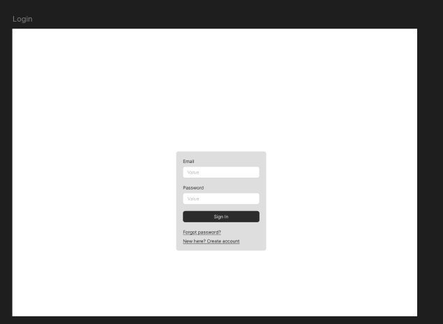
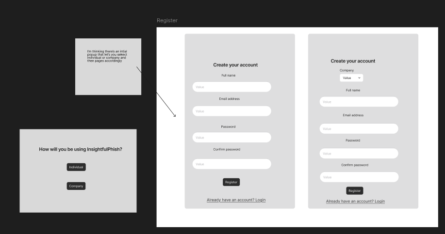
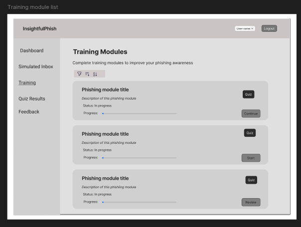
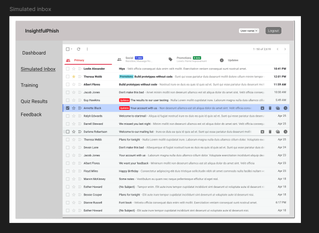
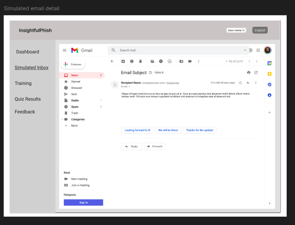
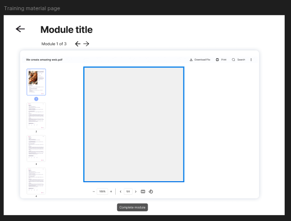
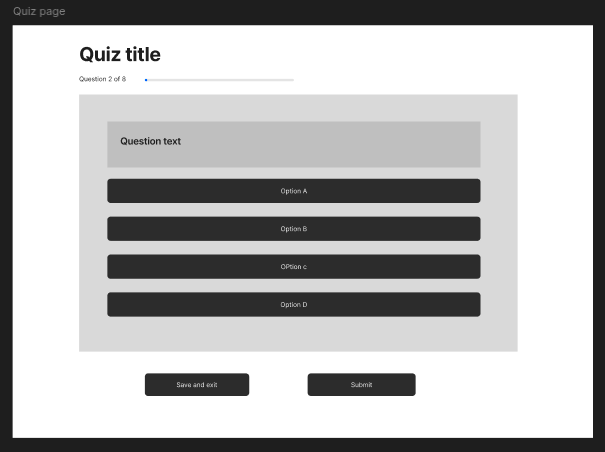
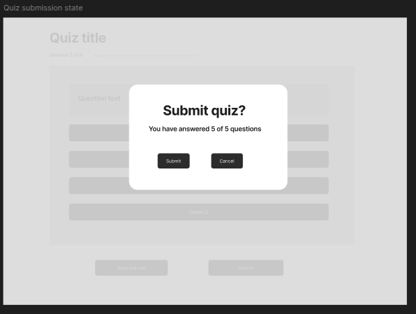

# Demo 1 Design Documentation

## Purpose

This document records the Demo 1 design baseline for Insightful Phish. It focuses on the trainee-facing brand style, screen layout direction, navigation points, component placement, interaction points, and wireframe references needed to support the Demo 1 flow.

Demo 1 design covers the base authentication screens and the three core trainee use cases:

- UC-01: View emails in simulated inbox
- UC-02: View training document
- UC-03: Complete quiz flow and view results

## Source Brand Guidelines

The full visual brand reference is available in [Brand Guidelines Demo 1.pdf](./Brand%20Guidelines%20Demo%201.pdf).

Supporting logo and brand assets are maintained in [brand/assets/](./brand/assets/).

## Brand Style

### Brand Overview and Personality

Insightful Phish is a modern cybersecurity brand centred around awareness, precision, and digital vigilance. The brand identity draws inspiration from the fast-paced nature of cybersecurity, using sharp visual elements, angular forms, and bold colour contrasts to create a strong and memorable presence.

The visual style should feel confident, alert, and modern while reinforcing the platform's focus on helping trainees recognise and respond to digital threats. The brand personality is bold, alert, and confident, balancing professionalism with strong visual energy and a security-focused digital aesthetic.

### Colour Palette

The brand palette uses strong dark surfaces with vivid purple accents. The HEX values below are treated as the source of truth. The Deep Ocean Purple RGB value is listed as it appears in the brand PDF, although it appears inconsistent with the HEX value.

| Colour            | HEX                                                                                             | RGB                       | Suggested use                                    |
| ----------------- | ----------------------------------------------------------------------------------------------- | ------------------------- | ------------------------------------------------ |
| Tuna Purple       | `#8400FF`  | `132, 0, 255`             | Primary brand accent / main action emphasis      |
| Bonito Violet     | `#B37DFF`  | `179, 125, 255`           | Secondary accent / highlights                    |
| Soft Lavender     | `#D6B3FF`  | `214, 179, 255`           | Soft accent / supporting surfaces                |
| Pale Lilac        | `#EEDEFF`  | `238, 222, 255`           | Light contrast / subtle backgrounds              |
| Dark Ocean Black  | `#13002B`  | `19, 0, 43`               | Main dark background                             |
| Deep Ocean Blue   | `#090054`  | `9, 0, 84`                | Dark panels / secondary dark surfaces            |
| Deep Ocean Purple | `#070054`  | `47, 3, 96` listed in PDF | Deep brand background / supporting dark surfaces |

### Typography

The brand guidelines specify two main typefaces:

- **Jost:** Used for headings, key visual labels, and buttons where a bold, geometric, modern emphasis is needed.
- **Overpass:** Used for body copy, supporting text, training content, and longer-form communication where readability is the priority.

Headings should use Jost to create a clear visual hierarchy. Body copy and training material should use Overpass to keep content readable and accessible for trainees.

### Logo and Iconography

The Insightful Phish logo is the primary visual identifier of the brand and should be used consistently across Demo 1 documentation and interface design.

Logo usage rules:

- Maintain original proportions, spacing, colours, and typography
- Avoid distortion, stretching, rotation, or unauthorised visual effects
- Do not scale the logo so small that details or text become difficult to recognise
- Maintain adequate spacing around the logo for clarity and readability
- Use light and dark logo variations according to background contrast

Logo variants described in the brand guidelines:

- Main light logo with the fish mark, `Insightful Phish`, and the motto `DON'T TAKE THE BAIT`
- Compact light logo without the motto, used only when the motto appears nearby or space is limited
- Navigation-bar light logo without the motto, used when horizontal space is limited
- Main dark logo with the fish mark, `Insightful Phish`, and the motto
- Compact dark logo without the motto, used only when the motto appears nearby or space is limited
- Navigation-bar dark logo without the motto

The brand includes light and dark favicon versions based on the fish/head icon. Favicons should remain recognisable at small sizes and preserve contrast against the browser or background context.

User interface iconography should use Google Material Iconography, specifically Material Symbols and Icons. Icons should be simple, clear, consistent, and aligned with the sharp modern visual style. Examples from the brand guidelines include search, home, menu, close, settings, check circle, favourite, add, star, chevron right, arrow forward iOS, logout, cancel, add circle, arrow back iOS, and arrow forward.

### Design Principles

Demo 1 screen design should prioritise:

- Consistency
- Clarity
- Sharp visual styling
- Strong contrast
- Bold typography
- Structured layouts
- Modern cybersecurity-focused interface design
- Clear visual hierarchy
- Intuitive flow through campaigns, training, quizzes, and simulations

Consistent component patterns and strong visual hierarchy should guide trainees clearly through the product while keeping the experience visually aligned with the Insightful Phish brand.

### UI Component Styling

The interface styling should directly reflect the brand personality. UI components should use:

- Sharp edges
- Strong contrast
- Bold typography
- Layered panels
- Modern cybersecurity styling
- Consistent visual language across buttons, accordions, badges, cards, navigation, and action rows

Buttons, accordions, badges, cards, navigation items, and action rows should feel like part of one product family. Locked or unavailable states should look distinct from openable states and should not imply that a disabled activity can be selected.

### Accessibility

The brand guidelines state that accessibility was considered in the interface design. The platform uses high-contrast colours, large readable typography, clear navigation, consistent layouts, and improved usability for trainees.

Google Lighthouse accessibility testing is reported in the brand guidelines as producing frontend scores ranging from 89 to 100. This range is design/testing evidence, not a permanent guarantee.

Accessibility guidance:

- Maintain strong contrast between text and background
- Avoid relying on colour alone to communicate state
- Use readable font sizes and clear spacing
- Keep navigation consistent
- Ensure icon-only actions have accessible labels where implemented
- Maintain clear focus and interaction states
- Keep validation, error, loading, and success messages readable and close to the relevant UI area

## Wireframes

### Wireframe Overview

Wireframe exports are maintained in [wireframes/](./wireframes/). The editable Figma source is linked from [wireframes/README.md](./wireframes/README.md).

The wireframes show the intended Demo 1 trainee-facing flow and may differ from the final implemented UI. Each section below records the screen layout intent, navigation points, component placement, user interaction points, and annotations.

The current wireframe set covers:

- Login
- Register
- Campaigns Page and Activity Overview
- Simulated Inbox
- Simulated Email Detail
- Training Document
- Quiz Page
- Quiz Submission State, retained as a submission/loading reference rather than a separate Demo 1 screen

### Login

**Purpose:**

- Provides the entry point into the Demo 1 trainee flow
- Supports the base login feature rather than a counted Demo 1 use case
- Supports the trainee entering existing credentials and accessing Demo 1 screens

**Navigation points:**

- Entered from the public/auth route
- Leads to the authenticated trainee campaign area after successful login
- Provides access to registration where appropriate

**Component placement:**

- Brand/logo area
- Email and password fields
- Primary login button
- Page-level authentication error area
- Register/navigation link

**User interaction points:**

- Enter credentials
- Submit login form
- Correct field-level validation issues
- Review authentication errors if login fails

**Annotations:**

- Field-level validation should appear for missing or incorrectly formatted input before submission where possible
- Authentication failure should be shown as a page-level error message because the issue may relate to the submitted credential combination rather than one field only
- Keep validation trainee-friendly and avoid exposing technical authentication details
- Prevent duplicate submission while authentication is processing

### Register

**Purpose:**

- Supports trainee account creation for Demo 1 access
- Presents only the fields required for the Demo 1 base features

**Navigation points:**

- Entered from the login page
- Leads to the login page after successful registration
- Provides a route back to login

**Component placement:**

- Brand/logo area
- Required account fields
- Password guidance/validation placement
- Primary registration button
- Page-level error or success area

**User interaction points:**

- Enter registration details
- Correct required-field and password validation errors
- Submit the registration form
- Navigate back to login if an account already exists

**Annotations:**

- Required fields should be visually clear
- Field-level validation should appear near the relevant field
- The primary registration action should show a submitting state after selection
- Duplicate submission should be prevented while processing
- Demo 1 only supports general trainee registration
- Any admin, organisation, or role-selection elements shown in the wireframe are future-facing and are not part of the implemented Demo 1 GUI
- In later versions, users may be able to choose the type of account or role they are signing in or registering as

### Campaigns Page

**Purpose:**

- Shows assigned campaigns and entry points into Demo 1 activities
- Provides the context needed to reach simulated inbox, training document, and quiz activities
- Reuses the original training list wireframe as the Demo 1 campaigns/activity overview design reference
- Shows available or assigned campaign activity content in a clear, scannable way

**Navigation points:**

- Entered after login
- Leads into campaign items and openable activity actions
- Returns to the campaign list or previous authenticated navigation context

**Component placement:**

- Header/navigation bar
- Campaign cards or accordions
- Campaign item/action rows
- Activity type labels
- Status badges for availability and progress
- Primary action controls

**User interaction points:**

- Expand or review campaign sections
- Select openable campaign items
- Read status and availability information
- Recognise locked or unavailable activity states

**Annotations:**

- The original training list wireframe now represents the Demo 1 campaigns screen
- Demo 1 uses campaigns and campaign items rather than old training modules
- The layout intent remains a clear, scannable list of assigned activity rows or cards
- The screen provides entry points into training, quiz, and simulated inbox activities where available
- Each item should make the topic, availability, status, and next action understandable
- Empty, locked, unavailable, and loading states should follow the shared feedback and accessibility rules
- Locked or unavailable content should be visually distinguishable from available content
- Campaign items must remain visually distinct from backend API routes
- Locked items should look disabled and should not imply they are clickable
- The layout intent is a clear, scannable activity overview rather than a final campaign-builder design

### Simulated Inbox

**Purpose:**

- Supports UC-01 by presenting campaign-provided simulated email summaries
- Shows simulated email summaries in a clear, scannable format
- Helps trainees inspect controlled simulated email content without implying access to a real mailbox

**Navigation points:**

- Entered from an openable simulated inbox campaign item
- Leads to simulated email detail
- Returns to the campaign/activity context through back navigation

**Component placement:**

- Inbox heading and simulated-context label
- Search or filter area where available
- Email summary rows
- Sender, subject, preview, received date/time, and read/unread indicators
- Loading, empty, and error states

**User interaction points:**

- Search/filter email summaries
- Select an email row
- Recognise unread/opened state
- Recover from empty or loading states

**Annotations:**

- The inbox must remain clearly simulated
- The inbox should show enough information for the trainee to identify each simulated message, such as sender, subject, preview text, received date/time, and opened/unopened state where applicable
- Empty, loading, and error states should explain what the trainee can do next
- The design must not imply real email delivery or live mailbox access
- Unread styling should be based on backend opened state where available

### Simulated Email Detail

**Purpose:**

- Lets the trainee inspect one simulated email in detail
- Shows the selected simulated email in a readable format
- Supports UC-01 email-open behaviour and safe review of sender, subject, body, and links

**Navigation points:**

- Entered from a simulated inbox email row
- Returns to the same campaign-item inbox context

**Component placement:**

- Back button
- Sender and subject area
- Received date/time
- Email body content
- Link/content review area where applicable
- Loading and error states

**User interaction points:**

- Open/read the simulated email
- Select safe links where supported by implementation
- Navigate back to the inbox

**Annotations:**

- The trainee should be able to review sender details, message content, links, and suspicious indicators where supported
- Navigation back to the inbox should remain clear
- Email content should be treated as controlled simulation content
- Links must not create unsafe real-world navigation risks

### Training Document

**Purpose:**

- Supports UC-02 by presenting assigned training content in a focused reading layout
- Provides a clear path onward where related quiz content is available

**Navigation points:**

- Entered from an openable training campaign item
- May lead to a linked quiz activity where available
- Returns to the campaign/activity context

**Component placement:**

- Clear page title and training content heading
- Training title
- Reading content area
- Readable spacing, paragraphs, and section breaks
- Progress/status messaging
- Optional next-step action
- Loading, unavailable, and error states

**User interaction points:**

- Read training material
- Mark/view completion state where implemented
- Move to quiz where available
- Return to previous activity context

**Annotations:**

- Demo 1 only supports backend-served markdown training content
- Other content formats, such as PDF, HTML, URL, or interactive training content, are future-facing and should not be implied as implemented by this wireframe
- Show a loading state while the document is being retrieved
- Show an empty or unavailable-content message if the document cannot be opened
- Provide a clear way back to the campaign/activity overview
- If a related quiz is available, present the quiz action as a clear next step without making quiz completion part of UC-02
- Feedback messages on this page should follow the shared validation, error-state, and accessibility rules
- Long-form content should remain readable and should not require horizontal scrolling
- `contentRef` remains an implementation/API concern and should not appear as a trainee-facing design element

### Quiz Page

**Purpose:**

- Supports UC-03 by presenting quiz questions and answer choices clearly
- Helps trainees understand what must be completed before submission and result display

**Navigation points:**

- Entered from an openable quiz campaign item or from related training content
- Leads to quiz submission and results
- Returns to the campaign/activity context where appropriate

**Component placement:**

- Quiz title and short instruction
- Question blocks
- Answer options
- Field-level validation messages
- Optional page-level validation summary
- Submit action
- Loading and error states

**User interaction points:**

- Select answers
- Correct unanswered required questions
- Submit the quiz
- Avoid duplicate submission while processing

**Annotations:**

- Show a brief instruction explaining that required questions must be answered
- Present questions in a clear order with enough spacing between question groups
- Required-question state should use text and visual treatment, not colour alone
- Validation messages should appear near the relevant question when an answer is missing or invalid
- A page-level validation summary may be shown when multiple required answers are missing
- The submit action should be clearly visible after the questions
- The trainee should be able to correct validation errors without losing existing answers
- Correct answers and educational feedback must not be exposed before submission
- UC-03 includes result display, but there is no separate quiz-results wireframe section in this document because no separate quiz-results image export is currently available

### Quiz Submission State

Scope note: This wireframe is not implemented as a separate Demo 1 screen. It is retained as a design reference for submission/loading behaviour, disabled submit states, and duplicate-submission prevention.

**Purpose:**

- Shows the intended feedback state while quiz answers are being processed
- Prevents uncertainty between submission and results

**Navigation points:**

- Entered after the trainee submits quiz answers
- Leads to quiz results when submission succeeds
- Allows safe retry or recovery if submission fails

**Component placement:**

- Submission/loading message
- Disabled or guarded submit state
- Error or retry area if submission fails

**User interaction points:**

- Wait while answers are submitted
- Avoid duplicate submission
- Retry or return if submission fails

**Annotations:**

- Show a loading or submitting indicator after the trainee submits the quiz
- Disable or guard the submit action while processing to prevent duplicate submissions
- Keep the trainee on the quiz page or transition state until submission completes
- Do not show raw technical errors if submission fails
- If submission fails, explain the issue in trainee-friendly language and provide a retry path where appropriate
- The trainee should not be left on a blank or ambiguous page during submission
- This wireframe should not be interpreted as a required Demo 1 route

## Feedback, Validation, and Accessibility UI Rules

These rules define supporting UI behaviour for Demo 1 validation, feedback, loading, empty, unavailable, and accessibility states. They support the trainee-facing flows but do not create separate Demo 1 use cases.

They apply mainly to UC-01, UC-02, UC-03, Login/Register as base feature support, and phishing feedback only as high-level contextual support. The UI should help trainees understand what is required, what is happening, what succeeded, what failed, and what they can do next.

### Field-Level Validation Messages

Field-level validation messages should appear close to the field, question, or input that needs attention.

Rules:

- Use field-level messages for missing required input, invalid answer format, or unsupported selections
- Keep messages short and specific
- Do not rely only on colour to identify the problem
- Required-field messages should explain what the trainee needs to provide
- Quiz validation messages should appear near the relevant question where possible
- Existing trainee input should remain visible after validation fails

Example wording:

- “Please enter your email address.”
- “Please answer this question before submitting.”
- “Choose one option for this question.”

### Page-Level Error Banners

Page-level error banners should be used when an issue affects the whole page, flow, or submission.

Rules:

- Place the banner near the top of the relevant content area
- Use plain, trainee-friendly wording
- Explain the next safe action where possible
- Do not show stack traces, raw exception names, or backend implementation details
- Keep the trainee on the current page when they can correct or retry the action

Appropriate uses:

- Training document load failure
- Quiz submission failure
- Quiz results load failure
- Unavailable assigned content
- Authentication failure on login/register base screens

### Success Messages

Success messages should confirm that the trainee's action was completed.

Rules:

- Use success messages after meaningful completed actions, such as successful quiz submission
- Keep the message brief and calm
- Make the next step clear
- Avoid implying extra features outside Demo 1 scope

Example wording:

- “Your quiz was submitted. Your results are ready.”
- “Your progress has been saved.”
- “You are signed in.”

### Warning Messages

Warning messages should be used when the trainee can continue but should be aware of a limitation or state.

Rules:

- Use warnings for non-blocking issues or important context
- Keep the tone helpful rather than alarming
- Explain whether the trainee needs to take action
- Do not use warnings for normal required-field validation; use field-level validation instead

Examples:

- “This training document is available, but progress may not be saved right now.”
- “This quiz is currently unavailable. Please return to the training material.”

### Empty States

Empty states should explain when there is no relevant content to show.

Rules:

- State clearly what is missing
- Avoid making the page look broken
- Provide a safe next step, such as returning to the campaign/activity overview or dashboard
- Keep the wording trainee-friendly

Applicable examples:

- No assigned campaigns or activities
- No simulated inbox items
- No available quiz content

### Loading and Submitting States

Loading and submitting states should show that the system is working.

Rules:

- Use loading states when retrieving training content, quiz content, inbox content, email details, or results
- Use submitting states when sending quiz answers or form data
- Prevent duplicate submissions while a request is processing
- Avoid blank pages during loading
- Keep loading text short and understandable

Example wording:

- “Loading training material…”
- “Submitting your quiz…”
- “Preparing your results…”

### Disabled States

Disabled states should prevent actions that are temporarily unavailable or unsafe to repeat.

Rules:

- Disable or guard submit buttons while a quiz or form is being submitted
- Use disabled states only when the reason is clear from nearby context
- Disabled controls should still be visually understandable and accessible
- Do not rely only on disabled buttons for validation; show clear validation messages as well

Applicable examples:

- Quiz submit button while submission is processing
- Login/register submit button while authentication is processing
- Locked or unavailable campaign item
- Unavailable quiz action when no quiz is assigned

### Quiz Feedback and Result Display

Quiz result display should confirm that the quiz attempt was completed and provide educational feedback.

Rules:

- Show a clear result summary after successful submission
- Display feedback in a supportive learning tone
- Where answer-level feedback is shown, distinguish correct and incorrect responses using text labels and visual treatment
- Avoid relying only on colour to communicate correctness
- Provide a clear navigation option back to the campaign/activity overview, training material, or dashboard
- If results cannot be loaded, show a safe error message and provide a retry or back-navigation option
- Keep feedback educational, not punitive

### Phishing Feedback Display

Phishing feedback is high-level contextual support for Demo 1 and should not be treated as a separate core use case.

Rules:

- Keep phishing feedback focused on safe learning guidance
- Explain suspicious email indicators in plain language
- Link feedback to the simulated inbox context where relevant
- Avoid expanding this into a full phishing-feedback workflow unless separately scoped
- Do not include real credential collection, real phishing delivery, or unsafe simulation behaviour

Example guidance areas:

- Suspicious sender details
- Urgent or threatening wording
- Unexpected links or attachments
- Mismatch between sender identity and message content

### Accessible Message Presentation

Feedback messages should be accessible and easy to perceive.

Rules:

- Place messages close to the relevant field, question, or content area
- Use text labels in addition to colour
- Ensure messages are readable at normal zoom levels
- Important page-level messages should be noticeable without disrupting the whole flow
- Trainees should be able to reach recovery actions, such as retry or back navigation, using the keyboard

### Keyboard Interaction Expectations

Trainees should be able to complete the Demo 1 trainee flows using keyboard navigation.

Rules:

- Interactive elements should follow a logical tab order
- Buttons, links, quiz options, and recovery actions should be keyboard-accessible
- Focus should not be trapped unexpectedly
- After validation fails, the trainee should be able to navigate to the relevant message or field
- Disabled controls should not create confusion in the focus order

### Screen-Reader Feedback Expectations

Screen-reader users should be able to understand important validation, loading, error, and success feedback.

Rules:

- Important messages should be written as meaningful text
- Messages should identify the relevant field, question, or page state
- Status changes such as submitting, success, or failure should be presented clearly
- Error summaries should help the trainee find what needs attention
- Visual-only feedback, such as colour changes without text, should be avoided

### Contrast Considerations

Validation, error, success, warning, and feedback states should meet basic readability expectations.

Rules:

- Text must remain readable against its background
- Colour should support meaning but should not be the only way meaning is communicated
- Error, warning, and success states should have distinguishable labels or icons where appropriate
- Final colour choices should align with the Demo 1 brand style guide when available

## Trainee Navigation and Training Screen Behaviour

The trainee training journey should remain simple, predictable, and aligned with the Demo 1 use cases and wireframes. This section supports UC-02 and UC-03. It does not define detailed quiz API behaviour, frontend routing implementation, or administrator navigation.

The primary Demo 1 trainee flow is:

1. Login/Register
2. Basic onboarding or orientation where available
3. Campaigns page / activity overview
4. Training document
5. Quiz entry point
6. Quiz/result feedback
7. Return navigation

### Campaigns Page and Activity Overview

The campaigns page acts as the primary authenticated landing area or activity hub after login. First-time trainees may receive basic onboarding/orientation guidance before or around this area.

The page should provide clear visibility into assigned campaigns and current activity. The trainee should be able to identify available training quickly, continue existing activity where available, and navigate into assigned campaign items with minimal navigation depth.

Campaigns may represent cybersecurity learning categories such as “Phishing Awareness” or “Password Security”. The dashboard/activity overview should prioritise clarity and quick access to active learning tasks rather than large amounts of secondary information.

### Trainee Orientation and Onboarding Guidance

The trainee experience should avoid presenting the platform as an unstructured or overwhelming set of tools immediately after authentication.

Basic onboarding/orientation should help trainees understand the purpose of the platform, available cybersecurity topics, how campaign activities are structured, how to begin, and how training connects to quizzes or simulations.

Examples of learning areas may include:

- Phishing awareness
- Password security
- Suspicious links and attachments
- Social-engineering awareness
- Safe credential and payment practices

For Demo 1, onboarding guidance should remain basic and informational rather than adaptive or highly personalised. Future personalised learning paths, skill assessment, and adaptive recommendations are outside Demo 1 scope.

### Activity Overview to Training Document

The activity overview should display assigned or available campaign items in a clear and scannable format.

Each item may display title, short summary or description, completion/progress status, availability state, and action to open content. Selecting a training item should open the corresponding training document page.

Locked, unavailable, or incomplete states should be visually distinguishable from available content. The trainee should be able to return easily without confusion or unnecessary navigation steps. Demo 1 should avoid deeply nested hierarchies or unnecessarily complex navigation paths.

### Training Document to Quiz Flow

The training document page supports UC-02 by presenting assigned training content in a structured and readable format.

The trainee should be able to read assigned training content, understand its relationship to associated quiz content, navigate to quiz flow when available, and return safely to the activity overview.

If a related quiz exists, the training document page should present the quiz action as a clear next step within the learning flow. The transition from training material into the quiz flow should preserve trainee context. Detailed quiz interaction behaviour remains part of UC-03 documentation and the Quiz Page section.

### Return Navigation

Training-related screens should provide consistent and predictable return navigation.

The trainee should be able to return to the campaigns page/activity overview and previously viewed training content where applicable. Navigation actions should remain visible and understandable across supported screen sizes.

The trainee should not encounter dead-end flows after viewing training material or accessing quiz-related screens. Trainees should always understand where they are in the training flow and how to return to previous screens.

### Loading, Empty, Locked, Unavailable, and Error States

Training-related screens should follow the shared validation, accessibility, loading, and feedback rules.

Loading states should communicate when training content, campaign/activity information, or quiz-entry information is being retrieved. Empty states should explain when no campaigns, activities, training content, or related quiz content exists.

Locked or unavailable states should clearly distinguish inaccessible content from available content and should explain the limitation where appropriate. Error states should avoid technical implementation details, provide safe retry or return-navigation behaviour, and preserve trainee orientation where possible.

Training flows should avoid blank, broken, or dead-end screens during loading or failure conditions.

### Responsive Behaviour Expectations

Demo 1 trainee flows should remain usable across desktop, tablet, and mobile layouts.

Training-related screens should prioritise readable training content, visible primary navigation actions, touch-friendly interaction areas, clear back-navigation behaviour, and accessible quiz-entry actions.

Training content should adapt responsively without requiring horizontal scrolling during normal reading behaviour. Primary trainee actions should remain accessible on smaller screens without excessive navigation complexity.

## Design Scope Notes

Demo 1 design is limited to the local trainee-facing prototype and supporting authentication screens. Organisation admin campaign builders, reporting dashboards, real email delivery, AI-assisted generation, fake login pages, attachments, and richer simulation interactions remain future-facing unless explicitly scoped in later documentation.

The wireframes are design artefacts used to guide implementation. They should be read together with [SRS.md](./SRS.md), [API.md](./API.md), [architecture.md](./architecture.md), [testing.md](./testing.md), and [traceability.md](./traceability.md), but this document does not duplicate those contracts.

## Appendix A: Document Change History

| Version | Date       | Author(s)   | Sections / Area Updated                    | Summary of Change                                                    |
| ------- | ---------- | ----------- | ------------------------------------------ | -------------------------------------------------------------------- |
| 0.1.0   | 2026-04-27 | Johan Nel   | Initial design scope                       | Created/expanded initial Demo 1 design specification.                |
| 0.1.1   | 2026-05-03 | Zoë Joubert | Feedback UI; validation; phishing feedback | Added UI feedback, validation, and phishing feedback scope guidance. |
| 0.1.2   | 2026-05-07 | Johan Nel   | Design structure; cross-references         | Aligned design document structure with other Demo 1 docs.            |
| 0.1.3   | 2026-05-09 | Connor Bell | Trainee navigation; training screens       | Added navigation and training-screen behaviour documentation.        |
| 0.1.4   | 2026-05-10 | Johan Nel   | Terminology                                | Updated learner/employee wording to trainee.                         |
| 0.1.5   | 2026-05-10 | Zoë Joubert | UI feedback rules                          | Added Demo 1 feedback and accessibility UI rules.                    |
| 0.1.6   | 2026-05-21 | Johan Nel   | Headings; links                            | Cleaned headings and links during domain-model documentation update. |
