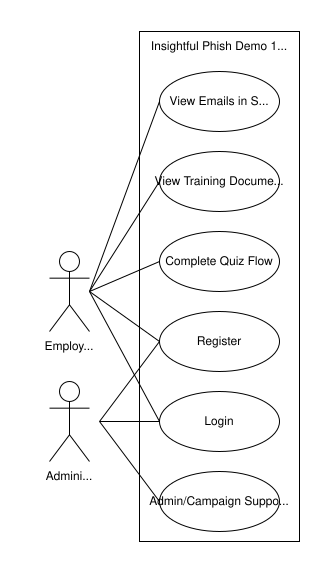
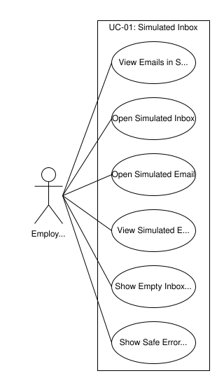
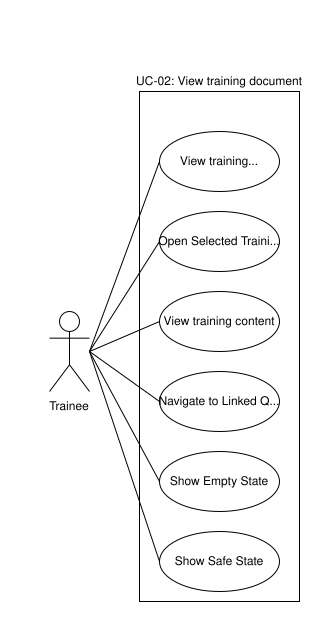
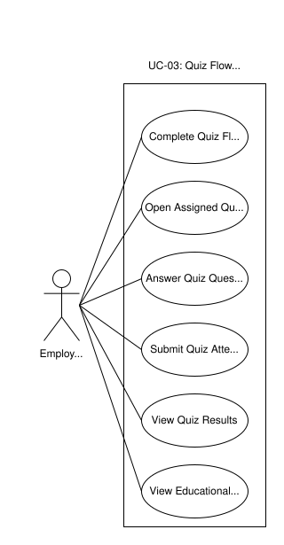

# Demo 1 Diagrams

## Purpose

This folder stores or indexes diagram sources and exports for Demo 1 planning documentation.

## Use Case Diagrams

Current draft source:

- [use-case-overview-demo1.drawio](./use-case-overview-demo1.drawio)

The use-case overview is draft material until the diagram issue is reviewed. It should show UC-01, UC-02, UC-03, base features, and supporting admin context without expanding the Demo 1 use case list.

Current SVG exports:

- [Demo 1 use case overview](./demo1-use-cases-overview.svg)
- [UC-01 simulated inbox use case diagram](./demo1-use-cases-uc01-simulated-inbox.svg)
- [UC-02 training document use case diagram](./demo1-use-cases-uc02-training-document.svg)
- [UC-03 quiz flow use case diagram](./demo1-use-cases-uc03-quiz-flow.svg)

### Overview

### UC-01: View Emails in Simulated Inbox

### UC-02: View Training Document

### UC-03: Complete Quiz Flow

### Base Features

Login/register and general validation are supporting features, not standalone Demo 1 core use cases.

### Supporting Organisation Admin Context

Organisation admin and campaign setup appear only as future/supporting context for assigning campaigns that expose simulations, training documents, quizzes, and modular campaign items/components. They should not expand the Demo 1 use case list.

## Domain Model Diagrams

The Demo 1 domain model is documented in [SRS.md](../SRS.md).

### UML Class Diagram

The domain model is preliminary and conceptual. It supports SRS, API, traceability, and terminology alignment; it is not a final database schema or Prisma migration plan.

Current source:

- [Initial domain model source](<./demo1-domain-model-(initial).drawio>)
- [Final domain model source](./demo1-domain-model-final.drawio)

Current SVG exports:

- [Initial domain model diagram](<./demo1-domain-model-(initial).svg>)
- [Final domain model diagram](./demo1-domain-model-final.svg)

#### Final Domain Model

#### Initial Domain Model

.svg>)

### Domain Model Explanation Support

Domain explanations are integrated in [SRS.md](../SRS.md) under Supporting Document References.

## Architecture Diagrams

### High-Level Architecture

Preliminary architecture guidance is documented in [architecture.md](../architecture.md). Final architecture diagrams are not required here unless separately completed.

### Simulation Modularity

Future-facing architecture context only unless the diagram issue finalises this diagram.

### Interaction and Progress Flow

Future-facing architecture context only unless the diagram issue finalises this diagram.

## References

### SRS Reference

[SRS.md](../SRS.md)

### Architecture Reference

[architecture.md](../architecture.md)

### API Reference

[API.md](../API.md)

### Traceability Reference

[traceability.md](../traceability.md)
