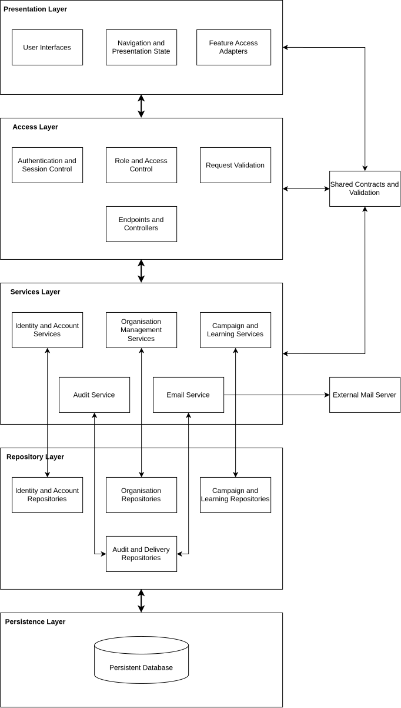

# Architecture Overview

This document establishes the logical organisation of Insightful Phish and the boundaries that guide implementation and refactoring.

## Contents

- [Architecture Overview](#architecture-overview)
  - [Contents](#contents)
  - [1. Purpose](#1-purpose)
  - [2. Architecture Overview](#2-architecture-overview)
    - [Architecture Diagram](#architecture-diagram)
  - [3. Layer Responsibilites](#3-layer-responsibilites)
    - [3.1 Presentation and Browser Layer](#31-presentation-and-browser-layer)
    - [3.2 API and Access-Control Layer](#32-api-and-access-control-layer)
    - [3.3 Application Services Layer](#33-application-services-layer)
    - [3.4 Repository and Data-Acees Layer](#34-repository-and-data-acees-layer)
    - [3.5 Persistence Layer](#35-persistence-layer)
  - [4. Dependancy Direction](#4-dependancy-direction)
  - [5. Shared Contracts](#5-shared-contracts)
  - [6. Cross-Cutting Services](#6-cross-cutting-services)
    - [6.1 Email Service](#61-email-service)
    - [6.2 Audit Service](#62-audit-service)
  - [7. Current Deviations](#7-current-deviations)
  - [8. References](#8-references)

## 1. Purpose

This document defines the intended logical organisation of the system, the responsibilities of each layer, the normal dependency direction, the role of supporting shared contracts and validation, the role of cross-cutting services, and known deviations in the current implementation.

## 2. Architecture Overview

A normal request follows this path:

1. A user interaction originates in the Presentation and Browser Layer.
2. The request crosses the API and Access-Control Layer boundary.
3. Validation, authentication, session checks, and access control are applied at the boundary where required by the operation.
4. An application service coordinates the relevant business use case.
5. The application service uses one or mose repositories.
6. The repositories communicate with persistant storage.
7. The result travels back through the API boundary to the Presentation and Browser Layer.

### Architecture Diagram



## 3. Layer Responsibilites

### 3.1 Presentation and Browser Layer

The presentation and broswer layer supports user interaction, displays system state and feedback, provides client-side input assistance, and invokes defined API contracts. It may improve usability y identifying incomplete or malformed input early, but it must not make authoritative business-rule or access-control decisions.

### 3.2 API and Access-Control Layer

The API and Access-Control Layer exposes the client-server boundary. It parses and validates requests, authenticates users, checks sessions, and applies access control and organisation-boundary enforcement where required. It translates transport requests into application-service calls and returns stable responses and safe errors. Controllers and request handlers should remain thin so that business workflows and data access do not accumulate at this boundary.

### 3.3 Application Services Layer

The application services layer coordinates business use cases and enforces workflow and domain rules. An application service sequences repository operations and invokes cross-cutting services when required. Transaction and idempotency requirements should be managed through suitable abstractions without exposing presentation concerns or direct persistent-storage details. This is the intended seperation and is not yet followed consistently by every current application service.

### 3.4 Repository and Data-Acees Layer

The repository and data-access layer isolates quries, writes, projections and persistence,specific operations. Repositories present application-orientated operations to services, apply the organisation or actor scoping required by the calling use case, and prevent persistence details from leaking into higher layers.

Access control remains a coordinated responsibility across the API boundary, application service, and repository where appropriate. Using a repository does not automatically gaurantee than an auhtorisation check or organisation boundary is correct.

### 3.5 Persistence Layer

The persistence layer holds durable system state and supports integrity contraints, relationships, transactional storage, indexing, and other persistence mechanisms required to preserve system data correctly. Its implementation details remain behind repository and data-access operations.

## 4. Dependancy Direction

Normal dependencies point downwards:

```text
Presentation and Brower
→ API and Access-Control
→ Application Services
→ Repository and Data-Access
→Persistence
```

Lower layers do not depend on presentation behaviour. Repositories do not coordinate user-facing workflows, API handlers should not perform persistence operations directly, and applciation services should depend on repositoru abractration and not persistence clients. Response data may however travel upwards without reversing source-code dependency responsibility.

> _**Dependency boundary**_ : Direct controller-to-persistence or application-service-to-persistence access bypasses the repository boundary and is a deviation from the target structure.

## 5. Shared Contracts

Shared contracts and validation support presentation, API, and application-service code by defining common request, response, and validation structures where appropriate. They reduce contract drift between parts of the system. They are however not a sixth runtime processing layer. Shared validation does not replace server-side authorisation checks or business-rule enforcement.

## 6. Cross-Cutting Services

### 6.1 Email Service

The email service supports multiple application use cases by coordinating message preperation and delivery requests and by recording or exposing delivery outcomes where required. It communicates through a mail adapter with an exxternal mail server.

### 6.2 Audit Service

The audit service records security-sensitive and accountability-relevant events, sanitises sensitive details, and supports authorised review. Relevant application services incoke it as part of their use cases, and it should persist audit records through an appropriate repository or data-access boundary. This target responsibility does not mean all current workflows are audited.

## 7. Current Deviations

The current implementation does not follow the target structure consistently. Quiz controller or application-service code currently performs direct data-access operations, while simulation application-service code constains direct quries, transactions, and persistence-specific concurrency handling. These areas should move towards deidicated repositories while preserving externall visibile behaviour and contracts during refactoring,

## 8. References

- [Demo 2 Software Requirements Specification](../srs/README.md)
- [SRS Function Requirements](../srs/functional-requirements.md)
- [SRS Quality Requirements](../srs/quality-requirements.md)
- [Architecture Overview](architecture-overview.md)

---

Previous section: [Architectural Requirements](architectural-requirements.md)

Next section: [Architectural Patterns](architectural-patterns.md)
