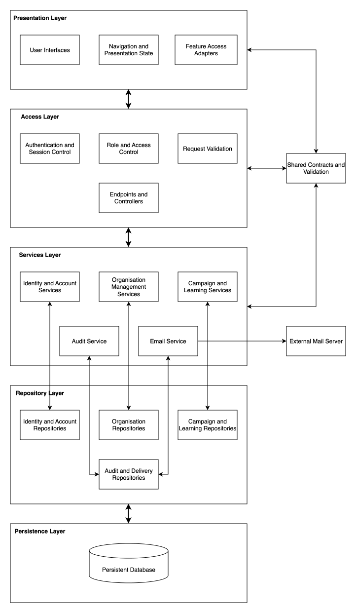

# Architecture Overview

This section defines the intended technology-neutral logical architecture of Insightful Phish, its five layers, normal dependency direction, supporting contracts, cross-cutting services, and known implementation deviations.

## SAS Content

- [0. Home](README.md)
- [1. Introduction](introduction.md)
- [2. Architectural Requirements](architectural-requirements.md)
- **[3. Architecture Overview](#3-architecture-overview)** &larr; _You are here_
  - [3.1 Purpose](#31-purpose)
  - [3.2 Architecture Diagram](#32-architecture-diagram)
  - [3.3 Layer Responsibilities](#33-layer-responsibilities)
  - [3.4 Shared Contracts](#34-shared-contracts)
- [4. Architectural Patterns](architectural-patterns.md)
- [5. Design Patterns](design-patterns.md)
- [6. Quality to Architecture Mapping](quality-architecture-mapping.md)
- [7. Technology Requirements](technology-requirements.md)
- [8. API Contracts](api-contracts.md)
- [9. Deployment and Operations](deployment.md)
- [10. Changelog](changelog.md)

---

## 3. Architecture Overview

Our architecture establishes clear responsibility and dependency boundaries for presentation, access, application, data access and data persistences. It guides new implementation and future refactoring.

### 3.2 Architecture Diagram

_Figure 3.1: Intended five-layer logical architecture for Insightful Phish._

To view the full rendered version of the diagram, click [here](../diagrams/sas/architecture-diagram.drawio.svg).

A normal request originates in the presentation layer, crosses the API boundary, is coordinated by an application service, and reaches persistent storage through a repository. The result returns through the same boundaries.

> [!Note]
> The diagram represents the intended architecture rather than claiming that every current implementation path already conforms to it.

### 3.3 Layer Responsibilities

- **Presentation Layer:** Presents pages, forms, training content, navitation, status informtation and feedback to the user. It captures user interaction, manages temporary browser state, performs usability focused input checks, and sends requests using the defined API contracts. It shouldn't be trusted to enforce permissions, organisation boundaries or business rules.
- **Access Layer:** Provides the system's controlled client-server entrypoint. It parses requests, validates request structure, authenticates users, checks session validity, applies rate limits, and confirms that users have the required role, permissions and organisation context (if they belong to an organisation). It invokes the appropriate application service and translates the result into a consistent response or safe error without exposing sensitive implementation details.
- **Services Layer:** Coordinates complete business use cases such as registration, invitation acceptance, campaign assignment, quiz submission etc. It applies workflow and lifecycle rules, orders repository operations and uses other services when necessary. It is independent of browser presentation and direct storage implementation details.
- **Repository Layer:** Provides application focussed operations for retrieving, creating, updating and summarising stored information. It isolates queries, projections, persistence specific behaviour and transactions from the application services. Repositories also apply user and organisation scoping, but they do not replace the access checks performed by the access and service layer.
- **Persistence Layer:** Stores durable system information. Higher layers should access this state through repositories instead of depending directly on database-specific structures.

### 3.4 Shared Contracts

Shared contracts define the information exchanged between athe Presentation Layer, Access Layer and the Services Layer. They provide common request structures, response structures, validation rules, enumerations and error formats so that both sides interpret the API consistently.

The presentation layer uses these contracts to construct valid requests, interpret responses, and provide early feedback to users. The access layer uses them to validate incoming data before invoking an application service. Application services may use contract-derived values, but should work with application and domain concepts rather than browser-specific or transport-specific details.

Shared contracts support several layers but are not a separate processing layer. Requests do not pass "through" shared contracts, and shared contracts should not contain workflow coordination, persistence operations, authentication decisions, or organisation-access rules.

---

Previous section: [Architectural Requirements](architectural-requirements.md)

Next section: [Architectural Patterns](architectural-patterns.md)
