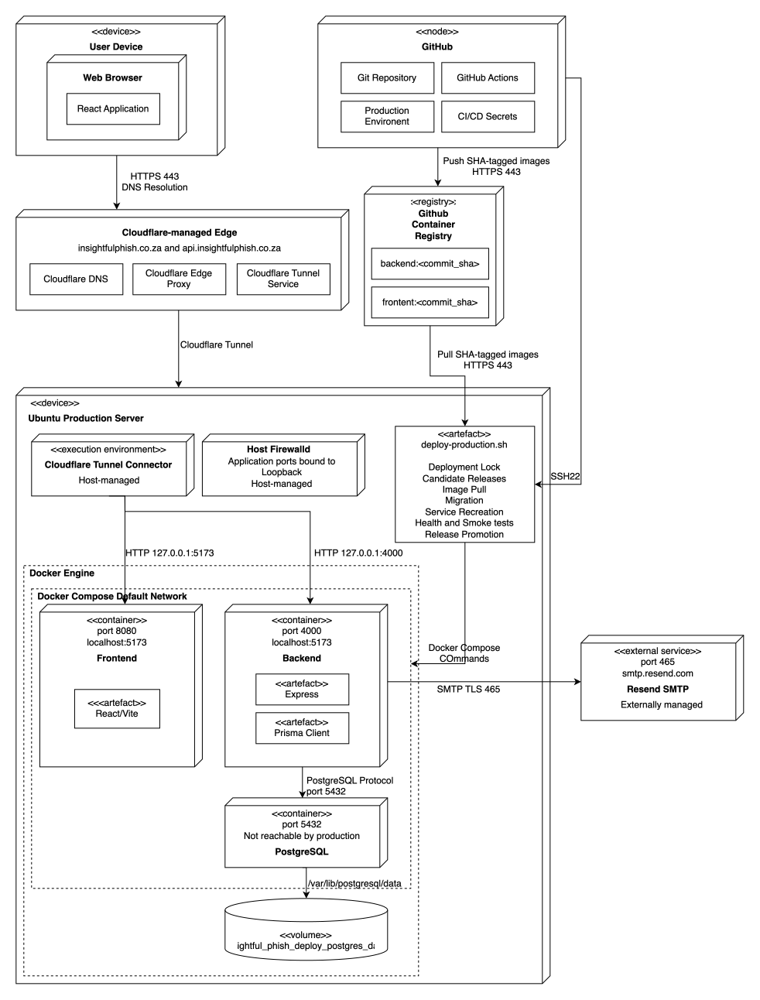
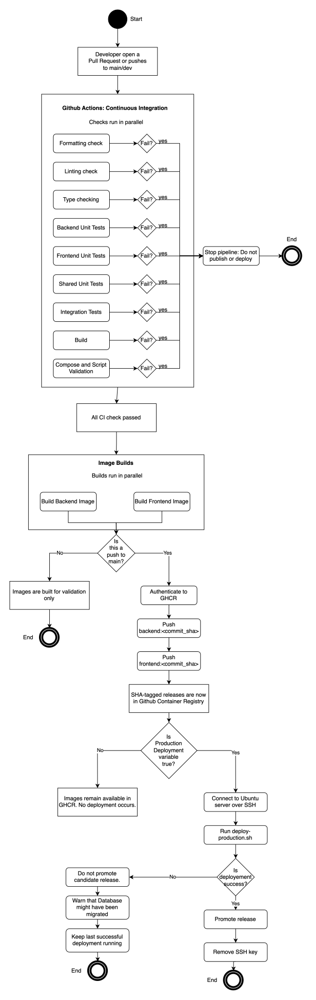

# Deployment and Operations

This section provides a view of the Insightful Phish deployment and CI/CD process.

## SAS Content

- [0. Home](README.md)
- [1. Architectural Requirements](architectural-requirements.md)
- [2. Architectural Patterns](architectural-patterns.md)
- [3. Design Patterns](design-patterns.md)
- [4. Quality to Architecture Mapping](quality-architecture-mapping.md)
- [5. Technology Requirements](technology-requirements.md)
- [6. API Contracts](api-contracts.md)
- **[7. Deployment and Operations](#7-deployment-and-operations)** &larr; _You are here_
  - [7.1 Purpose](#71-purpose)
  - [7.2 Deployment Diagrams](#72-deployment-diagrams)
  - [7.3 Deployment Failure Behaviour](#73-deployment-failure-behaviour)
  - [7.4 Rollback Strategy](#74-rollback-strategy)
- [8. Changelog](changelog.md)

---

## 7. Deployment and Operations

### 7.1 Purpose

Insightful Phish is deploted to an Ubuntu server using Docker Engine and Docker Compose. The production frontend, backend and PostgreSQL services run in containers, while Cloudflare provides the public DNS and Tunnel entry points. Production container images are built by Github Acrions, stored in the Github Container Registry and identified by the full Git commit SHA.

The deployment process validates the selected release, pulls its immages, applies database migrations, recreates the application services, and checks that the frontend and backend are healthy, before recording the deployment as successful.

### 7.2 Deployment Diagrams

#### 7.2.1 Deployment Architecture

_Figure 7.1: High-level deployment architecture for the Insightful Phish Demo 2 environment._

To view the full rendered version of the diagram, click [here](../diagrams/sas/deployment-diagram.drawio.svg).

#### 7.2.2 CI/CD Pipeline

_Figure 7.2: Continuous-integration and production-deployment flow for Insightful Phish._

To view the full rendered version of the diagram, click [here](../diagrams/sas/cicd-diagram.drawio.svg).

### 7.3 Deployment Failure Behaviour

A production deployment is performed using a full Git commit SHA. Before changing the running application, the deployment script validates the required files and Docker Compose configuration, creates a candidate release file, and pulls the corresponding backend and frontend images.

The deployment fails immediately if image retrieval, database migration, service recreation, container health checks, or HTTP smoke tests fail. The script reports the phase in which the failure occurred and exits with a non-zero status so that GitHub Actions records the deployment as failed.

A failed candidate is not promoted to the active release file, and the `current` release marker continues to identify the last successfully completed deployment. If failure occurs after service recreation, candidate containers may already have replaced the previous containers. The release marker therefore records the last verified release, but does not by itself guarantee that those containers are still running.

Database migrations execute before the application services are recreated. If migration succeeds and a later step fails, the database may already contain the new schema. The deployment process does not automatically reverse migrations or restore previous containers because doing so could start an older backend against an incompatible database.

The frontend and backend must pass their Docker health checks and host-level HTTP smoke tests before a deployment is recorded as successful. The backend health endpoint also checks database connectivity.

### 7.4 Rollback Strategy

The deployment script records the Git commit SHAs of the current and previous successful releases in:

- `deploy/releases/current`
- `deploy/releases/previous`

Successful deployments are also appended to `deploy/releases/deployment-history.log`.

Rollback is a manual action and is not automatic yet. The developer needs to identify the previous successful SHA and confirm that its backend image is compatible with the current database schema. If it is compatible, the previous SHA can be passed to the normal production deployment script. This causes the previous images to be pulled and deployed through the same migration, health-check, and smoke-test gates as any other release.

Application rollback does not automatically reverse Prisma migrations or restore database data. If the previous application version is incompatible with migrations already applied by the failed release, the developer must use a compatible forward correction or a separately planned database-recovery procedure. The previous application image must not be redeployed until this compatibility has been assessed.

---

Previous section: [API Contracts](api-contracts.md)

Next section: [SAS Changelog](changelog.md)
