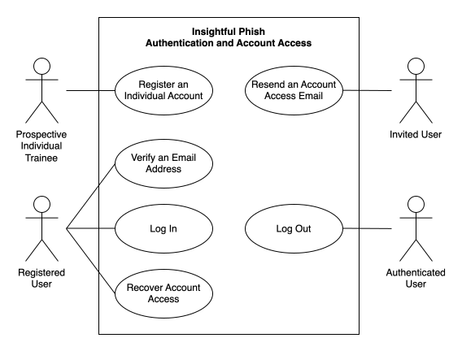
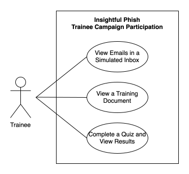
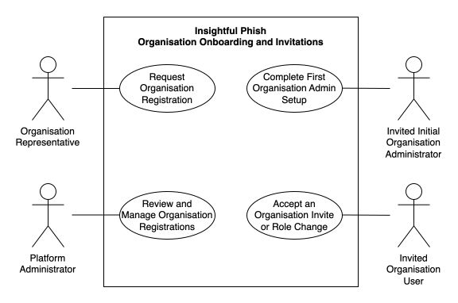
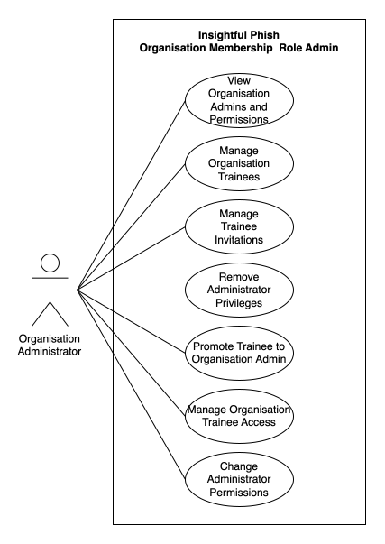
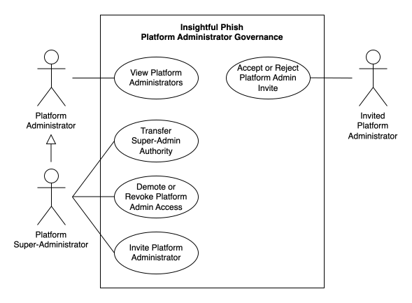
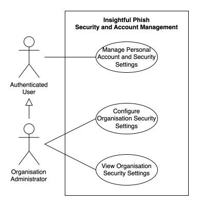

# Use Cases

### SRS Content

- [0. Home](README.md)
- [1. Introduction and Scope](introduction.md)
- [2. Users and User Stories](users-and-user-stories.md)
- [3. Functional Requirements](functional-requirements.md)
- **[4. Use Cases](#4-use-cases)** &larr; _You are here_
  - [4.1 High-Level Use Case Diagrams](#41-high-level-use-case-diagrams)
    - [Authentication and Account Access]
    - [Trainee Campaign Participation]
    - [Organisation Onboarding and Invitations]
    - [Organisation Membership and Role Administration]
    - [Platform Administrator Governance]
    - [Security and Account Management]
  - [4.2 Authentication and Account Access Use Cases](#42-authentication-and-account-access-use-cases)
    - [AUTH-01 Register an Individual Account](#auth-01-register-an-individual-account)
    - [AUTH-02 Verify an Email Address](#auth-02-verify-an-email-address)
    - [AUTH-03 Log In](#auth-03-log-in)
    - [AUTH-04 Log Out](#auth-04-log-out)
    - [AUTH-05 Recover Account Access](#auth-05-recover-account-access)
    - [AUTH-06 Resend an Account Access Email](#auth-06-resend-an-account-access-email)
  - [4.3 Core and Planned Product Use Cases](#43-core-and-planned-product-use-cases)
    - [UC-01 View Emails in a Simulated Inbox](#uc-01-view-emails-in-a-simulated-inbox)
    - [UC-02 View a Training Document](#uc-02-view-a-training-document)
    - [UC-03 Complete a Quiz and View Results](#uc-03-complete-a-quiz-and-view-results)
    - [UC-04 Request Organisation Registration](#uc-04-request-organisation-registration)
    - [UC-05 Review and Manage Organisation Registrations](#uc-05-review-and-manage-organisation-registrations)
    - [UC-06 Complete First Organisation Administrator Setup](#uc-06-complete-first-organisation-administrator-setup)
    - [UC-07 Accept an Organisation Invitation or Role Change](#uc-07-accept-an-organisation-invitation-or-role-change)
    - [UC-08 Manage Organisation Employees](#uc-08-manage-organisation-employees)
    - [UC-09 Manage Organisation Administrators and Permissions](#uc-09-manage-organisation-administrators-and-permissions)
    - [UC-10 Manage Platform Administrators](#uc-10-manage-platform-administrators)
    - [UC-11 Manage Organisation Security Settings](#uc-11-manage-organisation-security-settings)
    - [UC-12 Manage Personal Account and Security Settings](#uc-12-manage-personal-account-and-security-settings)
    - <!-- Todo add heading links here! -->
- [5. Quality Requirements](quality-requirements.md)
- [6. Domain Model](domain-model.md)

---

# 4. Use Cases

The following use cases describe how users interact with the Insightful Phish system to achieve specific goals, including the main successful interactions and relevant flows.

## 4.1 High-Level Use Case Diagrams

The follwoing high level use case diagrams group closely related use cases by system capability. Each grouped diagram is embedded once in this section, and is then cross-referenced from the written use cases it covers.

> [!note]
> The Use Case Diagrams below are only for use cases that have been implemented in the system. Unimplemented use cases are not in use case diagrams.

### Authentication and Account Access

_Figure 4.1: Supporting authentication and account access processes covering [`AUTH-01`](#auth-01-register-an-individual-account) to [`AUTH-06`](#auth-06-resend-an-account-access-email)_

### Trainee Campaign Participation

_Figure 4.2: Implemented trainee campaign participation processes covering [UC-01](#uc-01-view-emails-in-a-simulated-inbox), [UC-02](#uc-02-view-a-training-document) and [UC-03](#uc-03-complete-a-quiz-and-view-results)_

### Organisation Onboarding and Invitations

_Figure 4.3: Organisation registration, onboarding, and invitation response processes covering [UC-04](#uc-04-request-organisation-registration), [UC-05](#uc-05-review-and-manage-organisation-registrations), [UC-06](#uc-06-complete-first-organisation-administrator-setup) and [UC-07](#uc-07-accept-an-organisation-invitation-or-role-change)_

### Organisation Membership and Role Administration

_Figure 4.4: Organisation trainee, administrator, and permission management processes covering [UC-08](#uc-08-manage-organisation-trainees) and [UC-09](#uc-09-manage-organisation-administrators-and-permissions)_

### Platform Administrator Governance

_Figure 4.5: Platform administrator governance processes covering [UC-10](#uc-10-manage-platform-administrators)_

### Security and Account Management

_Figure 4.6: Organisation security and personal account management processes covering [UC-11](#uc-11-manage-organisation-security-settings) and [UC-12](#uc-12-manage-personal-account-and-security-settings)_

## 4.2 Authentication and Account Access Use Cases

### `AUTH-01` Register an Individual Account

R1.1

### `AUTH-02` Verify an Email Address

R1.1.3 to R1.1.5 and R 1.6

### `AUTH-03` Log In

R1.2

### `AUTH-04` Log Out

R1.3

### `AUTH-05` Recover Account Access

Completing password recovery R1.4 and R1.6

### `AUTH-06` Resend an Account Access Email

Resend features around verification, recovery, setup or invitation email resend R1.5 and R1.6

## 4.3 Core and Planned Product Use Cases

### `UC-01` View Emails in a Simulated Inbox

**TUCBW** A trainee opens an available simulated-inbox campaign item from an assigned campaign

**TUCEW** The trainee views the selected simulated email safely

**Use Case Diagram**

 <!-- TODO insert appropriate link -->

> [!Note]
> This Use Case (`UC-01`) is related to [User Stories **5.2** and **5.3**](), [Functional Requirements **R2**]() and [Functional Requirements **R3**](). <!-- TODO insert appropriate links -->

 
<strong>View more details about UC-01</strong>

**Trigger:** The trainee selects an available simulated inbox campaign item

**Primary Actor:** Trainee

**Preconditions**

- The trainee is authenticated and active
- The campaign and simulated inbox are available to the trainee
- Required preceding campaign items have been completed

**Postconditions**

- The trainee can read the selected simulated email safely
- The email open interaction is recorded where tracking succeeds
- No real mailbox is accessed

**Main Success Scenario**

1. The trainee opens an available simulated inbox campaign item
2. The system validates the trainee's campaign access and prerequisites
3. The system displays the simulated email summaries
4. The trainee selects an email
5. The system displays the controlled email content and records the open interaction
6. The trainee reads the selected simulated email

**Alternative Flows**

- If the inbox is empty, the system displays an empty state
- If the email has been opened before, the system displays it without creating duplicate progress
- After viewing an email, the trainee may return to the simulated inbox or campaign

**Exception Flows**

- If the campaign item or email is not accessible, the system denies access without exposing its content
- If interaction tracking fails after the email loads, the system still allows the trainee to read the email

### `UC-02` View a Training Document

**TUCBW** A trainee opens an available training document campaign item from an assigned campaign

**TUCEW** The trainee has read th training document and can continue with the campagin

**Use Case Diagram**

 <!-- TODO insert appropriate link -->

> [!Note]
> This Use Case (`UC-02`) is related to [User Stories **5.2** and **5.6**](), [Functional Requirements **R2**]() and [Functional Requirements **R4**](). <!-- TODO insert appropriate links -->

 
<strong>View more details about UC-02</strong>

**Trigger:** The trainee opens an available training document campaign item

**Primary Actor:** Trainee

**Preconditions**

- The trainee is authenticated and active
- The training document belongs to a campaign available to the trainee
- Required preceding campaign items have been completed

**Postconditions**

- The trainee can read the training document
- Viewed or completed progress is recorded where tracking succeeds
- The training document remains unmodified

**Main Success Scenario:**

1. The trainee opens an available training document campaign item
2. The system validates the trainee's campaign access and prerequisites
3. The system resolves and displays the approved document content
4. The system records that the document was viewed
5. The trainee reads the document, and where applicable, marks it as complete
6. The system displays the resulting progress and allows the trainee to continue with the campaign

**Alternative Flows**

- If the document was previously opened, the trainee continues reading it
- If the document was previously completed, the trainee may reread it without duplicating completion

**Exception Flows**

- If the document is missing, locked, or inaccessible, the system displays an unavailable state
- If progress tracking fails, the system preserves document access without recording false completion

### `UC-03` Complete a Quiz and View Results

**TUCBW** A trainee opens an available quiz campaign item from an assigned campaign

**TUCEW** The trainee recieves and views the results and permitted educational feedback for the submitted quiz

**Use Case Diagram**

 <!-- TODO insert appropriate link -->

> [!Note]
> This Use Case (`UC-03`) is related to [User Stories **5.2** and **5.7**](), [Functional Requirements **R2**]() and [Functional Requirements **R5**](). <!-- TODO insert appropriate links -->

 
<strong>View more details about UC-03</strong>

**Trigger:** The trainee selects an available quiz campagin item

**Primary Actor:** Trainee

**Preconditions**

- The trainee is authenticated and active
- The quiz belongs to a campaign available to the trainee
- Required preceding campaign items have been completed

**Postconditions**

- The submitted answers have been scored and the result has been stored
- The submitted attempt is read only
- The trainee can view the permitted result and educational feedback

**Main Success Scenario**

1. The trainee opens an available quiz campaign item
2. The system validates the trainee's campaign access and prerequisites
3. The system displays questions without correctness information
4. The system starts or resumes the trainee's attempt
5. The trainee answers the questions and submits the attempt
6. The system validates and scores the answers
7. The system stores the submission and displays the result and permitted feedback
8. The trainee returns to the campaign

**Alternative Flows**

- If an in-progress attempt exists, the system resumes it
- If the attempt was submitted previously, the system displays its read only result

**Exception Flows**

- If the required answers are missing or invalid, the system keeps the attempt in progress
- If the attempt belongs to another trainee or is already submitted, the system rejects the mutation
- If the result retrieval fails after submission, the attempt remains submitted and the trainee may retry loading the result

### `UC-04` Request Organisation Registration

**TUCBW** An Organisation Representative submits an organisation registration request through the public organisation registration page

**TUCEW** The Organisation Representative receives confirmation that the request has been submitted for platform review

**Use Case Diagram**

 <!-- TODO insert appropriate link -->

> [!Note]
> This Use Case (`UC-04`) is related to [User Story **1.1**]() and [Functional Requirements **R6**](). <!-- TODO insert appropriate links -->

 
<strong>View more details about UC-04</strong>

**Trigger:** The organisation representative submits the registration request form

**Primary Actor:** Organisation Representative

**Supporting Actor:** External Email Delivery Provider

**Preconditions**

- The Organisation Representative can access the public registration page
- The organisation does not have a conflicting unresovled request
- The representative's email does not conflict with an ineligible platform or organisation account

**Postconditions**

- A pending organisation registration request is stored
- A confirmation email attempt is recorded
- No organisation or administrator account is created yet

**Main Success Scenario**

1. The representative enters the organisation and representative details
2. The system validates the submitted information
3. The system check for conflicting accounts and registration requests
4. The system creates a pending registration request
5. The system sends a submission confirmation email
6. The system confirms to the representative that the request has been submitted and requires platform review

**Alternative Flows**

- If optional information is omitted, the system submits the request using the required information
- If the confirmation email fails, the request remains pending and the delivery failure is recorded

**Exception Flows**

- If required information is invalid, the system identifies the affected fields
- If a conflicting request or account exists, the system rejects the submission with a safe explanation
- If persistence fails, no incomplete request is created

### `UC-05` Review and Manage Organisation Registrations

**TUCBW** A Platform Administrator opens organisation registration management and selects a registration management action

**TUCEW** The Platform Administrator sees the resulting request, invitation, or organisation status after the selected action is completed

**Use Case Diagram**

 <!-- TODO insert appropriate link -->

> [!Note]
> This Use Case (`UC-05`) is related to [User Stories **7.1** to **7.3**]() and [Functional Requirements **R7**](). <!-- TODO insert appropriate links -->

 
<strong>View more details about UC-05</strong>

**Trigger:** The Platform Administrator selects an organisation registration request or registered organisation to manage

**Primary Actor:** Platform Administrator

**Supporting Actor:** External Email Delivery Provider

**Variants**

- View or filter registrations
- Mark a request as contacted
- Approve a request
- Reject a request
- Resend an initial administrator invitation
- View approved organisation details

**Preconditions**

- The platform administrator is authenticated and active
- The selected registration request exists
- The request is eligible for the selected review action

**Postconditions**

- The request reflects the completed review action
- Approval creates an onboarding organisation and initial organisation administrator invitation
- The action and notification outcome are recorded

**Main Success Scenario**

1. The Platform Administrator selects an organisation registration request
2. The system displays the submitted organisation, representative, status and history information
3. The Platform Administrator selects the approval action
4. The system validates that the request remains eligible for approval
5. The Platform Administrator confirms the organisation and initial administrator details
6. The system creates the organisation in an onboarding state and creates the initial administrator invitation
7. The system updates the request, sends the secure setup link, and displays the resulting status

**Alternative Flows**

- **View or filter registrations:** The Platform Administrator searches, filters, sorts, or views registration requests
- **Mark as contacted:** The Platform Administrator records that contact has occurred without approving or rejecting the request
- **Reject registration:** The Platform Administrator supplies a reason and confirms rejection
- **Resend setup invitation:** The Platform Administrator resends an eligible failed or expired invitation
- **View approved organisations:** The Platfmorm Administrator views the permitted surface level organisation details

**Exception Flows**

- If another administrator has already changed the request, the system rejects the stale action
- If approval would create a duplicate organisation or invitation, the system rejects it
- If notification email delivery fails after a valid state change, the new state remains and the failure is recorded

### `UC-06` Complete First Organisation Administrator Setup

**TUCBW** The invited Initial Organisation Administrator opens the secure setup link received after the organisation is approved

**TUCEW** The Initial Organisation Administrator receives confirmation that the account is active and can proceed to log in and administer the organisation

**Use Case Diagram**

 <!-- TODO insert appropriate link -->

> [!Note]
> This Use Case (`UC-06`) is related to [User Story **6.1**]() and [Functional Requirements **R8**](). <!-- TODO insert appropriate links -->

 
<strong>View more details about UC-06</strong>

**Trigger:** The invited Initial Organisation Administrator opens the secure organisation setup link

**Primary Actor:** Invited Initial Organisation Administrator

**Supporting Actor:** External Email Delivery Provider

**Preconditions**

- The setup token and invitation are valid and unsused
- The organisation is in a compatible onboarding state
- The invited email does not conflict with an ineligible existing account

**Postconditions**

- The Initial Organisation Administrator account and profile are active
- The administrator has received the initial permission set
- The organisation, registration request, and invitation show that onboarding is complete
- The administrator can proceed to log in and manage the organisation

**Main Success Scenario**

1. The invited Initial Organisation Administrator opens the secure setup link
2. The system validates the token, invitation, organisation and email context
3. The system displays the organisation and invited role
4. The administrator completes or confirms their name and password information
5. The system validates the submitted information
6. The system activates the administrator account, assigns the initial permissions, and activates the organisation
7. The system completes the invitation and sends a confirmation email
8. The system confirms that setup is complete and allows the administrator to proceed to login

**Alternative Flows**

- If the user's name information was provided by the invitation, the representative can confirm or update it before completing account setup
- If an eligible replacement setup link is required, the user can follow the resend process

**Exception Flows**

- If the token is invalid, expired, used or revoked, the system blocks setup
- If the organisation is no longer eligible for onboarding, the system leaves all states unchanged
- If setup fails, the system does not create a partial account, permissions or organisation state

### `UC-07` Accept an Organisation Invitation or Role Change

**TUCBW** An invited Organisation User opens a secure invitation or role change link

**TUCEW** The invited Organisation User receives confirmation that the accepted membership or role change has been applied

**Use Case Diagram**

 <!-- TODO insert appropriate link -->

> [!Note]
> This Use Case (`UC-07`) is related to [User Stories **4.1** and **4.3**]() and [Functional Requirements **R9**](). <!-- TODO insert appropriate links -->

 
<strong>View more details about UC-07</strong>

**Trigger:** The invited Organisation User opens a secure organisation invitation link

**Primary Actor:** Invited Organisation User

**Supporting Actor:** External Email Delivery Provider

**Variants**

- Accept a new trainee invitation
- Accept an administrator promotion invitation
- Reject a supported invitation

**Preconditions**

- The invitation token is valid and unused
- The organisation is eligible to apply the relevant membership or role change
- The invitation applies to the intended user and email address

**Postconditions**

- A new trainee account and membership have been created, or the existing user's accepted role change has been applied
- The invitation and token are completed consistently
- The user receives confirmation of the completed change

**Main Success Scenario**

1. The user opens the invitation link
2. The system validates the token, invitation, organisation and intended recipient
3. The system displays the organisation, invited role and consequences of acceptance
4. The user completes the required account setup or authenticates as the intended user
5. The user explicitly accepts the invitation
6. The system applies the membership or role change, including the documented account conversion policy where applicable
7. The system sends confirmation and displays the resulting access state

**Alternative Flows**

- **New trainee invitation:** A new Organisation Trainee completes account setup and accepts organisation membership
- **Administrator promotion:** An existing Organisation Trainee authenticates, reviews the effects on trainee access and progress, and accepts the administrator role and permissions
- **Invitation rejection:** The invited user rejects the invitation and the system confirms that their existing access remains unchanged

**Exception Flows**

- If the token is invalid, expired, used or revoked, the system blocks acceptance
- If the user or organisation role conflicts with the invitation, the system rejects the change
- If acceptance fails, the previous role, membership, access, and progress remain unchanged

### `UC-08` Manage Organisation Trainees

**TUCBW** An Organisation Administrator opens organisation trainee management page and selects a trainee management action

**TUCEW** The Organisation Administrator sees the resulting trainee, membership, or invitation status after the selected action is completed

**Use Case Diagram**

 <!-- TODO insert appropriate link -->

> [!Note]
> This Use Case (`UC-08`) is related to [User Stories **6.2** to **6.4**]() and [Functional Requirements **R10**](). <!-- TODO insert appropriate links -->

 
<strong>View more details about UC-08</strong>

**Trigger:** The Organisation Administrator selects a trainee management action

**Primary Actor:** Organisation Administrator

**Supporting Actor:** External Email Delivery Provider

**Variants**

- View trainees
- Invite a trainee
- Resend an invitation
- Revoke an invitation
- Disable a trainee
- Reactivate a trainee

**Preconditions**

- The administrator is authenticated and active
- The administrator and target trainee belong to the same organisation
- The administrator has the permissions required for the selected action

**Postconditions**

- The trainee list, invitation, or membership reflects the completed action
- Requuired sessions are revoked when a trainee is disabled
- The action and notification outcome are recorded

**Main Success Scenario**

1. The Organisation Administrator opens the trainee management page
2. The system displays the organisation's trainees and invitation statuses
3. The administrator selects the invite trainee variant
4. The system validates the email address, organisation scope and invitation eligibility
5. The system creates the invitation and sends a secure invitation link
6. The system displays the resulting invitation status

**Alternative Flows**

- **View trainees:** The Organisation Administrator views trainees and their invitation or membership statuses
- **Resend invitation:** The Organisation Administrator resends an eligible pending invitation
- **Revoke invitation:** The Organisation Administrator revokes an unaccepted invitation
- **Disable trainee:** The Organisation Administrator confirms the disablement of an active trainee
- **Reactivate trainee:** The Organisation Administrator reactivates an eligible disabled trainee

**Exception Flows**

- If the organisation administrator lacks permission, the system blocks the action
- If the email belongs to an ineligible or already active user, the system rejects the invitation
- If the target belongs to another organisation, the system denies access
- If email delivery fails, the invitation remains recorded with a failed delivery state

### `UC-09` Manage Organisation Administrators and Permissions

**TUCBW** An Organisation Administrator opens organisation administrator management and selects an administrator management action

**TUCEW** The Organisation Administrator sees the resulting administrator, permission, or promotion invitation status

**Use Case Diagram**

 <!-- TODO insert appropriate link -->

> [!Note]
> This Use Case (`UC-09`) is related to [User Stories **6.5** to **6.7**]() and [Functional Requirements **R11**](). <!-- TODO insert appropriate links -->

 
<strong>View more details about UC-09</strong>

**Trigger:** The Organisation Administrator selects an administrator management action

**Primary Actor:** Organisation Administrator

**Supporting Actors:** External Email Delivery Provider

**Variants**

- View administrators and permissions
- Invite a trainee for promotion
- Resend a promotion invitation
- Change permissions
- Remove administrative privileges

**Preconditions**

- The organisation administrator is authenticated and active
- The administrator and target organisation are the same organisation
- The organisation permits the selected action
- The administrator has the permission required for the selected action

**Postconditions**

- The administrator list, promotion invitation or permission state reflects the completed action
- Critical administrator capabilities remain assigned
- The action is recorded in the audit log

**Main Success Scenario**

1. The Organisation Administrator opens organisation administrator management
2. The system displays the organisation's administrators and their permissions
3. The administrator selects the promote trainee variant, an eligible trainee, and the intended permissions
4. The system validates the target, organisation scope, actor permission, and permission dependencies
5. The system creates and sends the administrator promotion invitation
6. The system displays the pending promotion status

**Alternative Flows**

- **View permissions:** The Organisation Administrator views another administrator's assigned permissions
- **Change permissions:** The Organisation Administrator changes another administrator's permissions
- **Resend promotion:** The Organisation Administrator resends an eligible promotion invitation
- **Remove privileges:** The Organisation Administrator confirms the removal of another administrator's privileges

**Exception Flows**

- If the organisation administrator lacks permission, the system blocks the action
- If the target belongs to a different organisation, the system blocks the action
- If the target is not an eligible active trainee or already has an active promotion invitation, the system rejects the invitation
- If a change would remove the final critical administrator capability, the system preserves the previous state

### `UC-10` Manage Platform Administrators

**TUCBW** A Platform Administrator, Platform Super-Administrator, or invited user initiates the applicable platform administrator management action

**TUCEW** The initiating actor sees the resulting administrator, invitation, or role status after the selected action is completed

**Use Case Diagram**

 <!-- TODO insert appropriate link -->

> [!Note]
> This Use Case (`UC-10`) is related to [User Stories **8.1** to **8.3**]() and [Functional Requirements **R12**](). <!-- TODO insert appropriate links -->

 
<strong>View more details about UC-10</strong>

**Trigger:** An applicable actor selects ot responds to a platform administrator management action

**Primary Actors by Variant**

- **Platform Administrator:** View the administrator list
- **Platform Super-Administrator:** Invite, resend, transfer, demote, or revoke
- **Invited User:** Accept or reject an administrator invitation or upgrade

**Supporting Actor:** External Email Delivery Provider

**Variants:**

- View platform administrators
- Invite an administrator
- Accept or reject an invitation
- Resend an invitation
- Transfer the super-administrator role
- Demote or revoke an administrator

**Preconditions**

- The initiating actor is authenticated where the selected variant requires authentication
- Only the Platform Super-Administrator may perform privileged governance actions
- The selected target is eligible for the requested action

**Postconditions**

- The platform administrator list or role state reflects the completed action
- Exactly one active Platform Super-Administrator remains after any role transfer action
- Obsolete privileged sessions are revoked

**Main Success Scenario**

1. The Platform Super-Administrator opens platform administrator management
2. The system displays the platform administrators, roles, statuses, and pending invitations
3. The super-administrator selects the invite variant and enters the target details
4. The system validates the target and determines whether new account setup or account conversion is required
5. The system creates and sends the appropriate invitation
6. The system displays the resulting invitation status

**Alternative Flows**

- **View administrators:** A normal Platform Administrator views the list in read-only mode
- **Accept or reject invitation:** The invited user reviews the invitation and any account conversion consequences before accepting or rejecting it
- **Resend invitation:** The Platform Super-Administrator resends an eligible invitation
- **Transfer super-administrator role:** The Platform Super-Administrator supplies their password and typed confirmation before transferring the role
- **Demote or revoke administrator:** The Platform Super-Administrator confirms the removal or demotion of a normal Platform Administrator

**Exception Flows**

- If a normal platform administrator attempts a restricted action, the system denies it
- If the target account has an incompatible role or organisation relationship, the system blocks the invitation
- If a transfer would not leave exactly one platform super-administrator, the system preserves the existing roles
- If confirmation fails, no role change occurs

### `UC-11` Manage Organisation Security Settings

**TUCBW** A Organisation Administrator opens the organisation's security settings to view or configure them

**TUCEW** The Organisation Administrator sees the effective security settings or confirmation that permitted changes were saved

**Use Case Diagram**

 <!-- TODO insert appropriate link -->

> [!Note]
> This Use Case (`UC-11`) is related to [User Story **6.8**]() and [Functional Requirements **R13**](). <!-- TODO insert appropriate links -->

 
<strong>View more details about UC-11</strong>

**Trigger:** An Organisation Administrator opens the organisation's security settings or submits permitted changes

**Primary Actor:** Organisation Administrator

**Variants**

- View effective settings
- Update permitted settings
- Discard unsaved changes

**Preconditions**

- The organisation administrator is authenticated and active, and belongs to the organisation
- The administrator has permission to update settings when using an editing variant

**Postconditions**

- The administrator can view the organisation's effective security settings
- Valid submitted changes are saved and displayed
- Invalid changes leave the previous settings active
- Successfuly changes are recorded in the audit log

**Main Success Scenario**

1. The Organisation Administrator opens the organisation security settings
2. The system displays the saved settings, enforcement, state, and platform limits
3. The administrator changes one or more permitted settings
4. The system validates the values, combinations, organisation scope, and actor permissions
5. The system saves and audits the valid changes
6. The system displays the saved values and explains when they take effect

**Alternative Flows**

- **Read-only viewing:** An Organisation Administrator without editing permissions views the effective settings without changing them
- **Discard changes:** The Organisation Administrator discards unsaved changes and the system restores the saved values
- **Disable enforcement:** An authorised Organisation Administrator disables organisation enforcement so eligible users can use personal preferences

**Exception Flows**

- If a value exceeds platform limits, the system rejects the change
- If settings conflict, the system preserves the previous policy
- If the actor targets another organisation or lacks permissions, the system denies the update

### `UC-12` Manage Personal Account and Security Settings

**TUCBW** An Authenticated User opens their personal account and security settings

**TUCEW** The Authenticated User sees the resulting account, security, session, or preferences state after the selected action is completed

**Use Case Diagram**

 <!-- TODO insert appropriate link -->

> [!Note]
> This Use Case (`UC-12`) is related to [User Stories **2.4** to **2.6**](), [Functional Requirements **R1**]() and [Functional Requirements **R14**](). <!-- TODO insert appropriate links -->

 
<strong>View more details about UC-12</strong>

**Trigger:** The Authenticated User selects a personal account or security management action

**Primary Actor:** Authenticated User

**Supporting Actors:** External Email Delivery Provider

**Variants**

- View account information
- Update personal information
- Change email address
- Change password
- View or revoke sessions
- Manage session preferences
- Request eligible account deletion or deactivation

**Preconditions**

- The user is authenticated and active
- The selected setting belongs to the user
- Applicable organisation policies permit the requested change

**Postconditions**

- The selected valid account, security, session or preference change is reflected in the user's account
- Required external notifications have been requested
- Sessions affected by a sensitive change have been revoked
- A completed deletion or deactivation request leaves the account in the applicable final state

**Main Success Scenario**

1. The Authenticated User opens their account and security settings
2. The system displays the user's account information, active sessions, and effective settings
3. The user selects and completes a permitted account management action
4. The system validates the action against the user's credentials and applicable platform and organisation policies
5. The system applies the valid change and any required session or notification consequences
6. The system displays the resulting account or security state

**Alternative Flows**

- **Update personal information:** The user changes their permitted name information
- **Change email address:** The user requests and verifies a new email address
- **Change password:** The user confirms their current password and supplies a valid new password
- **Manage sessions:** The user views and revokes one or more sessions belonging to their account
- **Delete or deactivate account:** An eligible user supplies their password and typed confirmation before requestion deletion or deactivation

**Exception Flows**

- If the current password or submitted information is invalid, the system rejects the change
- If organisation policy controls a setting, the system displays is as read only
- If email verification fails or the new address becomes unavailable, the current email remains active
- If the user targets another user's session, the system denies the action
- If the user is ineligible for self service deletion or deactivation, the system rejects the request and leaves the account active

### `UC-13` Manage Organisation Lifecycle and Access

Post onboarding lifecycle, visibility, suspension and reactivation

### `UC-14` Manage Organisation Trainee Tags

### `UC-15` Manage Organisation Context

Branding, terminology, policy, and domain context

### `UC-16` Manage Premade Campaigns

### `UC-17` Manage Organisation Campaigns

### `UC-18` Manage Training Documents

### `UC-19` Manage Quizzes

### `UC-20` Manage Simulated Inboxes and Emails

### `UC-21` Generate and Review Draft Training Content with AI Assistance

Generated content must remain a draft until it has been reviewed by a human actor

### `UC-22` Browse Published Premade Campaigns

### `UC-23` Self-enrol in Premade Campaigns

### `UC-24` View Available Training Campaigns

R2

### `UC-25` Reset a Self-Enrolled Campaign

### `UC-26` Assign Campaigns to Organisation Trainees

### `UC-27` Reset Organisation Campaign Progress

### `UC-28` Classify a Simulated Email

### `UC-29` Interact with a Simulated Email Threat

### `UC-30` View Personal Campaign Progress and Results

### `UC-31` View Organisation Training Reports

### `UC-32` Review Organisation Audit History

### `UC-33` View Platform Usage and Lifecycle Overview

### `UC-34` Review Platform Audit and Security Events

### `UC-35` Configure and Launch Ethical Real Email Simulation Campaigns

---

The next section of the SRS is: [Quality Requirements](quality-requirements.md)
