# Insightful Phish Demo 2 User Manual

## Introduction

This manual will explain how users can use the platform Insightful Phish. Each section will focus on what a user can do, where to find it, and what they can expect to appear on screen.

## System Requirements and Access

Use a modern Desktop browser such as Chrome, Brave or safari. The demo 2 interface is designed for authenticated users and public visitors who need to register, verify email, reset passwords, or request organisational access.

### Sign In

1. Open the login page.
2. Enter your email address and password.
3. Select **Login**.
4. After a successful login, the system opens the campaign area for trainee users.

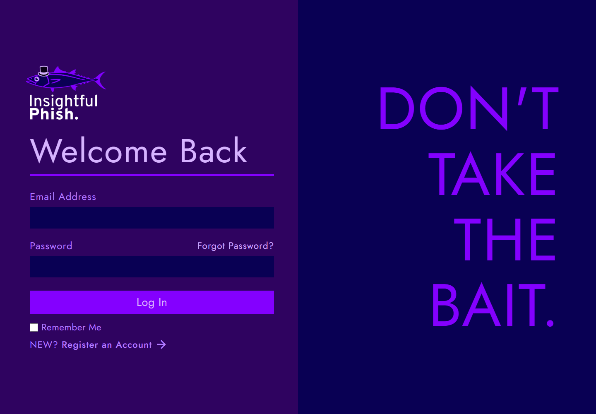

### Create An Individual Account

1. Open the registration Page.
2. Enter your first name, last name, email, password, and password confirmation.
3. Select **register**.
4. Check your email for the verification link before trying to use the account fully.

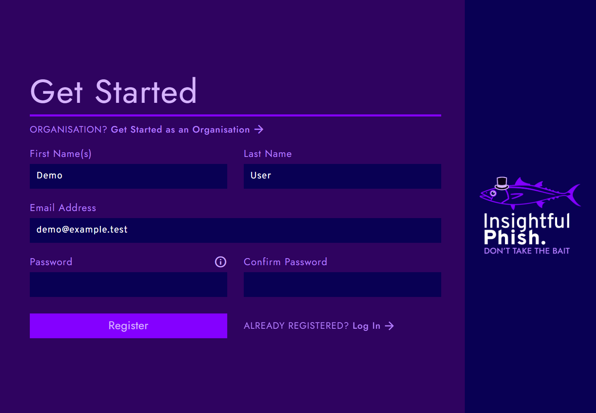

### Verify Your Email Address

1. Open the email verification link from your inbox.
2. Wait for the verification results.
3. If the link has expired and th page offers a resend action, request a new verification link.

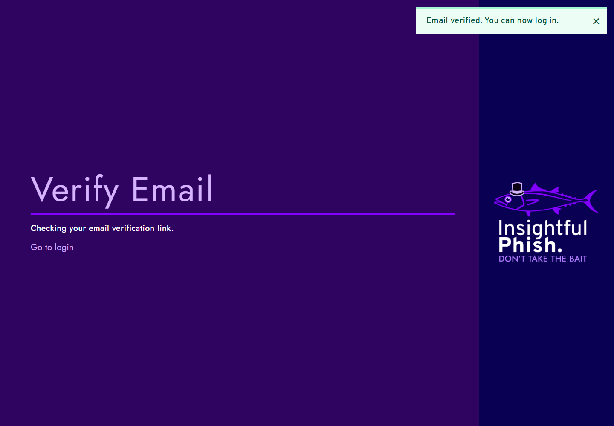

## Account and Security

This section will cover all of the security measures one can take within the application.

### Reset a forgotten Password

1. Open **Forgot Password** from the login area.
2. Enter the email address for your account.
3. Select the password reset link.
4. open the password reset link from your email.
5. Enter and confirm the new password.

### Complete an account setup from and invitation link

1. Open the setup link from the invitation link.
2. Review the role and organisation shown on the page.
3. Enter your first name, last name, password, and password confirmation.
4. Select **Complete Setup**.
5. When setup is completed, go back to loh-in and sign in.

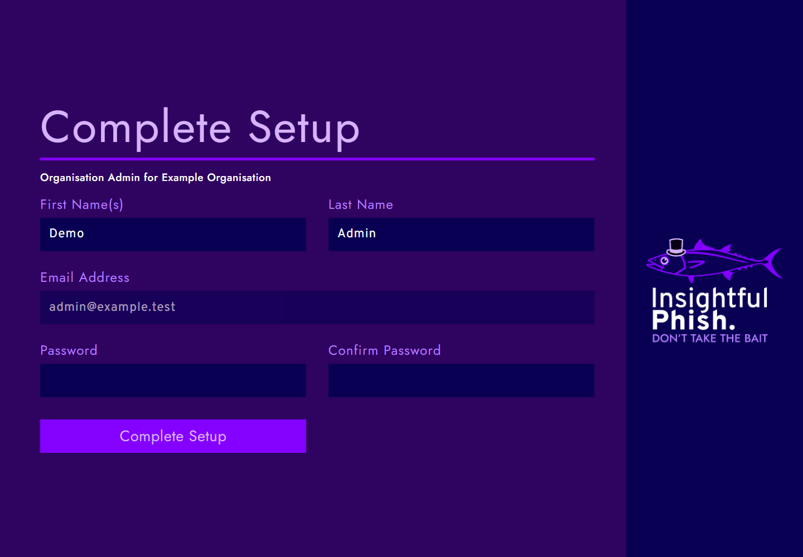

### Open account management

1. Sign in.
2. Open the account menu in the top nav.
3. Select account management.
4. Use the tabs for personal info, account settings, and sessions.

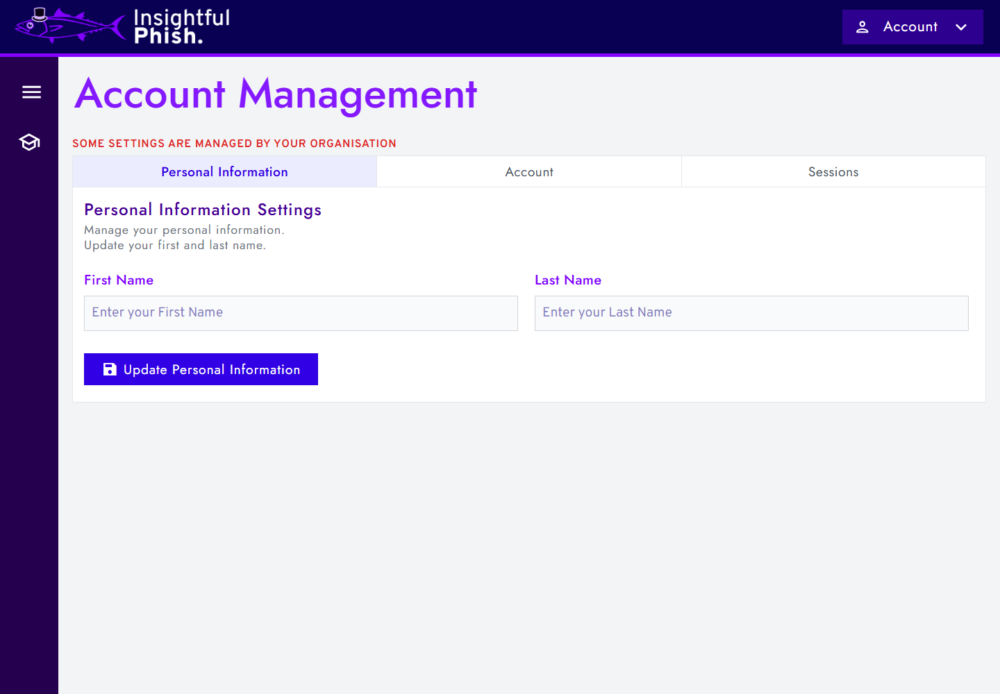

### request an email change

1. Open **Account Management**.
2. Select the **Account** tab.
3. Select **Change email**.
4. Enter the new email address, confirm it, and enter your password.
5. Submit the request and follow the verification email sent to the new address.

### Change your password

1. Open **Account Management**.
2. Select the **Account** tab.
3. Select **Change Password**.
4. Enter your current password.
5. Enter and confirm the new password.
6. Submit the change.

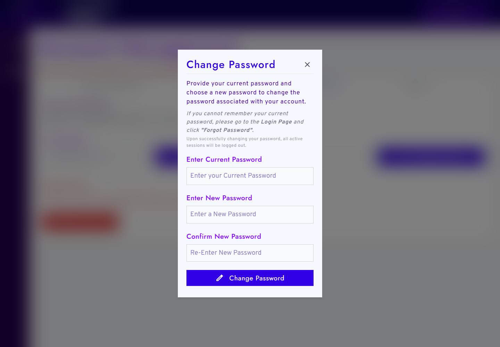

### Review Sessions

1. Open **Account Management**.
2. Select the **Sessions** tab.
3. Review the listed devices and recent activity.
4. Use the available logout actions for sessions you no longer want active.

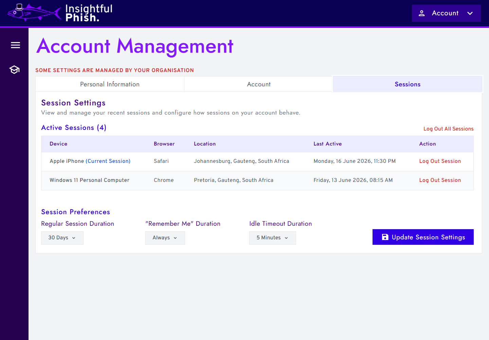

## Individual Trainee Tasks

This section will cover campaign access, training docs, quizzes, simulated inbox activity and simulated email review.

### View assigned campaigns

1. sign in as a trainee.
2. Open **Campaigns**.
3. Review each campaign card and its status.
4. Open a campaign to see the available activities.

### Read a training document

1. Open a campaign.
2. Select an available training document activity.
3. Read the content.
4. Use the page action to mark the document as complete when available.

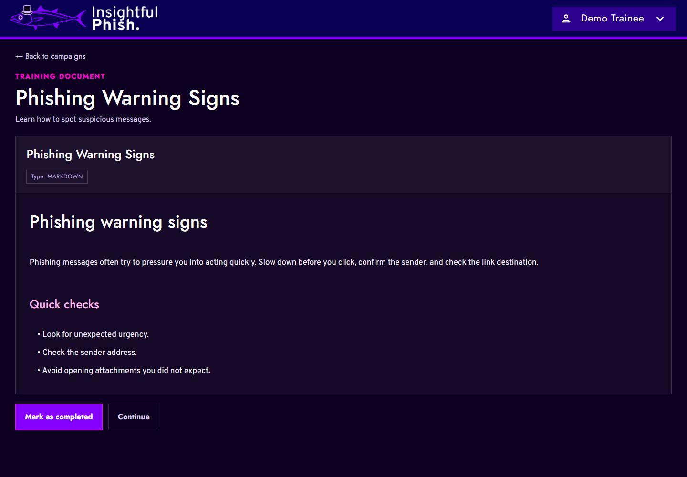

### Complete a quiz

1. Open a campaign.
2. Select an available quiz activity.
3. Answer the quiz questions.
4. submit the quiz.
5. review the results page.

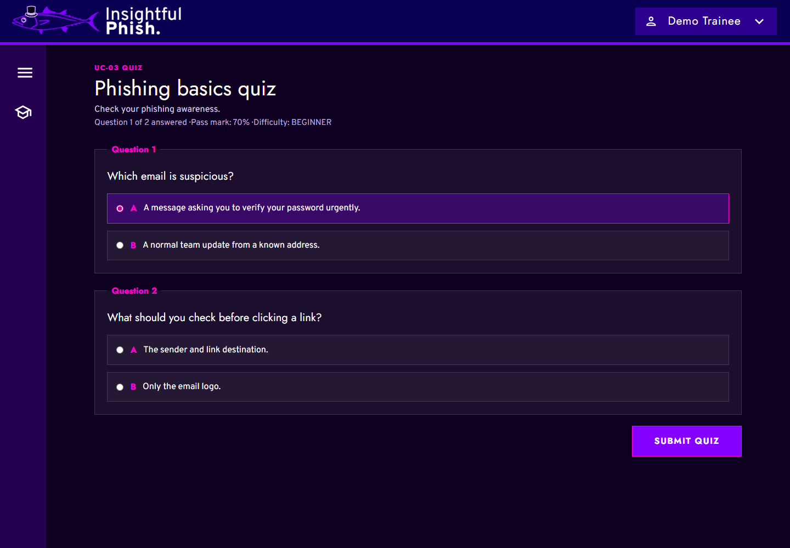

### Work through a simulated inbox

1. Open a campaign.
2. Select the simulated inbox activity.
3. Review the emails listed in the inbox.
4. Open an email to inspect the details.
5. Follow the onscreen action for the simulation.

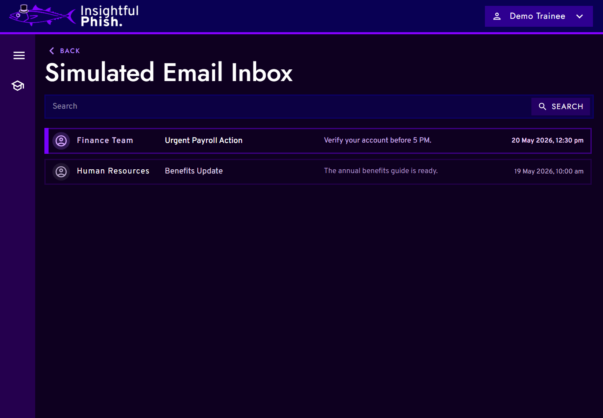
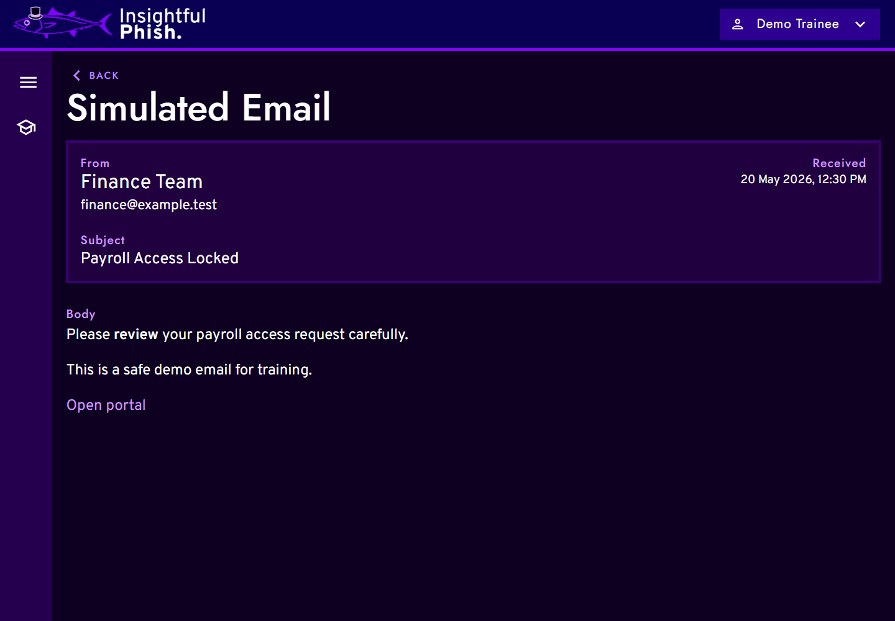

## Organisation Trainee Tasks

This section covers org setup links, accepting org related account setup, completing assigned campaign work, and using account security controls where allowed.

### Request organisation Access

1. Open the organisation registration request page.
2. Complete **Organisation information**.
3. Select **Next**.
4. Complete **Representative Information**.
5. Submit the request.
6. Wait for Platform review.

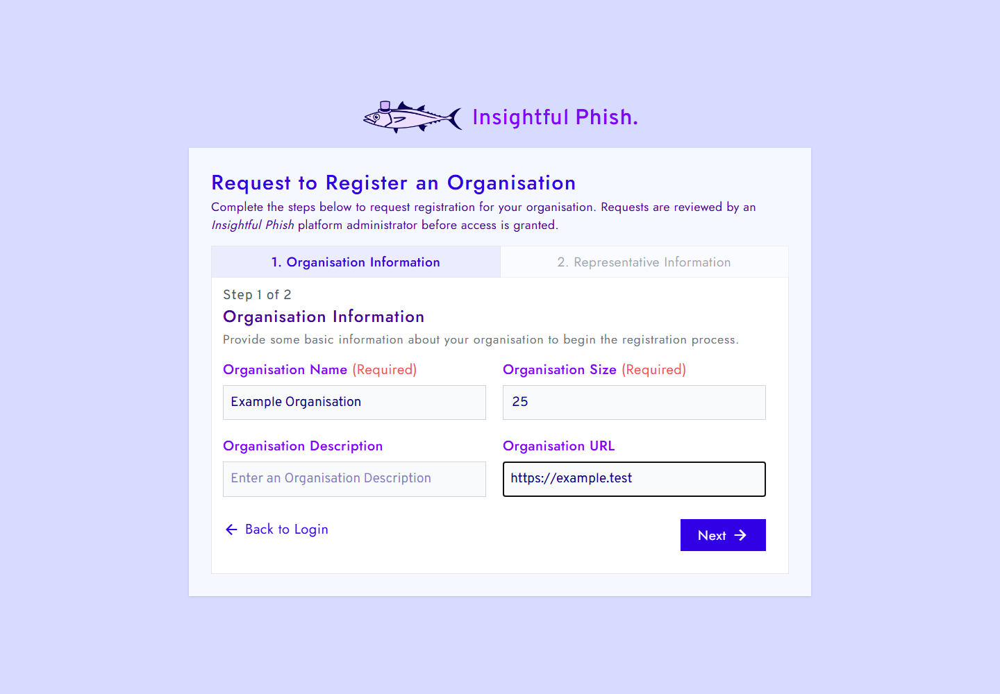
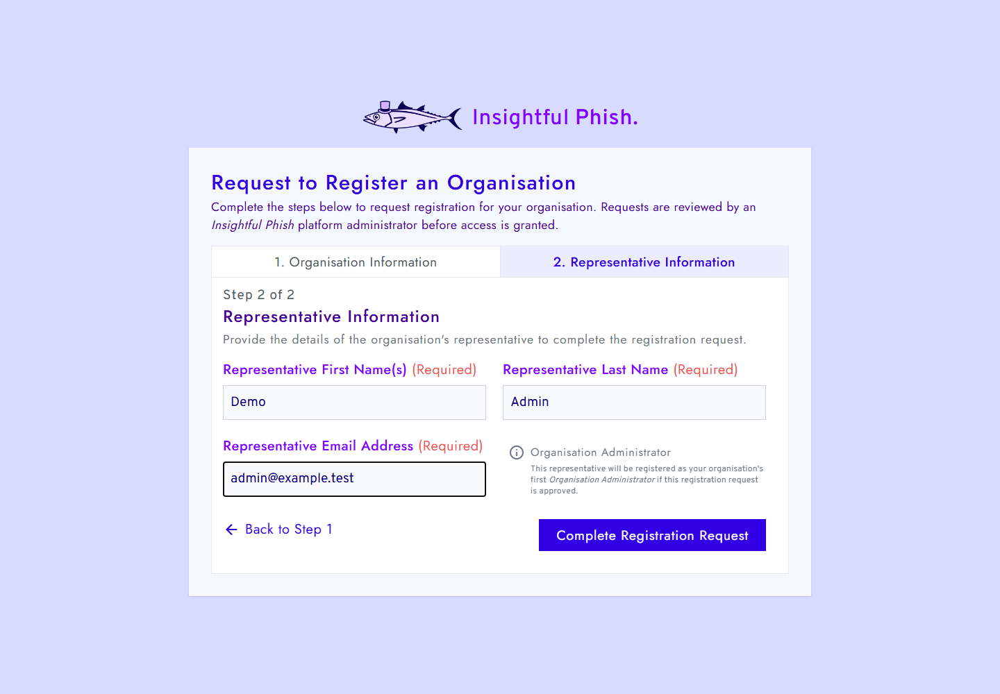
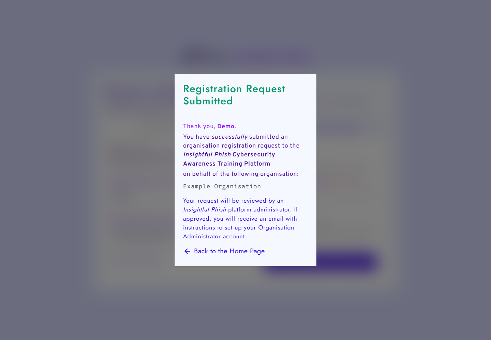

### Complete Initial Organisation Administartor Setup

1. Open the setup link from the approval email.
2. Review the organisation and role shown on the setup page.
3. Enter your name and password details.
4. Select **Complete Setup**.
5. Sign in after success message appears.

## Organisation Admin Tasks

This section covers org reg requests, initial admin setup, org information, org security preferances, trainee management and org management.

## Platform Admin Tasks

This section covers org request review, org detail review, onboarding timeline checks, setup email resend, and platform level org management screens.

## Troubleshooting

This section will mention common errors users might see and the safest way to handle them.

## Security and privacy

We will use demo accounts and non-sensitive sample data when capturing screens

## Glossary

This section explains the user facing terms used in the manual.

## Support

For demo 2 support, contact the team through the project support line or team email.
