# Insightful Phish Demo 3 Admin User Manual

## Introduction

This manual contains administration workflows for Organisation Admins and Insightful Phish Admins. It is separated from the normal Demo 3 User Manual so administrators can find role-specific management tasks without duplicating shared account guidance.

For sign-in, password, account management, session, invitation acceptance, and initial setup instructions, use the **[Demo 3 User Manual](user-manual.md)**.

Screenshots referenced in this manual are catalogued under [`user-interface/`](user-interface/README.md) and should use demo data that is safe to share.

## Contents

- [Introduction](#introduction)
- [Organisation Admin Tasks](#organisation-admin-tasks)
  - [Review Organisation Information](#review-organisation-information)
  - [Update Organisation Security Preferences](#update-organisation-security-preferences)
  - [Invite an Organisation Trainee](#invite-an-organisation-trainee)
  - [Resend a Trainee Invitation](#resend-a-trainee-invitation)
  - [Revoke a Trainee Invitation](#revoke-a-trainee-invitation)
  - [Disable an Organisation Trainee](#disable-an-organisation-trainee)
  - [Re-enable an Organisation Trainee](#re-enable-an-organisation-trainee)
  - [View Administrator Permissions](#view-administrator-permissions)
  - [Promote an Organisation Trainee](#promote-an-organisation-trainee)
  - [Edit Administrator Permissions](#edit-administrator-permissions)
  - [Remove Administrator Privileges](#remove-administrator-privileges)
  - [Browse and Open Campaigns](#browse-and-open-campaigns)
  - [Build or Edit a Campaign Draft](#build-or-edit-a-campaign-draft)
  - [Manage the Campaign Lifecycle](#manage-the-campaign-lifecycle)
  - [Assign Campaigns to Organisation Trainees](#assign-campaigns-to-organisation-trainees)
  - [Review Campaign Insights](#review-campaign-insights)
- [Insightful Phish Admin Tasks](#insightful-phish-admin-tasks)
  - [Review Organisation Requests](#review-organisation-requests)
  - [Review Request or Organisation Details](#review-request-or-organisation-details)
  - [Manage Platform Administrators](#manage-platform-administrators)
- [Shared Account and Support Guidance](#shared-account-and-support-guidance)

## Organisation Admin Tasks

Organisation Admins manage their Organisation's information, security preferences, trainees, administrators, invitations, and Campaign workflows where their permissions allow.

### Review Organisation Information

**Audience:** Organisation Admin.

**Preconditions:** you are signed in as an Organisation Admin.

**Required permission:** Organisation information must be available to your role.

**Navigation:** **Organisation Information**.

**Purpose:** review the Organisation record, representative, administrators, and lifecycle history available to your role.

1. Open **Organisation Information**.
2. Use the tabs to review basic information, representative information, administrators, and timeline details.

**Expected result:** the platform shows Organisation information available to your role.

**Note:** Organisation status and timeline entries are review information. They should not be edited from this page unless the UI provides an explicit action.

**Troubleshooting:** if a tab or value is unavailable, confirm that you are viewing your own Organisation and refresh the page. Contact an Insightful Phish Admin when the Organisation record itself needs correction.

**Screenshots:**

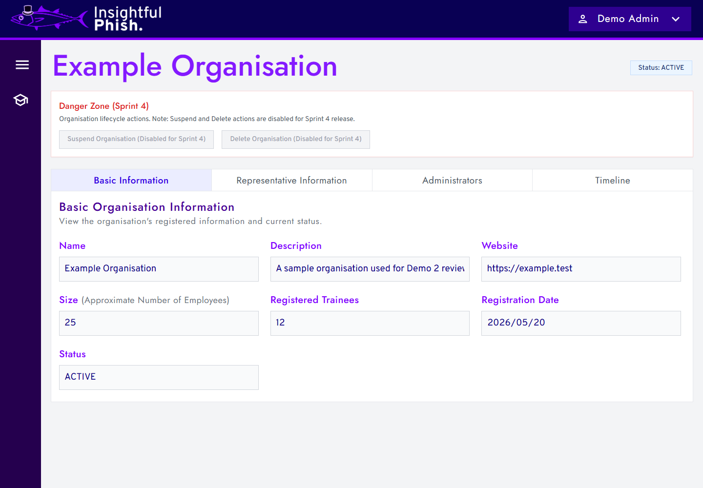
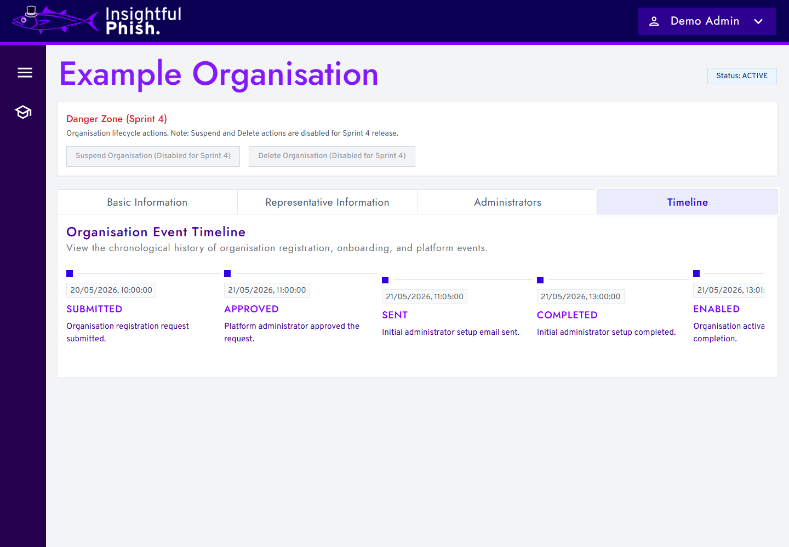

### Update Organisation Security Preferences

**Audience:** Organisation Admin.

**Preconditions:** you are signed in and the Organisation is in a state that permits security changes.

**Required permission:** the page must show Organisation security preferences as editable for your account.

**Navigation:** **Security Preferences**.

**Purpose:** configure Organisation-wide account and session policies shown by the page.

1. Open **Security Preferences**.
2. Review any read-only message at the top of the page.
3. Change only the settings that are editable for your role.
4. Select **Update Organisation Security Preferences**.
5. Check for the success or validation message.

**Expected result:** editable settings are saved, and read-only settings remain unchanged.

**Warning:** Organisation security settings can affect user sessions and account-change permissions across the Organisation.

**Troubleshooting:** if the page says settings cannot be modified because the Organisation is suspended, inactive, or disabled, resolve the Organisation status before trying to save changes.

**Screenshot:** 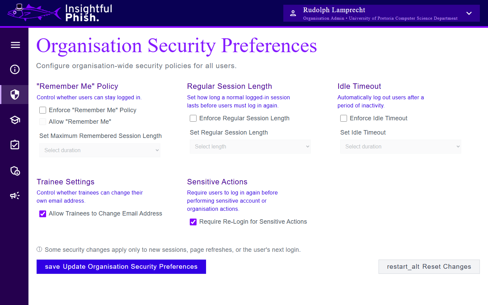

### Invite an Organisation Trainee

**Audience:** Organisation Admin.

**Preconditions:** the person is not already an active or disabled member of the Organisation, and the Organisation permits invitations.

**Required permission:** Invite Organisation Trainees.

**Navigation:** **Trainees**.

**Purpose:** send a new Organisation Trainee invitation to an eligible email address.

1. Open **Trainees**.
2. Select **Invite Trainee**.
3. Enter the trainee's email address and optional name details shown by the form.
4. Submit the invitation.
5. Check the result message before closing the modal.

**Expected result:** an actionable invitation row appears and the invitation email is queued when delivery preparation succeeds.

**Note:** a queued invitation is not proof that the email has already been delivered.

**Troubleshooting:** if the request is rejected, check whether the email belongs to an existing or disabled member, whether another actionable invitation exists, and whether the Organisation still allows invitations.

**Screenshots:**

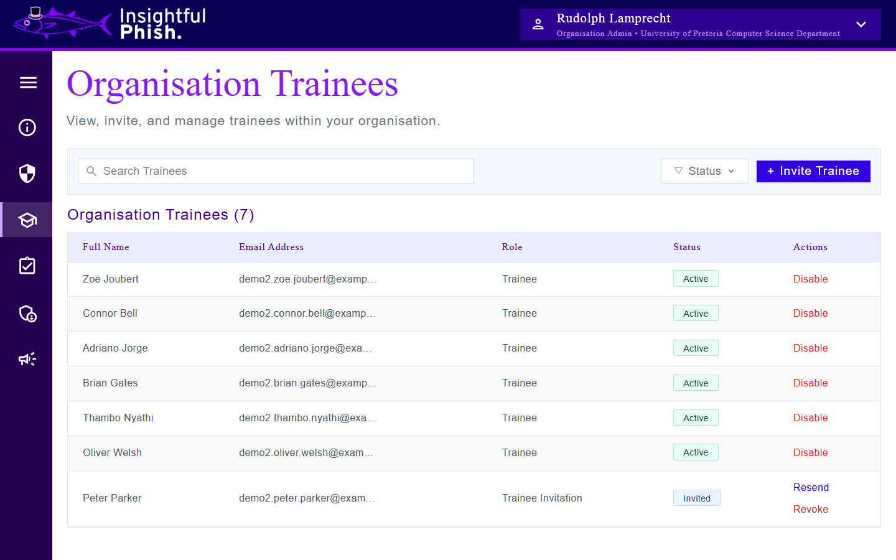
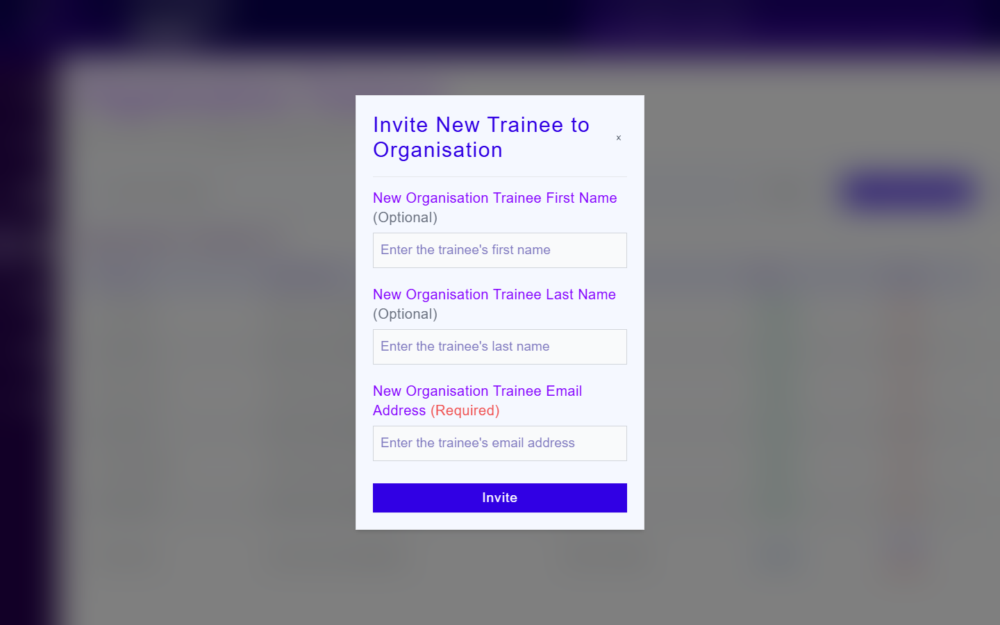

### Resend a Trainee Invitation

**Audience:** Organisation Admin.

**Preconditions:** the row represents an invitation whose current lifecycle state permits resend.

**Required permission:** Invite Organisation Trainees.

**Navigation:** **Trainees** > locate the invitation row.

**Purpose:** replace an eligible invitation link and queue a fresh invitation email.

1. Find the invitation using search or the status filter.
2. Select **Resend** from the row actions when it is available.
3. Confirm the resend action.
4. Wait for the refreshed invitation state.

**Expected result:** the previous unused link is replaced and the list refreshes with the authoritative invitation state.

**Warning:** after a successful resend, the older invitation link should no longer be used.

**Troubleshooting:** resend may be unavailable during a cooldown or after the invitation becomes terminal. Refresh the list if another administrator may have changed it.

### Revoke a Trainee Invitation

**Audience:** Organisation Admin.

**Preconditions:** the row represents an invitation that is still eligible for revocation.

**Required permission:** Invite Organisation Trainees.

**Navigation:** **Trainees** > locate the invitation row.

**Purpose:** prevent an outstanding Organisation Trainee invitation from being accepted.

1. Find the invitation.
2. Select **Revoke** from its row actions.
3. Review the confirmation dialog.
4. Select **Revoke Invitation**.

**Expected result:** the invitation becomes unusable and the management list refreshes.

**Warning:** revocation invalidates the outstanding invitation link. Send a new invitation only after confirming that access should be offered again.

**Troubleshooting:** if the invitation was already accepted, completed, revoked, or changed by another administrator, refresh the list and use the actions shown for its current state.

### Disable an Organisation Trainee

**Audience:** Organisation Admin.

**Preconditions:** the row represents an active Organisation Trainee membership that is eligible for disablement.

**Required permission:** Remove Organisation Trainees.

**Navigation:** **Trainees** > locate the active membership row.

**Purpose:** suspend the existing Organisation membership without deleting or reinviting the trainee.

1. Select **Disable** on the active trainee row.
2. Review the named trainee and the access warning.
3. Enter your current administrator password.
4. Add a reason when the form provides that option.
5. Confirm the disable action.

**Expected result:** the existing membership is marked **Disabled**, active access is revoked, and the refreshed row remains a membership rather than becoming an invitation.

**Warning:** disabling a trainee revokes their active sessions and can interrupt work in progress.

**Troubleshooting:** an incorrect password, changed membership state, insufficient permission, or inactive Organisation can prevent the action. Refresh the list before retrying a conflict.

### Re-enable an Organisation Trainee

**Audience:** Organisation Admin.

**Preconditions:** the row represents an existing disabled Organisation Trainee membership that is eligible for re-enablement.

**Required permission:** Remove Organisation Trainees.

**Navigation:** **Trainees** > locate the disabled membership row.

**Purpose:** return the existing disabled membership to active status without creating another profile or invitation.

1. Select **Re-enable** on the disabled trainee row.
2. Review the membership and session warning.
3. Enter your current administrator password.
4. Select **Re-enable Trainee**.
5. Wait for the authoritative trainee list to refresh.

**Expected result:** the same membership returns to **Active** and its current disable details are cleared.

**Warning:** previously revoked sessions are not restored. The trainee must sign in again.

**Troubleshooting:** if the membership is no longer disabled, belongs to another Organisation, or your password or permission is rejected, the action will not proceed. Refresh the list to reconcile stale state.

### View Administrator Permissions

**Audience:** Organisation Admin.

**Preconditions:** you are signed in and the administrator list is available.

**Required permission:** View Organisation Admins.

**Navigation:** **Administrators**.

**Purpose:** inspect the permissions currently assigned to an Organisation Admin.

1. Open **Administrators**.
2. Search for the administrator when necessary.
3. Select **View Permissions** on the row.
4. Review the displayed permission names.

**Expected result:** the page shows the administrator's current permissions without changing them.

**Troubleshooting:** if the page or action is unavailable, confirm your view permission and Organisation context, then refresh the list.

### Promote an Organisation Trainee

**Audience:** Organisation Admin.

**Preconditions:** the target email belongs to an active Organisation Trainee in the same Organisation, and no active administrator membership or pending promotion already exists for that user.

**Required permission:** Invite Organisation Admins.

**Navigation:** **Administrators**.

**Purpose:** offer an existing Organisation Trainee an Organisation Admin role with a selected permission set.

1. Open **Administrators**.
2. Open the administrator promotion form.
3. Enter the existing trainee's email address.
4. Select at least one appropriate permission.
5. Submit the promotion.
6. Ask the trainee to review and accept the role-change invitation sent to their email address.

**Expected result:** a promotion invitation is created for the existing trainee. The user becomes an Organisation Admin only after completing the supported acceptance flow.

**Warning:** this workflow grants administrative access. Confirm the trainee's identity and select only the permissions required for their responsibilities.

**Troubleshooting:** the promotion is rejected when the email is not an active trainee in the Organisation, the user is already an active admin, or a promotion is already pending. Refresh the list before retrying stale state.

### Edit Administrator Permissions

**Audience:** Organisation Admin.

**Preconditions:** the target is an active Organisation Admin whose permissions your account is allowed to change.

**Required permission:** Change Organisation Admin Permissions.

**Navigation:** **Administrators** > locate the administrator row.

**Purpose:** adjust the administrator's Organisation permissions without changing their account identity.

1. Select **Edit Permissions**.
2. Review the administrator named in the modal.
3. Select or clear permissions according to the person's responsibilities.
4. Select **Save Permissions**.

**Expected result:** the updated authoritative permission set appears in the administrator list.

**Warning:** permissions can grant access to security settings, people management, and Campaign workflows. Do not grant broader access than the role requires.

**Troubleshooting:** protected or critical permission rules may prevent an invalid change. Refresh the list if the administrator or your own permissions changed while the modal was open.

### Remove Administrator Privileges

**Audience:** Organisation Admin.

**Preconditions:** the target is an Organisation Admin eligible for removal and is not protected by the current Organisation administration rules.

**Required permission:** Remove Organisation Admins.

**Navigation:** **Administrators** > locate the administrator row.

**Purpose:** remove Organisation Admin access from the selected user through the supported lifecycle operation.

1. Select **Remove** on the administrator row.
2. Review the named administrator and destructive-action warning.
3. Enter your current administrator password.
4. Type `REMOVE` exactly in the confirmation field.
5. Confirm the removal.

**Expected result:** the administrator privileges are removed and the authoritative administrator list refreshes.

**Warning:** this is a security-sensitive access change and can revoke the person's administrative sessions. Confirm the correct person before continuing.

**Troubleshooting:** removal can fail when the password is wrong, the target or Organisation state changed, the target is protected, or your permission is no longer valid. Refresh before retrying a conflict.

**Screenshots:**

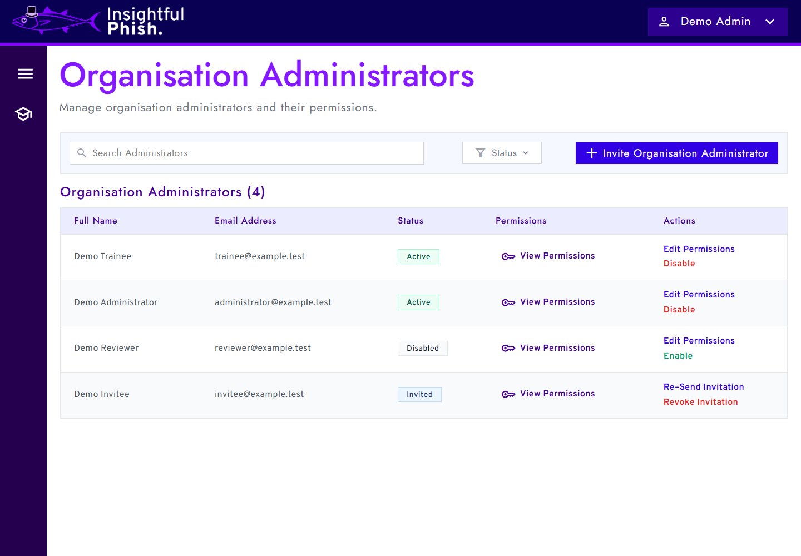
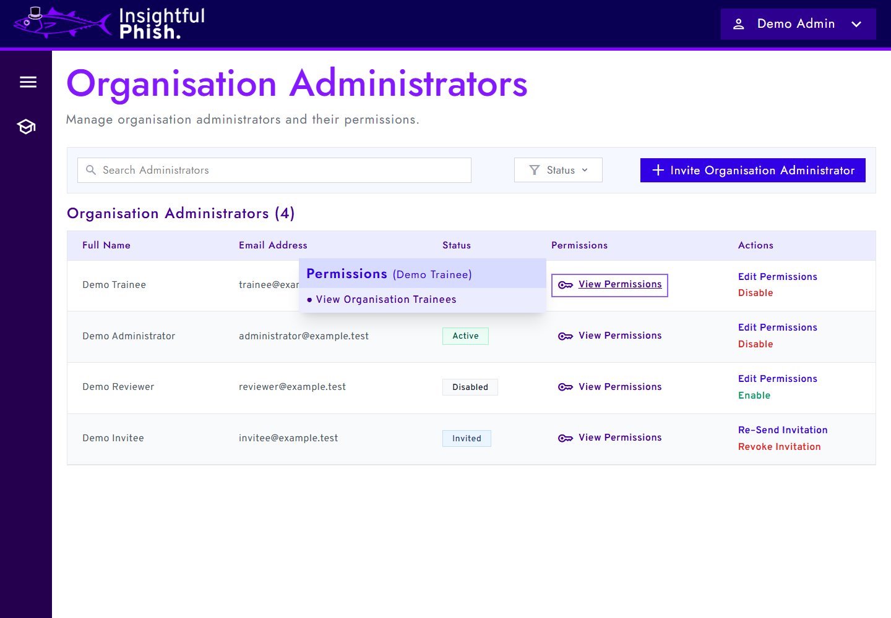

### Browse and Open Campaigns

**Audience:** Organisation Admins and Insightful Phish Admins.

**Preconditions:** you are signed in and Campaign management is available to your role.

**Required permission:** Organisation Admins require Campaign viewing or management permission. Insightful Phish Admins use their platform Campaign access.

**Navigation:** Organisation Admins select **Campaigns** for their Organisation. Insightful Phish Admins select **Campaigns** to open **Platform Campaigns**.

**Purpose:** find Campaigns, review their lifecycle state, and open the appropriate read-only or editing view.

1. Open **Campaigns** or **Platform Campaigns** from the signed-in navigation.
2. Use **Search campaigns** or **Campaign status** to narrow the list.
3. Move between result pages when pagination controls are available.
4. Select **View Campaign** for an active or archived Campaign.
5. For a draft, select **Continue Editing** when you can manage it or **View Draft** when you have view-only access.
6. Select **Create Campaign** when the action is available and you need a new draft.

**Expected result:** the selected Campaign opens in the builder or read-only detail view appropriate to its lifecycle state and your permissions.

**Note:** Organisation Campaigns belong to the signed-in Organisation. Platform Campaigns are managed from the platform Campaign list and do not use an Organisation URL or Organisation schedule.

**Troubleshooting:** if the Campaign entry or **Create Campaign** action is missing, check your role and Campaign permissions. Clear search or status filters if an expected Campaign is absent, then refresh the list.

### Build or Edit a Campaign Draft

**Audience:** Organisation Admins with Campaign management permission and Insightful Phish Admins managing Platform Campaigns.

**Preconditions:** you can open **Create Campaign** or **Continue Editing**, and the Campaign is a draft that permits editing.

**Required permission:** Organisation Admins require Manage Campaigns. Insightful Phish Admins use platform Campaign management access.

**Navigation:** **Campaigns** or **Platform Campaigns** > **Create Campaign** or **Continue Editing**.

**Purpose:** define Campaign details and arrange the training activities participants will complete.

1. Enter the required **Campaign name** and an optional description.
2. Select the Campaign colour.
3. For an Organisation Campaign, set the **Start date and time** and **End date and time**. The end must be after the start.
4. Find available training content under **Campaign Items** and add the items needed for the Campaign.
5. Use **Move up** and **Move down** to place the items in the intended order.
6. Set each item's requirement to **Required** or **Optional**.
7. Use **Remove** to take an unwanted item out of the draft.
8. Review the Campaign summary.
9. Select **Save Draft** for a new Campaign or **Save Changes** for an existing draft.

**Expected result:** the saved draft retains its details, Organisation schedule where applicable, ordered items, and required or optional settings.

**Warning:** removing an item or changing its order can alter the intended training sequence. Review the full item order before saving.

**Troubleshooting:** if saving is unavailable, enter a Campaign name, correct invalid Organisation dates, and wait for any current save to finish. If an item reports that its source is unavailable, remove or replace it before activation.

### Manage the Campaign Lifecycle

**Audience:** Organisation Admins with Campaign management permission and Insightful Phish Admins managing Platform Campaigns.

**Preconditions:** the Campaign has been saved and its current state permits the requested lifecycle action.

**Required permission:** Organisation Admins require Manage Campaigns. Insightful Phish Admins use platform Campaign management access.

**Navigation:** **Campaigns** or **Platform Campaigns** > open the Campaign.

**Purpose:** move a Campaign between draft, active, and archived states through the actions allowed by its current state.

#### Activate a Campaign

1. Open a saved draft using **Continue Editing**.
2. Confirm that it contains at least one available Campaign item.
3. Save any unsaved changes.
4. Select **Activate Campaign**.
5. Review the confirmation and select **Activate Campaign** again.

**Expected result:** the Campaign becomes **Active** and its detail page shows the actions available for an active Campaign.

**Warning:** activation can make an Organisation Campaign available for assignment or participation. Confirm its content, item order, and Organisation schedule before proceeding.

#### Archive a Campaign

1. Open an active Campaign using **View Campaign**.
2. Select **Archive Campaign**.
3. Review the confirmation and confirm the archive action.

**Expected result:** the Campaign becomes **Archived** and is no longer treated as active.

**Warning:** archiving changes Campaign availability. Check its current use before confirming.

#### Reactivate a Campaign

1. Find the Campaign using the **Archived** status filter when necessary.
2. Open it using **View Campaign**.
3. Select **Reactivate Campaign**.
4. Review the confirmation and confirm reactivation.

**Expected result:** the Campaign returns to **Active** when the transition remains valid.

**Warning:** reactivation makes the Campaign active again. Review its content and Organisation schedule, where applicable, before confirming.

**Troubleshooting:** a lifecycle action may be hidden or disabled when your permission changed, the Campaign is in a different state, source content is unavailable, the draft has no items, or edits remain unsaved. Refresh the detail page and follow the reason shown near the action.

### Assign Campaigns to Organisation Trainees

**Audience:** Organisation Admins.

**Preconditions:** the Organisation has at least one eligible active Organisation Trainee and at least one assignable active Campaign.

**Required permission:** Assign Campaigns.

**Navigation:** select **Assign Training Campaigns** from the Organisation Admin navigation.

**Purpose:** assign one or more active Campaigns to eligible Organisation Trainees through a reviewed batch operation.

1. On **1. Organisation Trainee Selection**, use search and pagination to find eligible trainees.
2. Select each trainee who should receive the Campaigns, then select **Continue**.
3. On **2. Training Campaign Selection**, review each Campaign's current assignment count and select the active Campaigns to assign.
4. Select **Continue**.
5. On **3. Review Assignment**, confirm the selected trainees, selected Campaigns, and calculated total number of assignments.
6. Select **Complete Assignment**.
7. In **Confirm Campaign Assignment**, check the trainee, Campaign, and total assignment counts, then select **Confirm Assignment**.
8. Review the result message showing how many assignments were created and how many requested combinations were already assigned.

**Expected result:** new trainee-and-Campaign combinations are created. Existing assignments are reported as already assigned and their progress is not reset.

**Warning:** assignment gives the selected trainees access to Campaign content. Review both lists and the total assignment count before confirming. Leaving the flow discards unsubmitted selections when you confirm that you want to leave.

**Troubleshooting:**

- If no trainees or Campaigns appear, clear the search, check other result pages, and confirm that eligible active records exist.
- If a selected trainee becomes disabled or unavailable, the flow returns to trainee selection so you can refresh the choice.
- If a selected Campaign becomes inactive or unavailable, the flow returns to Campaign selection.
- If the result reports already-assigned combinations, no duplicate assignment is created; review only the newly created count.
- If the action is absent, confirm that your role still has Assign Campaigns permission.

### Review Campaign Insights

**Audience:** Organisation Admins with Campaign visibility permission.

**Preconditions:** the Organisation Campaign is active or otherwise exposes its insights action, and Campaign statistics are available to your role.

**Required permission:** View Campaigns or Manage Campaigns. Unassignment additionally requires Assign Campaigns and row-level action eligibility.

**Navigation:** **Campaigns** > **View Campaign** > **View Assigned Trainees & Insights**.

**Purpose:** review Campaign participation and progress, then remove an assignment when the permitted destructive action is necessary.

1. Open the Organisation Campaign from **Campaigns**.
2. Select **View Assigned Trainees & Insights**.
3. Review the Campaign identity, status, duration, type, owner, and description.
4. Review the summary values for **Assigned**, **Started**, **Completed**, **Progression**, and **Quiz Average**.
5. Use the **Assigned Trainees** table to compare each trainee's progress percentage, completed item count, quiz average, and status.
6. Use the table pagination when more assigned trainees are available.
7. Select **Back to Campaign** when you have finished reviewing the insights.

**Expected result:** the page shows authoritative Campaign summary metrics and the current paginated trainee progress rows. A missing quiz average is shown as unavailable rather than as a calculated score.

#### Unassign a Trainee

1. Find the trainee in the **Assigned Trainees** table.
2. Select **Unassign** when the row offers the action.
3. In **Unassign Trainee from Campaign**, verify the trainee and Campaign names.
4. Select **Unassign**, or select **Keep Assigned** to cancel.
5. Wait for the insights and trainee table to refresh.

**Expected result:** the selected assignment is removed and the summary metrics and trainee list are reloaded from the platform.

**Warning:** unassigning a trainee permanently removes that trainee's progress for the Campaign. This cannot be treated as a temporary pause. Confirm the correct trainee and Campaign before proceeding.

**Troubleshooting:** use **Retry Statistics** after a retryable loading failure. If **Unassign** is absent, the assignment or your permission does not allow it. If another administrator changed the assignment, refresh the insights before trying again. Wait before retrying when the page reports too many requests.

## Insightful Phish Admin Tasks

Insightful Phish Admins, also referred to as Platform Administrators in some interface areas, review Organisation registration requests and manage platform-level Organisation records.

### Review Organisation Requests

**Audience:** Insightful Phish Admin.

**Preconditions:** you are signed in with Insightful Phish Admin access.

**Navigation:** **Organisation Management**.

1. Open **Organisation Management**.
2. Use the search field and filters to find a request.
3. Select **Review Request** when the request is pending.
4. Review the request details before taking an approval or rejection action.

**Expected result:** the platform lets you approve, reject, or leave the request unchanged according to its current state.

**Warning:** approval can trigger the initial Organisation Admin setup process. Rejection should be used only after checking the request details.

**Available actions:**

- Use **Review Request** to inspect a pending request before deciding.
- Use **Mark As Contacted** when the representative has been contacted outside the platform.
- Use **Approve Request** only after checking the Organisation and representative information.
- Use **Reject Request** with a clear reason when the request should not continue.
- Use **Delete Request** only when the page offers it and the request should be removed from the active review queue.

**Troubleshooting:** if a request cannot be loaded or updated, close the modal, refresh the list, and check whether another admin has already changed the request.

**Screenshots:**

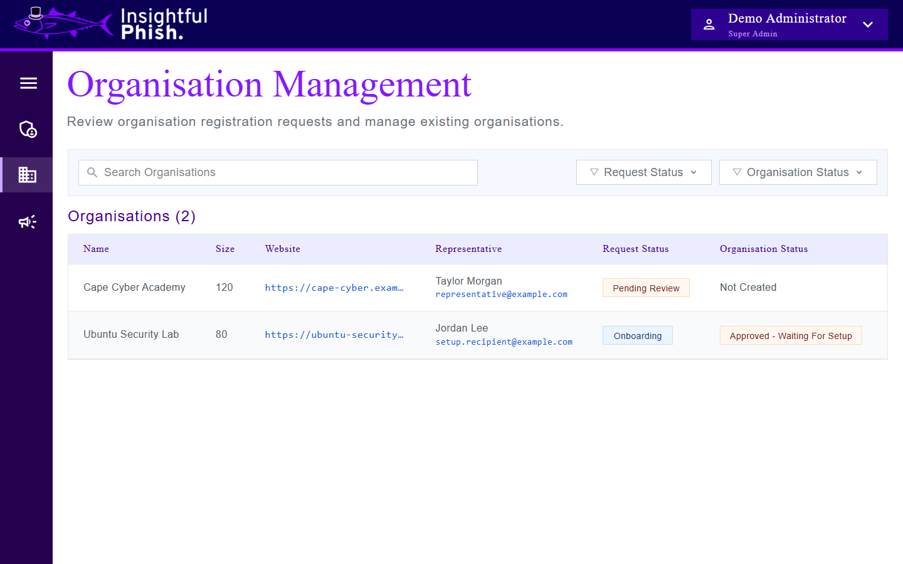
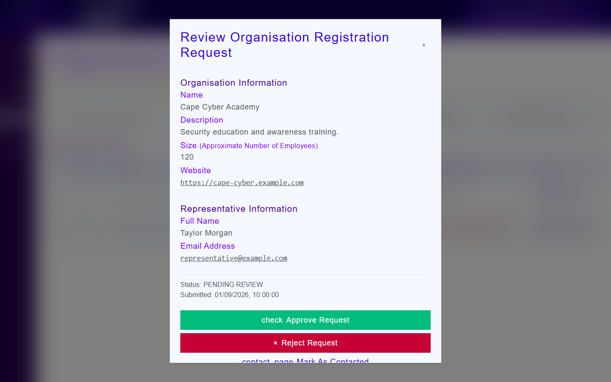

### Review Request or Organisation Details

**Audience:** Insightful Phish Admin.

**Preconditions:** you are signed in with Insightful Phish Admin access and have opened a reachable request or Organisation detail page from the UI.

**Navigation:** **Organisation Management** > request or Organisation details.

1. Open the request or Organisation detail page from **Organisation Management**.
2. Review basic information and representative information.
3. Open the timeline tab to confirm the onboarding history.
4. Use the resend setup action only when the page shows that resend is available.

**Expected result:** the platform shows the detail record, lifecycle state, timeline, and safe actions for the selected request or Organisation.

**Warning:** setup email resend actions are security-sensitive. Do not expose private email addresses or setup links in screenshots.

**Troubleshooting:** if the setup email could not be queued during approval, open the Organisation detail page and use the resend action only when the page shows that it is available.

**Screenshots:**

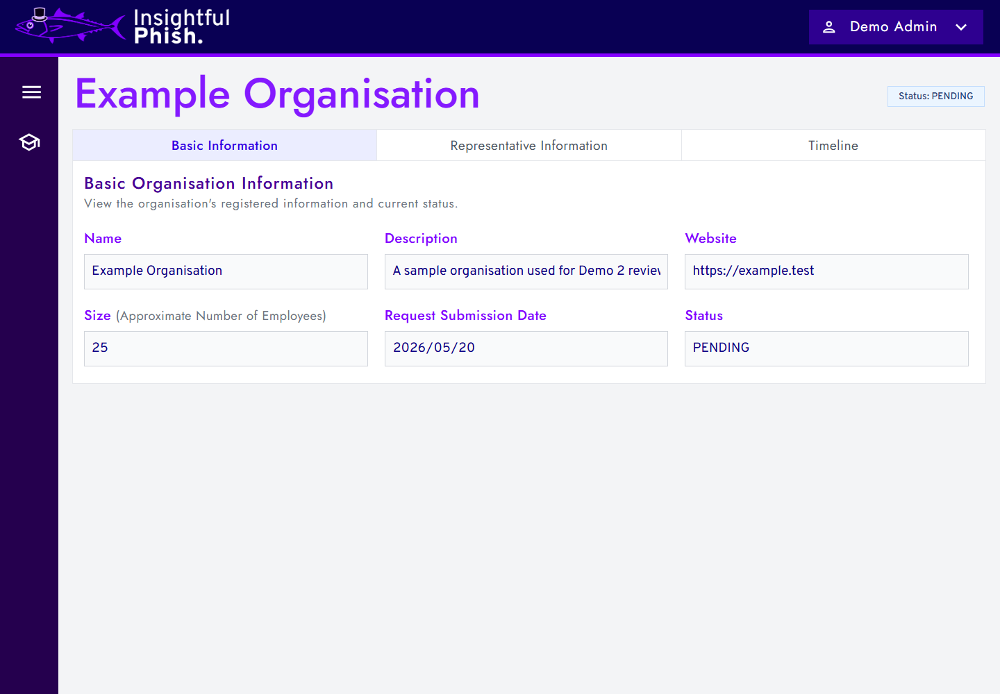

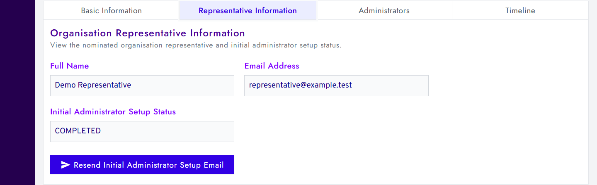

### Manage Platform Administrators

**Audience:** Insightful Phish Admins with access to Platform Administrator management.

**Preconditions:** you are signed in as an Insightful Phish Admin. Some actions, such as inviting a Platform Administrator or transferring the Super Platform Administrator role, may require elevated platform privileges.

**Navigation:** **Platform Administrators**.

1. Open **Platform Administrators**.
2. Use the search field or status filters such as **Active**, **Invited**, **Disabled**, or **Failed Invitation** to find an administrator.
3. Use **Invite Platform Administrator** when the button is available and a new administrator needs access.
4. For invited administrators, use resend or revoke actions only when the row shows that the invitation is still actionable.
5. Use **Demote Administrator Role**, **Disable Administrator**, **Re-Enable**, or **Transfer Super Administrator Role** only when the UI shows that the action is allowed.
6. Review the confirmation dialog before completing any role or status change.

**Expected result:** the platform updates the administrator list or invitation state and shows the changed status.

**Warning:** Platform Administrator actions can change who controls Organisation approvals and platform-level records. Transfer and demotion actions should be reviewed carefully before confirmation.

**Troubleshooting:** if an action is hidden or unavailable, your current platform role may not allow it, the administrator may be in the wrong lifecycle state, or the list may need to be refreshed.

## Shared Account and Support Guidance

Administrators use the same account, password, email, session, security, troubleshooting, and privacy workflows as other users. See the **[Demo 3 User Manual](user-manual.md)** for those shared instructions and for Organisation registration and initial Organisation Admin setup.

---

Previous section: [Demo 3 User Manual](user-manual.md)

Next section: [User Interface Screenshot Catalogue](user-interface/README.md)
