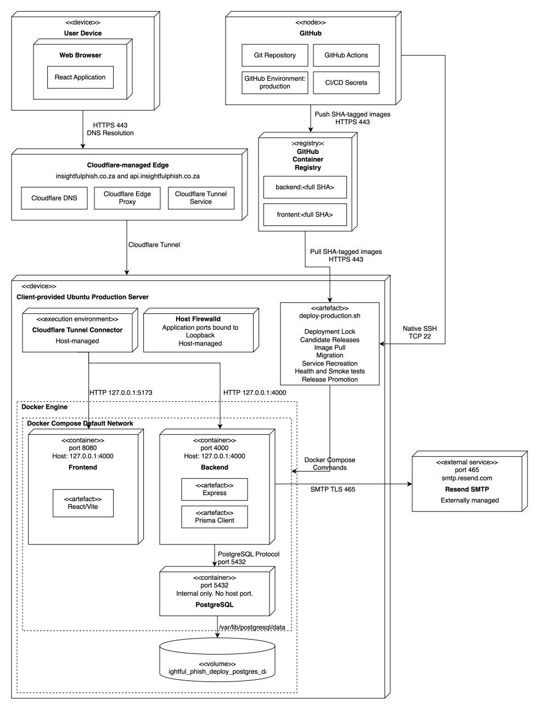
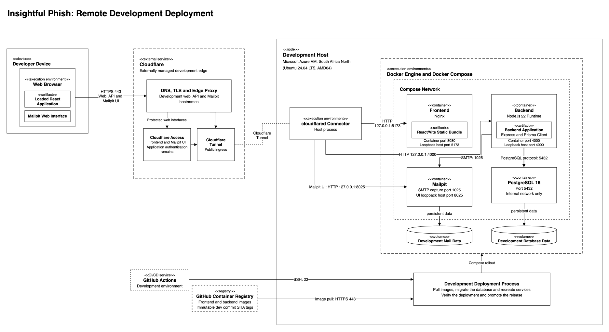

# Deployment and Operations

This section provides a view of the Insightful Phish deployments and CI/CD processes.

## SAS Content

- [0. Home](README.md)
- [1. Introductions](introduction.md)
- [2. Architectural Requirements](architectural-requirements.md)
- [3. Architecture Overview](architecture-overview.md)
- [4. Architectural Patterns](architectural-patterns.md)
- [5. Design Patterns](design-patterns.md)
- [6. Quality to Architecture Mapping](quality-architecture-mapping.md)
- [7. Technology Requirements](technology-requirements.md)
- [8. API Contracts](api-contracts.md)
- **[9. Deployment and Operations](#9-deployment-and-operations)** &larr; _You are here_
  - [9.1 Purpose](#91-purpose)
  - [9.2 Environment Separations](#92-environment-separation)
    - [Production Environment](#production-environment)
    - [Development Environment](#development-environment)
    - [CI/CD Workflow Separation](#cicd-workflow-separation)
  - [9.3 Deployment Diagrams](#93-deployment-diagrams)
    - [9.3.1 Production Deployment](#931-production-deployment)
    - [9.3.2 Development Deployment](#932-development-deployment)
    - [9.3.3 CI/CD Pipeline](#933-cicd-pipeline)
  - [9.4 Deployment Failure Behaviour](#94-deployment-failure-behaviour)
  - [9.5 Rollback Strategy](#95-rollback-strategy)
  - [9.6 Production Host Bootstrap](#96-production-host-bootstrap)
- [10. Changelog](changelog.md)

---

## 9. Deployment and Operations

### 9.1 Purpose

Insightful Phish has distinct production and development environments. Production is hosted on an Ubuntu Server which was supplied by our client, while Development is hosted on a separate ARM64 Ubuntu Virtual machine in Microsoft Azure.

Both environments use Docker Engine and Docker Compose to run the application. Application HTTP traffic reaches each host through a separate Cloudflare Tunnel. Github Actions uses native SSH to invoke a restricted deployment wrapper on the appropriate host. Deployment SSH does not pass through the Cloudflare Tunnel.

Backend and Frontend container images are built and published by the separate Continuous Deployment workflow, after Continuous Integration succeeded for the exact deployment commit. Images are stored in the Github Container Registry (GHCR). Each environment uses immutable image tags derived from the full Git commit SHA. Production uses `<full SHA>` tags, while development uses `dev-<full SHA>` tags.

### 9.2 Environment Separation

Production and Development are completely separate. They do not share deployment destinations, Github Environments, SSH credentials, secrets, databases, volumes or release records. A development deployment cannot update the production application or its deployment state.

#### Production Environment

The Production frontend is publicly available at [insightfulphish.co.za](https://insightfulphish.co.za), and the Production API is available at [api.insightfulphish.co.za](https://api.insightfulphish.co.za).

Production becomes eligible after a push to `main` completes Continuous Integration successfully. The completed CI run triggers Continuous Deployment for that exact commit SHA, which publishes the following images to GHCR:

- `backend:<full SHA>`
- `frontend:<full SHA>`

The production frontend is built with `https://api.insightfulphish.co.za` as its `VITE_API_BASE_URL`. This is build-time configuration compiled into the frontend image rather than a runtime environment variable.

Continuous Deployment invokes production deployment only when `PRODUCTION_DEPLOY_ENABLED` is `true`. The deployment job uses the GitHub Environment named `production` and the concurrency group `insightfulphish-production`. Once a production deployment starts, a newer workflow run does not cancel it.

#### Development Environment

The Development frontend is publicly available at [dev.insightfulphish.co.za](https://dev.insightfulphish.co.za), and the Development API is available at [api-dev.insightfulphish.co.za](https://api-dev.insightfulphish.co.za). Captured development emails can be viewed using the Mailpit UI at [mail-dev.insightfulphish.co.za](https://mail-dev.insightfulphish.co.za)

The Development frontend and Mailpit UI are protected by Cloudflare Access. To gain access to these Development environment pages, use your email address. If you are allowed to access the development environment, you will receive an OTP and can use that to gain access to the Development pages.

Development becomes eligible after a push to `dev` completes Continuous Integration successfully. The completed CI run triggers Continuous Deployment for that exact commit SHA, which publishes AMD64 images to GHCR using these tags:

- `backend:dev-<full SHA>`
- `frontend:dev-<full SHA>`

The development frontend is built with the repository variable `DEVELOPMENT_FRONTEND_API_URL`, whose deployed value is `https://api-dev.insightfulphish.co.za`. Because this URL is compiled into the frontend image, the `dev-` tag prefix prevents development frontend content from overwriting a production image created from the same Git commit.

Continuous Deployment invokes development deployment only when `DEVELOPMENT_DEPLOY_ENABLED` is `true`. The deployment job uses the GitHub Environment named `development` and the concurrency group `insightfulphish-development`. Once a development deployment starts, a newer workflow run does not cancel it.

#### CI/CD Workflow Separation

Pull Requests to `dev` and `main` run Continuous Integration and Policy independently. Pull Requests stop after validation and cannot publish images, request a deployment environment, access deployment SSH credentials or invoke a deployment wrapper.

Continuous Integration owns formatting, linting, typechecking, unit tests, integration tests, application builds and deployment-configuration validation. Policy independently checks forbidden environment files and frozen Demo documentation directories. Policy reports its result separately and does not form part of the Continuous Deployment eligibility gate.

A completed Continuous Integration run triggers Continuous Deployment. Before publication, the deployment eligibility job checks that the triggering workflow is Continuous Integration, that the triggering event was a push, and that the branch is either `dev` or `main`. It also checks that Continuous Integration succeeded and that the target SHA is valid. A failed, cancelled, manually triggered, branch mismatched or invalid CI result cannot publish or deploy.

Once Continuous Deployment has verified that eligibility has succeeded correctly, it will check out the `head_sha` reported by the Continuous Integration run. It builds each multi-stage Docker image once, publishes the environment specific SHA tag to GHCR and passes the same SHA to the appropriate remote deployment wrapper. The deployment host pulls the published image and does not rebuild it.

### 9.3 Deployment Diagrams

#### 9.3.1 Production Deployment



_Figure 9.1: Production Deployment on client provided server architecture._

To view the full rendered version of the diagram, click [here](../diagrams/sas/production-deployment-diagram.drawio.svg).

#### 9.3.2 Development Deployment



_Figure 9.2: Development Deployment on Microsoft Azure Ubuntu VM._

To view the full rendered version of the diagram, click [here](../diagrams/sas/development-deployment-diagram.drawio.svg).

#### 9.3.3 CI/CD Pipeline


_Figure 9.3: Continuous-integration and for both development and production for Insightful Phish._

To view the full rendered version of the diagram, click [here](../diagrams/sas/cicd-diagram.drawio.svg).

### 9.4 Deployment Failure Behaviour

Production and Development use the same guarded deployment implementation with an allow-listed target, separate application directory, Compose config, image-tag format and deployment locks. Before modifying the application, the script validates the target and the 40 character SHA, verifies the required files and runtime environment, creates a candidate release file, validates the rendered Compose config, pulls the immutable images and applies Prisma migrations.

After migration, the script recreates the application services, waits for the backend and frontend container health checks, and performs host-level HTTP smoke tests. Development additionally verifies that the backend can connect to Mailpit at `mailpit:1025`.

If candidate recreation or health verifications fail, the script recreates the previous backend and frontend images using the unchaged successful `release.env`. It then repeats the container and HTTP health checks against the restored application. The candidate remains unsuccessful and the deployment returns a non-zero status even when restoration succeeds.

The automatic system recovery does not reverse Prisma migration, restore database data or reset PostgreSQL volums. Because of this, automatic deployment requires that every migration be backward-compatible with the immediately previous application release.

Both `Production` and `Development` use this failure behaviour.

### 9.5 Rollback Strategy

The deployment script records the Git commit SHAs of the current and previous successful releases in:

- `deploy/releases/current`
- `deploy/releases/previous`

Successful deployments are also appended to `deploy/releases/deployment-history.log`.

If a candidate release fails, it does not replace the successful `current`, `previous` or `release.env` state. The deployment history records candidate start, candidate failure, restoration start, restoration result and successful candidate promotion without recording runtime secrets. Automatic recovery restores only the previous application containers. It does not reverse database migrations. Because of this, all database migrations must be backward compatible.

Both `Production` and `Development` use this rollback strategy.

### 9.6 Production Host Bootstrap

We provide a bootstrap setup script, `bootstrap-production-host.sh` to allow easy setup of the production environment on a new server.

Production host setup starts when Southern Cross Solutions supplies an Ubuntu 22.04 TLS AMD64 server with administrator SSH access. In theory, another server or host with the same operating system, architecture and access would probably also work.

Infrastructure provisioning, networking, DNS and Cloudflare account setup is client-controlled and assumed set up. It is not part of the bootstrap setup.

To start the host bootstrap on the server, do the following:

1. Ensure that you are on the server with an account that has administrator access
2. Clone our repository to an appropriate location using

```bash
git clone https://github.com/COS301-SE-2026/Cybersecurity-Awareness-Training-Platform
cd Cybersecurity-Awareness-Training-Platform
git switch main
```

1. Run the provided bootstrapping script using

```bash
sudo ./deploy/bootstrap-production-host.sh
```

The boostrap does NOT create or store any credentials. Ensure you do the following before assuming that the host is properly set up:

- Add the CI Deployment public key to `/home/insightful-deploy/.ssh/authorized_keys`
- Create `/var/www/insightfulphish/app/deploy/.env` from `deploy/.env.example`. It should by owned by root with mode 600
- Authenticate root to GHCR to ensure that it can reach the packages
- Configure the Cloudflare Tunnel
- Configure the Github `production` environment secrets.

To check that the host is ready without starting a deployment, you can run:

```bash
docker --version
docker compose version
sudo visudo -cf /etc/sudoers.d/insightfulphish-production-deploy
sudo stat -c '%a %U:%G %n' \
  /usr/local/bin/deploy-insightfulphish-production \
  /var/www/insightfulphish/app/docker-compose.deploy.yml \
  /var/www/insightfulphish/app/deploy/.env
```

---

Previous section: [API Contracts](api-contracts.md)

Next section: [SAS Changelog](changelog.md)
