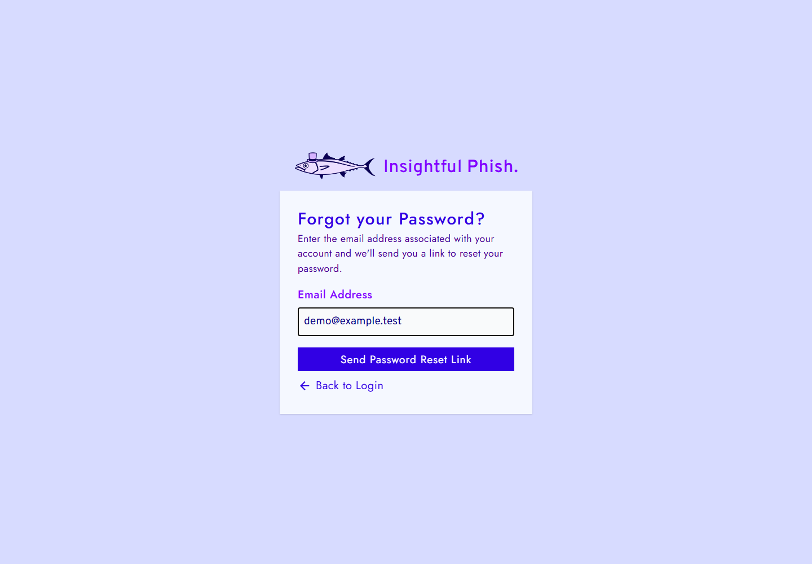
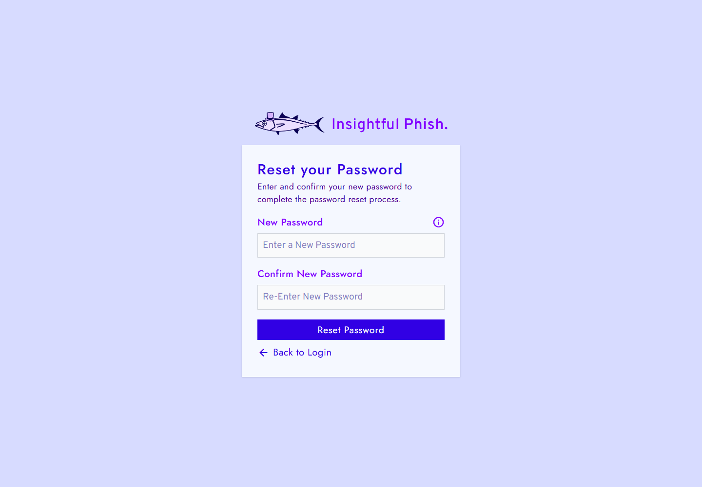
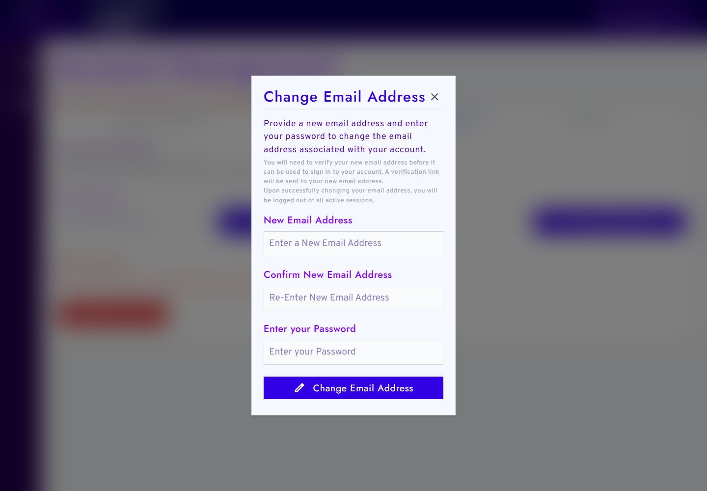
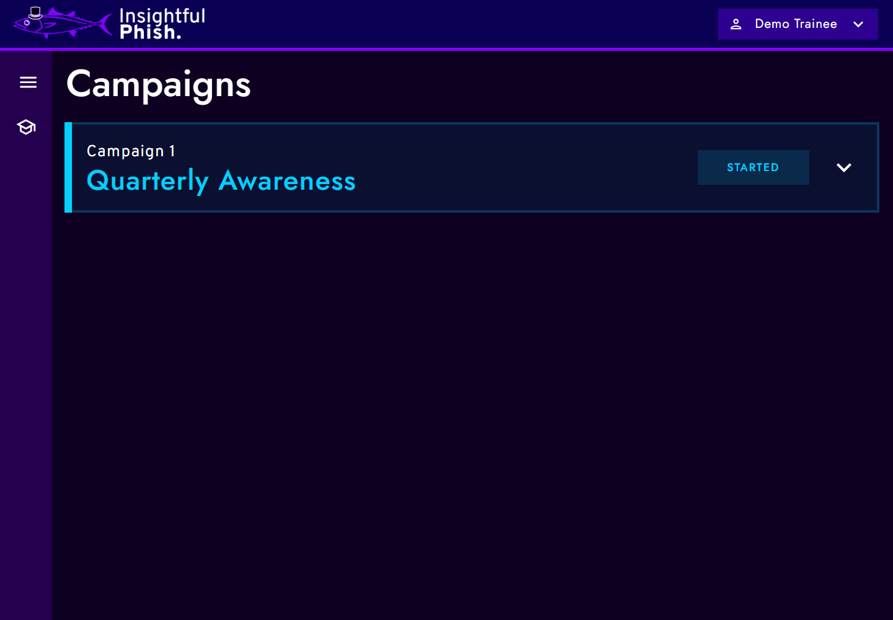
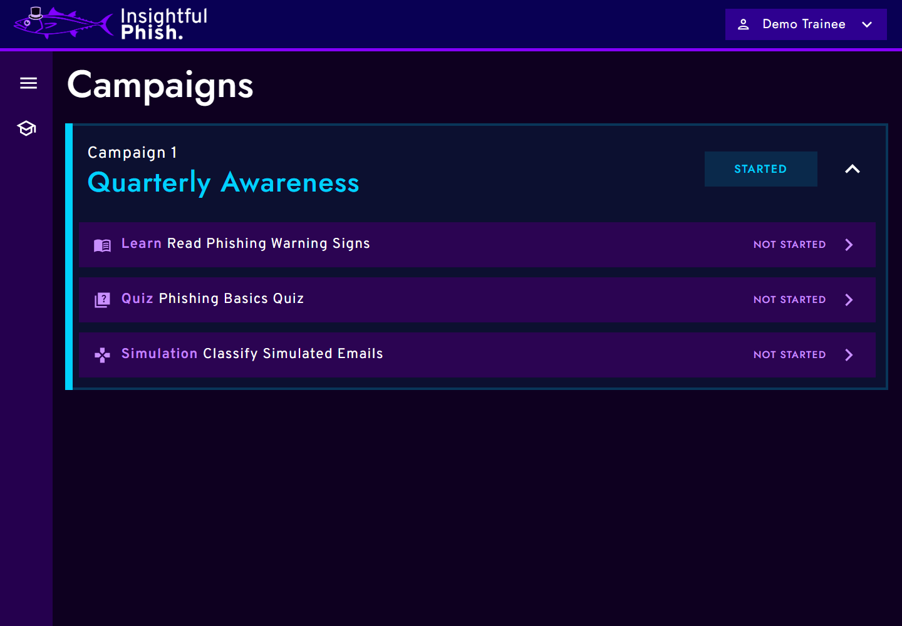
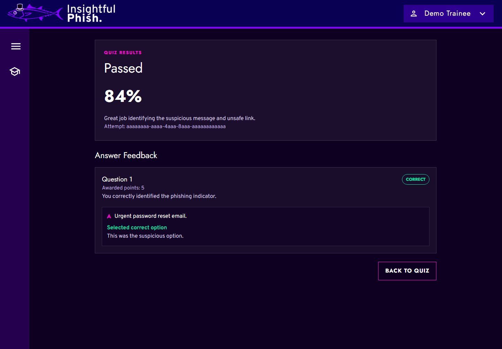

# Insightful Phish Demo 3 User Manual

## Introduction

This manual explains how people use the Demo 3 Insightful Phish platform. It is organised by role and task so that each user can find the part of the product that applies to them without reading the whole document.

Demo 3 documentation should describe the integrated product only. Screenshots referenced in this manual are kept under [`user-interface/`](user-interface/README.md) and should use demo data that is safe to share.

## Contents

- [Introduction](#introduction)
- [Access and Account Basics](#access-and-account-basics)
  - [Sign In](#sign-in)
  - [Create a General Trainee Account](#create-a-general-trainee-account)
  - [Verify Your Email Address](#verify-your-email-address)
  - [Reset a Forgotten Password](#reset-a-forgotten-password)
  - [Complete Account Setup From an Invitation](#complete-account-setup-from-an-invitation)
  - [Accept an Organisation Invitation](#accept-an-organisation-invitation)
- [Account Management and Security](#account-management-and-security)
  - [Open Account Management](#open-account-management)
  - [Update Personal Information](#update-personal-information)
  - [Request an Email Change](#request-an-email-change)
  - [Change Your Password](#change-your-password)
  - [Review Active Sessions](#review-active-sessions)
  - [Update Session Settings](#update-session-settings)
- [General Trainee Tasks](#general-trainee-tasks)
  - [View Available Campaigns](#view-available-campaigns)
  - [Open Campaign Activities](#open-campaign-activities)
- [Organisation Trainee Tasks](#organisation-trainee-tasks)
  - [View Assigned Organisation Campaigns](#view-assigned-organisation-campaigns)
  - [Read a Training Document](#read-a-training-document)
  - [Complete a Quiz](#complete-a-quiz)
  - [Work Through a Simulated Inbox](#work-through-a-simulated-inbox)
- [Organisation Admin Tasks](#organisation-admin-tasks)
  - [Request Organisation Access](#request-organisation-access)
  - [Complete Initial Organisation Admin Setup](#complete-initial-organisation-admin-setup)
  - [Review Organisation Information](#review-organisation-information)
  - [Update Organisation Security Preferences](#update-organisation-security-preferences)
  - [Review Organisation Trainees](#review-organisation-trainees)
  - [Review Organisation Administrators](#review-organisation-administrators)
  - [Manage Campaigns](#manage-campaigns)
  - [Build or Edit a Campaign Draft](#build-or-edit-a-campaign-draft)
  - [Assign Campaigns to Organisation Trainees](#assign-campaigns-to-organisation-trainees)
  - [Review Campaign Statistics](#review-campaign-statistics)
- [Insightful Phish Admin Tasks](#insightful-phish-admin-tasks)
  - [Review Organisation Requests](#review-organisation-requests)
  - [Review Request or Organisation Details](#review-request-or-organisation-details)
  - [Manage Platform Administrators](#manage-platform-administrators)
- [Troubleshooting](#troubleshooting)
- [Security and Privacy](#security-and-privacy)
- [Glossary](#glossary)
- [Support](#support)

## How to Read a Task

Each task should give the user enough information to complete the workflow from a role-appropriate entry point:

- **Audience:** who the task is for.
- **Preconditions:** account state, role, permissions, or data needed before starting.
- **Navigation:** where to go in the application.
- **Steps:** what to do.
- **Expected result:** what should happen after the task succeeds.
- **Screenshot:** an image reference where it helps.
- **Note or warning:** any important security, permission, expiry, or destructive-action detail.

## Access and Account Basics

Use a modern desktop browser such as Chrome, Edge, Brave, Firefox, or Safari. The Demo 3 interface supports public visitors, General Trainees, Organisation Trainees, Organisation Admins, and Insightful Phish Admins.

### Sign In

**Audience:** all registered users.

**Preconditions:** you have an active account and know your email address and password.

**Navigation:** open the login page.

1. Enter your email address and password.
2. Select **Login**.
3. Wait for the platform to open the area available to your role.

**Expected result:** the platform signs you in and shows the appropriate signed-in navigation.

**Screenshot:** 

### Create a General Trainee Account

**Audience:** public visitors who are allowed to register as General Trainees.

**Preconditions:** you have an email address that is not already registered.

**Navigation:** open the registration page.

1. Enter your first name, last name, email address, password, and password confirmation.
2. Select **Register**.
3. Check your email for the verification link before using the account fully.

**Expected result:** the platform creates a pending account and asks you to verify your email address.

**Screenshot:** 

### Verify Your Email Address

**Audience:** users who have received an email verification link.

**Preconditions:** your verification link is valid and has not already been used.

**Navigation:** open the verification link from your email.

1. Open the email verification link.
2. Wait for the verification result.
3. If the link has expired and the page offers a resend action, request a new verification link.

**Expected result:** the platform verifies your email address or shows a safe message explaining why the link cannot be used.

**Screenshot:** 

### Reset a Forgotten Password

**Audience:** users who cannot sign in because they forgot their password.

**Preconditions:** your account exists and is eligible for password reset.

**Navigation:** open **Forgot Password** from the login area.

1. Enter the email address for your account.
2. Submit the password reset request.
3. Open the reset link from your email.
4. Enter and confirm the new password.
5. Submit the change.

**Expected result:** the platform updates your password when the reset link and new password are valid.

**Warning:** reset links are sensitive. Do not share them, and do not use screenshots that reveal reset tokens.

**Screenshots:**

### Complete Account Setup From an Invitation

**Audience:** invited Organisation Admins or Organisation Trainees.

**Preconditions:** you have a valid invitation or setup link.

**Navigation:** open the setup link from your invitation email.

1. Review the role and Organisation shown on the setup page.
2. Enter your first name, last name, password, and password confirmation.
3. Select **Complete Setup**.
4. Sign in after the success message appears.

**Expected result:** the platform completes your invited account setup and lets you sign in with the new credentials.

**Warning:** setup links can expire, be revoked, or be used only once.

**Screenshot:** 

### Accept an Organisation Invitation

**Audience:** signed-in users who have been invited to join an Organisation.

**Preconditions:** you are signed in with the account that should receive the Organisation role, and the invitation link is valid.

**Navigation:** open the invitation link from your email.

1. Review the Organisation and role shown on the invitation page.
2. Confirm that you want to accept the invitation.
3. Follow any instruction to sign in again if the page says your role or session has changed.

**Expected result:** the platform links your account to the Organisation role allowed by the invitation, or shows a safe reason why the invitation cannot be accepted.

**Warning:** invitation links are single-use and role-sensitive. Do not forward them to another person.

**Troubleshooting:** if the invitation is expired, revoked, already used, or blocked because the Organisation is suspended, ask the Organisation Admin who invited you to send a new invitation or confirm that the Organisation is active.

## Account Management and Security

Account Management contains personal details, account actions, security preferences, and session controls where they are available for the signed-in user.

### Open Account Management

**Audience:** signed-in users.

**Preconditions:** you are signed in.

**Navigation:** open the account menu in the top navigation and select **Account Management**.

1. Open the account menu.
2. Select **Account Management**.
3. Use the tabs for profile details, account settings, security preferences, and sessions.

**Expected result:** the platform shows account controls that match your role and Organisation policy.

**Screenshot:** 

### Update Personal Information

**Audience:** signed-in users.

**Preconditions:** you are signed in and the account page has loaded successfully.

**Navigation:** **Account Management** > **Personal**.

1. Review the current first name and last name.
2. Update the fields that need to change.
3. Select the update action on the page.
4. Check the success or validation message.

**Expected result:** the platform saves the updated profile details and keeps the account email unchanged.

**Troubleshooting:** if the page cannot load, use **Retry Loading Account**. If validation fails, correct the highlighted fields and submit again.

### Request an Email Change

**Audience:** signed-in users whose policy allows email changes.

**Preconditions:** you know your current password and have access to the new email address.

**Navigation:** **Account Management** > **Account**.

1. Select **Change Email**.
2. Enter the new email address.
3. Confirm the new email address.
4. Enter your password.
5. Submit the request.
6. Follow the verification email sent to the new address.

**Expected result:** the platform records a pending email-change request and changes the account email only after verification succeeds.

**Warning:** email changes are security-sensitive and may revoke active sessions according to policy.

**Troubleshooting:** if **Change Email** is disabled, email changes are managed by Organisation policy. If the new address is already in use, use another address or contact the responsible administrator.

**Screenshot:** 

### Change Your Password

**Audience:** signed-in users whose policy allows password changes.

**Preconditions:** you know your current password.

**Navigation:** **Account Management** > **Account**.

1. Select **Change Password**.
2. Enter your current password.
3. Enter and confirm the new password.
4. Submit the change.

**Expected result:** the platform updates your password and applies the configured session-revocation behaviour.

**Warning:** do not enter passwords into screenshots or share password-change confirmation messages that contain private account details.

**Troubleshooting:** if the current password is rejected, use **Forgot Password** from the login area. If the new password is rejected, follow the password rules shown in the form.

**Screenshot:** 

### Review Active Sessions

**Audience:** signed-in users.

**Preconditions:** you are signed in.

**Navigation:** **Account Management** > **Sessions**.

1. Review the listed sessions and recent activity.
2. Use the available logout actions for sessions you no longer want active.
3. Confirm any security-sensitive action when prompted.

**Expected result:** the selected session is revoked, or the platform shows why the action is unavailable.

**Warning:** logging out other sessions can interrupt active work on another device.

**Troubleshooting:** if a session was already revoked or the list is stale, refresh the sessions tab and try again only if the session still appears.

**Screenshot:** 

### Update Session Settings

**Audience:** signed-in users whose Organisation policy allows session preference changes.

**Preconditions:** you are signed in and the **Sessions** tab is available.

**Navigation:** **Account Management** > **Sessions**.

1. Review **Session Preferences**.
2. Adjust the editable regular session, remember-me, or idle-timeout preferences shown by the page.
3. Select **Update Session Settings**.
4. Check the confirmation or validation message.

**Expected result:** editable session preferences are saved. Policy-controlled settings remain read-only or disabled.

**Warning:** shorter session settings may require you to sign in more often. Longer settings should only be used where Organisation policy allows them.

**Troubleshooting:** if a control says **Disabled by Policy** or cannot be changed, the Organisation policy is controlling that setting.

## General Trainee Tasks

General Trainees use the platform for their own training activity. In the current integrated Demo 3 UI, General Trainees use the same **Campaigns** area as assigned trainees to review available training and open activities that are available to them.

### View Available Campaigns

**Audience:** General Trainees.

**Preconditions:** you are signed in as a General Trainee and at least one Campaign is available to your account.

**Navigation:** **Campaigns**.

1. Open **Campaigns** from the signed-in navigation.
2. Review the Campaign cards and their progress status.
3. Open a Campaign to see its training activities.
4. Select an available activity when you are ready to start.

**Expected result:** the platform shows Campaigns available to your account and opens available activities without exposing internal Campaign IDs or setup details.

**Note:** if no Campaign is shown, there may be no current Campaign available to your account yet. Self-enrolment is not exposed as a separate completed user-facing workflow in the current Demo 3 navigation, so this manual does not describe a separate enrolment button.

**Screenshot:** 

### Open Campaign Activities

**Audience:** General Trainees.

**Preconditions:** a Campaign is visible on the **Campaigns** page.

**Navigation:** **Campaigns** > open a Campaign.

1. Select the Campaign row or accordion to reveal its activity list.
2. Review which activities are available and which are locked.
3. Open the available training document, quiz, or simulation activity shown by the Campaign.
4. Return to **Campaigns** when you need to choose another activity.

**Expected result:** the selected activity opens if it is available. Locked or unavailable activities remain visible but cannot be started.

**Troubleshooting:** if an activity cannot be opened, complete the earlier required activity first or refresh the Campaigns page to load the latest progress.

**Screenshot:** 

## Organisation Trainee Tasks

Organisation Trainees are linked to an Organisation and use the platform for Organisation-assigned awareness training.

### View Assigned Organisation Campaigns

**Audience:** Organisation Trainees.

**Preconditions:** you are signed in as an Organisation Trainee and your Organisation has assigned at least one Campaign to you.

**Navigation:** **Campaigns**.

1. Open **Campaigns** from the signed-in navigation.
2. Review each Campaign's name and progress status.
3. Open a Campaign to view its ordered activities.
4. Start the next available activity.

**Expected result:** assigned Campaigns appear with their current progress. Activities that are not yet available remain locked until their prerequisites are met.

**Troubleshooting:** if no Campaign appears, check that you are signed in with the Organisation-linked account and ask an Organisation Admin whether a Campaign has been assigned.

**Screenshots:**

### Read a Training Document

**Audience:** General Trainees and Organisation Trainees.

**Preconditions:** the Campaign contains an available training document.

**Navigation:** **Campaigns** > open Campaign > select the training document activity.

1. Open the training document from the Campaign activity list.
2. Read the content shown on the page.
3. Use the available completion or navigation control when you have finished.
4. Return to the Campaign if you need to continue with the next activity.

**Expected result:** the platform records the training document progress and unlocks any later activity when the Campaign rules allow it.

**Troubleshooting:** if the document does not load, return to **Campaigns**, reopen the Campaign, and retry the activity. If it remains unavailable, the content source may need administrator attention.

**Screenshot:** 

### Complete a Quiz

**Audience:** General Trainees and Organisation Trainees.

**Preconditions:** the Campaign contains an available quiz.

**Navigation:** **Campaigns** > open Campaign > select the quiz activity.

1. Open the quiz from the Campaign activity list.
2. Answer each visible question.
3. Submit the quiz.
4. Review the results page.

**Expected result:** the platform records the quiz attempt and shows the result available to your account.

**Warning:** submit only when your answers are ready. If the page shows that a quiz is locked, complete the required earlier activity first.

**Troubleshooting:** if the submit action fails, check the message shown on the page and retry only after the page has finished loading.

**Screenshots:**

### Work Through a Simulated Inbox

**Audience:** General Trainees and Organisation Trainees.

**Preconditions:** the Campaign contains an available simulated inbox activity.

**Navigation:** **Campaigns** > open Campaign > select the simulation activity.

1. Open the simulated inbox from the Campaign activity list.
2. Review the simulated messages.
3. Open a message to inspect its details.
4. Use the safe interaction controls provided by the page.

**Expected result:** the platform records safe simulation interactions without asking for real credentials or exposing real email content.

**Warning:** simulated emails are training content. Do not enter real passwords, payment details, or private information into simulation screens.

**Troubleshooting:** if a simulated message cannot be opened, return to the inbox and try again. If the activity is locked, complete the prerequisite Campaign activity first.

**Screenshots:**

## Organisation Admin Tasks

Organisation Admins manage their Organisation's information, security preferences, trainees, administrators, invitations, and Campaign workflows where their permissions allow.

### Request Organisation Access

**Audience:** public Organisation representative.

**Preconditions:** your Organisation is not already registered through the platform.

**Navigation:** open the Organisation registration request page.

1. Complete **Organisation Information**.
2. Select **Next**.
3. Complete **Representative Information**.
4. Submit the request.
5. Wait for review by an Insightful Phish Admin.

**Expected result:** the platform records the request and shows a safe confirmation message.

**Note:** the representative listed in the request is the person expected to complete the first Organisation Admin setup if the request is approved.

**Troubleshooting:** if the request cannot be submitted, correct the field errors shown on the page. If the Organisation is already registered, use the existing Organisation access path instead of submitting a duplicate request.

**Screenshots:**

### Complete Initial Organisation Admin Setup

**Audience:** approved initial Organisation Admin.

**Preconditions:** an Insightful Phish Admin has approved the Organisation request and you have a valid setup link.

**Navigation:** open the setup link from the approval email.

1. Review the Organisation and role shown on the setup page.
2. Enter your name and password details.
3. Select **Complete Setup**.
4. Sign in after the success message appears.

**Expected result:** the platform completes the first Organisation Admin setup and activates the Organisation if the setup is still valid.

**Warning:** the setup link is single-use and should not be shared.

**Troubleshooting:** if the setup link is expired, revoked, or already used, an Insightful Phish Admin may need to resend the setup email from the Organisation detail page.

**Screenshot:** 

### Review Organisation Information

**Audience:** Organisation Admin.

**Preconditions:** you are signed in as an Organisation Admin.

**Navigation:** **Organisation Information**.

1. Open **Organisation Information**.
2. Use the tabs to review basic information, representative information, administrators, and timeline details.

**Expected result:** the platform shows Organisation information available to your role.

**Note:** Organisation status and timeline entries are review information. They should not be edited from this page unless the UI provides an explicit action.

**Screenshots:**

### Update Organisation Security Preferences

**Audience:** Organisation Admin with the required permissions.

**Preconditions:** you are signed in as an Organisation Admin and the setting is editable for your role.

**Navigation:** **Security Preferences**.

1. Open **Security Preferences**.
2. Review any read-only message at the top of the page.
3. Change only the settings that are editable for your role.
4. Select **Update Organisation Security Preferences**.
5. Check for the success or validation message.

**Expected result:** editable settings are saved, and read-only settings remain unchanged.

**Warning:** Organisation security settings can affect user sessions and account-change permissions across the Organisation.

**Troubleshooting:** if the page says settings cannot be modified because the Organisation is suspended, inactive, or disabled, resolve the Organisation status before trying to save changes.

**Screenshot:** 

### Review Organisation Trainees

**Audience:** Organisation Admin with trainee-management permissions.

**Preconditions:** you are signed in as an Organisation Admin.

**Navigation:** **Trainees**.

1. Open **Trainees**.
2. Use search or filters to find a trainee or invitation.
3. Open the invite trainee modal when a new trainee invitation needs to be prepared.
4. Follow any confirmation prompts shown for row actions.

**Expected result:** the platform shows current trainee memberships and actionable invitations according to their lifecycle state.

**Available actions:**

- Use **Invite Trainee** when the Organisation is allowed to send a new trainee invitation.
- Use **Log Out Session** or session-related account controls from Account Management, not from the trainee table.
- Use **Disable Trainee** only when the UI shows that the action is available and you can confirm it with your password.
- Use **Revoke Invitation** for an invitation that should no longer be usable.
- Use resend actions only for invitations that still support setup or acceptance.

**Warning:** disabling a trainee can revoke active sessions. Revoking an invitation prevents that invitation link from being used.

**Troubleshooting:** if invitation actions are unavailable, check your permissions, the Organisation status, and the invitation state. Accepted or completed invitations may remain as history but should not be treated as new actionable invites.

**Screenshots:**

### Review Organisation Administrators

**Audience:** Organisation Admin with administrator-management permissions.

**Preconditions:** you are signed in as an Organisation Admin.

**Navigation:** **Administrators**.

1. Open **Administrators**.
2. Search or filter the administrator list.
3. Select **View Permissions** to inspect a user's visible permissions.
4. Open the invite or edit permissions modal when needed.

**Expected result:** the platform shows Organisation administrators and available invitation or permission actions.

**Available actions:**

- Use **Invite Organisation Administrator** to invite a new administrator when you have the required permission.
- Use **View Permissions** to inspect visible permissions for an administrator.
- Use **Edit Permissions** to change an administrator's permission set when the action is available.
- Use removal or disable actions only when the UI offers them and the action is appropriate for the Organisation.

**Warning:** administrator permissions can grant access to sensitive Organisation settings, invitations, and Campaign workflows. Review selected permissions before saving.

**Troubleshooting:** if the invite or edit action is hidden, your account does not have the required permission or the current Organisation state does not allow that action.

**Screenshots:**

### Manage Campaigns

**Audience:** Organisation Admins with Campaign viewing or management permission.

**Preconditions:** you are signed in as an Organisation Admin and the Campaign management area is available to your role.

**Navigation:** use the Campaign management entry point exposed by the application for your Organisation.

1. Open the Campaign management page.
2. Use **Search campaigns** or **Campaign status** to narrow the list.
3. Select **View Campaign**, **View Draft**, or **Continue Editing** for the Campaign you need to inspect.
4. Select **Create Campaign** only when the page shows the action and your role is allowed to manage Campaigns.

**Expected result:** the platform shows Campaigns in their current lifecycle state and exposes only the actions allowed for your role.

**Warning:** Campaign lifecycle actions affect trainee access to training content. Review the Campaign status, items, start date, and end date before changing it.

**Troubleshooting:** if the Campaign management entry point or action is unavailable, your account may not have the required Campaign permission or the Organisation state may not allow the action.

### Build or Edit a Campaign Draft

**Audience:** Organisation Admins with Campaign management permission.

**Preconditions:** you can open **Create Campaign** or **Continue Editing** from the Campaign management page.

**Navigation:** Campaign management > **Create Campaign** or **Continue Editing**.

1. Enter a Campaign name and optional description.
2. Choose the Campaign colour and schedule fields where the form shows them.
3. Add Campaign items from **Campaign Items**.
4. Review the Campaign order and adjust required or optional items where the builder allows it.
5. Select **Save Draft** or **Save Changes**.
6. Use **Activate Campaign** only after the draft has at least one available item and the page shows activation as available.

**Expected result:** the draft is saved with the selected items and can be activated when it meets the Campaign rules.

**Warning:** activating a Campaign can make it visible for assignment or participation. Save and review changes before activating.

**Troubleshooting:** if activation is disabled, check the message below the button. The page may require items, available source content, saved changes, or a valid schedule.

### Assign Campaigns to Organisation Trainees

**Audience:** Organisation Admins with Campaign assignment permission.

**Preconditions:** the Organisation has eligible Organisation Trainees and assignable Campaigns, and the application exposes a completed assignment entry point for your role.

**Navigation:** use the assignment action shown by the Organisation management area when that action is available.

The current Demo 3 UI includes a three-step assignment screen with **Organisation Trainee Selection**, **Training Campaign Selection**, and **Review Campaign Assignment** views. The final submit path is not presented here as a completed user workflow until it is exposed as a finished action from the application.

**Expected result:** when the completed assignment action is exposed in the integrated UI, the user should be able to select trainees, select Campaigns, review the total assignment count, and submit without resetting existing progress.

**Warning:** assignment changes who can access Campaign content. Confirm the selected trainees and Campaigns before completing an assignment in a completed flow.

**Troubleshooting:** if the assignment action is not visible, the completed flow may not be enabled for your role yet, your account may not have Campaign assignment permission, or the Organisation may not have eligible trainees and Campaigns.

### Review Campaign Statistics

**Audience:** Organisation Admins with Campaign visibility permission.

**Preconditions:** Campaign statistics must be exposed from a role-appropriate Campaign page.

**Navigation:** use the statistics or reporting action shown by the Campaign page.

The current Demo 3 UI contains Campaign management and trainee Campaign activity pages, but no separate Campaign statistics navigation label or statistics page is exposed as a normal user workflow yet.

**Expected result:** when a statistics view is added to the integrated UI, it should be reachable from the Campaign page and should show progress or outcome information without exposing private trainee data unnecessarily.

**Troubleshooting:** if you cannot find statistics, use the Campaign list and Campaign detail pages for current lifecycle and item information, then check whether the statistics feature has been enabled for your role.

## Insightful Phish Admin Tasks

Insightful Phish Admins, also referred to as Platform Administrators in some interface areas, review Organisation registration requests and manage platform-level Organisation records.

### Review Organisation Requests

**Audience:** Insightful Phish Admin.

**Preconditions:** you are signed in with Insightful Phish Admin access.

**Navigation:** **Organisation Management**.

1. Open **Organisation Management**.
2. Use the search field and filters to find a request.
3. Select **Review Request** when the request is pending.
4. Review the request details before taking an approval or rejection action.

**Expected result:** the platform lets you approve, reject, or leave the request unchanged according to its current state.

**Warning:** approval can trigger the initial Organisation Admin setup process. Rejection should be used only after checking the request details.

**Available actions:**

- Use **Review Request** to inspect a pending request before deciding.
- Use **Mark As Contacted** when the representative has been contacted outside the platform.
- Use **Approve Request** only after checking the Organisation and representative information.
- Use **Reject Request** with a clear reason when the request should not continue.
- Use **Delete Request** only when the page offers it and the request should be removed from the active review queue.

**Troubleshooting:** if a request cannot be loaded or updated, close the modal, refresh the list, and check whether another admin has already changed the request.

**Screenshots:**

### Review Request or Organisation Details

**Audience:** Insightful Phish Admin.

**Preconditions:** you are signed in with Insightful Phish Admin access and have opened a reachable request or Organisation detail page from the UI.

**Navigation:** **Organisation Management** > request or Organisation details.

1. Open the request or Organisation detail page from **Organisation Management**.
2. Review basic information and representative information.
3. Open the timeline tab to confirm the onboarding history.
4. Use the resend setup action only when the page shows that resend is available.

**Expected result:** the platform shows the detail record, lifecycle state, timeline, and safe actions for the selected request or Organisation.

**Warning:** setup email resend actions are security-sensitive. Do not expose private email addresses or setup links in screenshots.

**Troubleshooting:** if the setup email could not be queued during approval, open the Organisation detail page and use the resend action only when the page shows that it is available.

**Screenshots:**

### Manage Platform Administrators

**Audience:** Insightful Phish Admins with access to Platform Administrator management.

**Preconditions:** you are signed in as an Insightful Phish Admin. Some actions, such as inviting a Platform Administrator or transferring the Super Platform Administrator role, may require elevated platform privileges.

**Navigation:** **Platform Administrators**.

1. Open **Platform Administrators**.
2. Use the search field or status filters such as **Active**, **Invited**, **Disabled**, or **Failed Invitation** to find an administrator.
3. Use **Invite Platform Administrator** when the button is available and a new administrator needs access.
4. For invited administrators, use resend or revoke actions only when the row shows that the invitation is still actionable.
5. Use **Demote Administrator Role**, **Disable Administrator**, **Re-Enable**, or **Transfer Super Administrator Role** only when the UI shows that the action is allowed.
6. Review the confirmation dialog before completing any role or status change.

**Expected result:** the platform updates the administrator list or invitation state and shows the changed status.

**Warning:** Platform Administrator actions can change who controls Organisation approvals and platform-level records. Transfer and demotion actions should be reviewed carefully before confirmation.

**Troubleshooting:** if an action is hidden or unavailable, your current platform role may not allow it, the administrator may be in the wrong lifecycle state, or the list may need to be refreshed.

## Troubleshooting

### Login Does Not Work

- Check that the email and password are entered correctly.
- If the password is forgotten, use the password reset flow.
- If the account has not been verified yet, complete email verification first.
- If you recently changed your password or email address, sign out in any open tabs and sign in again with the latest details.

### Verification Link Has Expired

- Use the resend option if it is shown.
- If resend is not available, request a new link from the relevant registration, setup, or invitation flow.
- If the link has already been used, sign in and check whether the expected account change has already completed.

### Setup Link Is Invalid or Already Used

- Setup links can expire, be revoked, or be used only once. Ask the admin who sent the invitation to send a new setup link.
- If you are already signed in with a different account, sign out before opening the setup link again.

### A Setting Is Read-Only

- Some account or security settings may be controlled by Organisation policy.
- If a setting is read-only, follow the message shown on the page or contact an Organisation Admin.

### An Action Button Is Missing or Disabled

- Check that you are signed in with the role that owns the task.
- Check whether the record is in a state that still allows the action. Completed, expired, revoked, rejected, disabled, or suspended records may limit available actions.
- Refresh the page if another administrator may have changed the record while you were viewing it.

### A Request Fails or Rate Limits

- Read the message shown on the page and correct any field-level validation errors.
- If the page says there were too many requests, wait briefly before trying again.
- If the page cannot load data, use the retry action where it is provided or sign out and sign in again.

### A Page Shows No Data

- Refresh the page and check that you are signed in with the correct role. Some pages are role-specific and only show information for users with the required access.
- If the empty state remains, there may be no current records for the selected filter.
- If there are no eligible Campaigns or Organisation Trainees, ask the relevant administrator to check Campaign status, trainee status, and assignment permissions.
- If Campaign statistics are unavailable or empty, check whether a statistics page is exposed for your role and whether the Campaign has activity to report.

### Help Link Opens Older Manual Content

- Use this Demo 3 User Manual as the current manual for Demo 3 workflows.
- Some in-product Help links may still open an older wiki manual until the product navigation is updated.

## Security and Privacy

Do not share passwords, setup links, reset links, verification links, or private Organisation information.

When using screenshots for Demo 3, use seeded demo data or clearly fake examples. Crop the browser address bar when it contains a token. If an email address is visible, use a safe sample address rather than a real private address.

Administrators should only perform actions for Organisations and users they are responsible for. Trainees should only use their own account and assigned training activities.

## Glossary

**Campaign:** A set of training activities assigned or made available to a trainee.

**Campaign Assignment:** The process Organisation Admins use to assign Campaigns to Organisation Trainees.

**Campaign Builder:** The area Organisation Admins use to create or edit Campaign content where the integrated UI supports it.

**Campaign Statistics:** Reporting views that show Campaign progress and outcomes where the integrated UI supports them.

**General Trainee:** A trainee who uses the platform outside a managed Organisation context.

**Insightful Phish Admin:** A platform-level administrator who reviews Organisation requests and platform Organisation information.

**Initial Organisation Admin Setup:** The first setup process used by the approved Organisation representative.

**Organisation Admin:** A user who manages Organisation settings, trainees, administrators, invitations, and Campaign workflows where permitted.

**Organisation Registration Request:** A request asking Insightful Phish to create an Organisation account.

**Organisation Trainee:** A user linked to an Organisation for assigned training.

**Simulated Inbox:** A safe training inbox used for phishing awareness.

**Timeline:** A history of important onboarding events for a request or Organisation.

**Training Document:** Reading material that teaches a cybersecurity topic.

**Quiz:** A set of questions used to check understanding after training.

## Support

For Demo 3 support, use the support guidance shown in the application or contact the responsible Organisation Admin.

---

Previous section: [Testing Policy](testing-policy.md)

Next section: [User Interface Screenshot Catalogue](user-interface/README.md)
