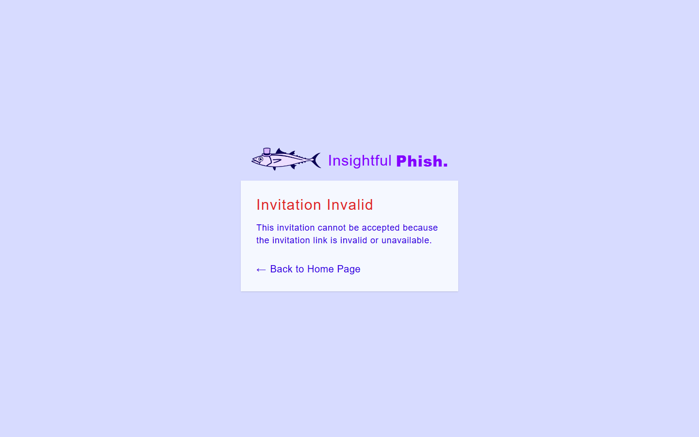

# Insightful Phish Demo 3 User Manual

## Introduction

This manual explains how people use the Demo 3 Insightful Phish platform. It is organised by role and task so that each user can find the part of the product that applies to them without reading the whole document.

Demo 3 documentation should describe the integrated product only. Screenshots referenced in this manual are kept under [`user-interface/`](user-interface/README.md) and should use demo data that is safe to share.

Organisation Admins and Insightful Phish Admins should also use the **[Demo 3 Admin User Manual](admin-user-manual.md)** for administration workflows. Shared sign-in, account, password, and session instructions remain in this manual.

## Contents

- [Insightful Phish Demo 3 User Manual](#insightful-phish-demo-3-user-manual)
  - [Introduction](#introduction)
  - [Contents](#contents)
  - [How to Read a Task](#how-to-read-a-task)
  - [Access and Account Basics](#access-and-account-basics)
    - [Sign In](#sign-in)
    - [Log Out](#log-out)
    - [Create a General Trainee Account](#create-a-general-trainee-account)
    - [Verify Your Email Address](#verify-your-email-address)
    - [Reset a Forgotten Password](#reset-a-forgotten-password)
    - [Complete Account Setup From an Invitation](#complete-account-setup-from-an-invitation)
    - [Accept an Organisation Invitation](#accept-an-organisation-invitation)
  - [Account Management and Security](#account-management-and-security)
    - [Open Account Management](#open-account-management)
    - [Update Personal Information](#update-personal-information)
    - [Request an Email Change](#request-an-email-change)
    - [Change Your Password](#change-your-password)
    - [Review Active Sessions](#review-active-sessions)
    - [Update Session Settings](#update-session-settings)
  - [General Trainee Tasks](#general-trainee-tasks)
    - [View Available Campaigns](#view-available-campaigns)
    - [Open Campaign Activities](#open-campaign-activities)
  - [Organisation Trainee Tasks](#organisation-trainee-tasks)
    - [View Assigned Organisation Campaigns](#view-assigned-organisation-campaigns)
    - [Read a Training Document](#read-a-training-document)
    - [Complete a Quiz](#complete-a-quiz)
    - [Review Quiz Results](#review-quiz-results)
    - [Work Through a Simulated Inbox](#work-through-a-simulated-inbox)
    - [Inspect a Simulated Email](#inspect-a-simulated-email)
  - [Organisation Access](#organisation-access)
    - [Request Organisation Access](#request-organisation-access)
    - [Complete Initial Organisation Admin Setup](#complete-initial-organisation-admin-setup)
  - [Troubleshooting](#troubleshooting)
    - [Login Does Not Work](#login-does-not-work)
    - [Verification Link Has Expired](#verification-link-has-expired)
    - [Setup Link Is Invalid or Already Used](#setup-link-is-invalid-or-already-used)
    - [A Setting Is Read-Only](#a-setting-is-read-only)
    - [An Action Button Is Missing or Disabled](#an-action-button-is-missing-or-disabled)
    - [A Request Fails or Rate Limits](#a-request-fails-or-rate-limits)
    - [A Page Shows No Data](#a-page-shows-no-data)
  - [Security and Privacy](#security-and-privacy)
  - [Glossary](#glossary)
  - [Support](#support)

## How to Read a Task

Each task should give the user enough information to complete the workflow from a role-appropriate entry point:

- **Audience:** who the task is for.
- **Preconditions:** account state, role, permissions, or data needed before starting.
- **Navigation:** where to go in the application.
- **Steps:** what to do.
- **Expected result:** what should happen after the task succeeds.
- **Screenshot:** an image reference where it helps.
- **Note or warning:** any important security, permission, expiry, or destructive-action detail.

> [!Note]
> Please note that the User Interface in this User Manual might differ slightly from the User Interface on the actual website. All tasks should still follow the same process.

## Access and Account Basics

Use a modern desktop browser such as Chrome, Edge, Brave, Firefox, or Safari. The Demo 3 interface supports public visitors, General Trainees, Organisation Trainees, Organisation Admins, and Insightful Phish Admins.

### Sign In

**Audience:** all registered users.

**Preconditions:** you have an active account and know your email address and password.

**Navigation:** open the login page.

**Purpose:** access the areas and tasks available to your account and role.

1. Enter your email address and password.
2. Select **Log In**.
3. Wait for the platform to open the area available to your role.

**Expected result:** the platform signs you in and shows the appropriate signed-in navigation.

**Troubleshooting:** if sign-in fails, check the message shown on the page. Verify the email address, use **Forgot Password** when necessary, and complete email verification if the account is still pending.

**Screenshot:** 

### Log Out

**Audience:** all signed-in users.

**Preconditions:** you are signed in.

**Navigation:** open the account menu in the top navigation.

**Purpose:** end access to the current signed-in session on the device you are using.

1. Open the account menu.
2. Select **Logout**.
3. Wait for the login page to appear.

**Expected result:** the current session ends and the platform returns you to the login page.

**Note:** use Account Management session controls when you need to end a different session or all other sessions.

**Troubleshooting:** if a protected page remains visible, refresh the page and confirm that it redirects to the login page before leaving the device.

### Create a General Trainee Account

**Audience:** public visitors who are allowed to register as General Trainees.

**Preconditions:** you have an email address that is not already registered.

**Navigation:** open the registration page.

**Purpose:** create an individual General Trainee account using an email address you control.

1. Enter your first name, last name, email address, password, and password confirmation.
2. Select **Register**.
3. Check your email for the verification link before using the account fully.

**Expected result:** the platform creates a pending account and asks you to verify your email address.

**Note:** registration being accepted does not mean the verification email has already been delivered. Check the verification guidance shown by the page.

**Troubleshooting:** correct any highlighted fields before trying again. If the email address is already registered, sign in or use **Forgot Password** instead of creating a duplicate account.

**Screenshot:** 

### Verify Your Email Address

**Audience:** users who have received an email verification link.

**Preconditions:** your verification link is valid and has not already been used.

**Navigation:** open the verification link from your email.

**Purpose:** confirm that you control the email address associated with the account.

1. Open the email verification link.
2. Wait for the verification result.
3. If the link has expired and the page offers a resend action, request a new verification link.

**Expected result:** the platform verifies your email address or shows a safe message explaining why the link cannot be used.

**Warning:** verification links are intended for the named account and should not be shared.

**Troubleshooting:** if the link is expired, invalid, or already used, follow the state-specific guidance on the page. Use resend only when the page offers it.

**Screenshot:** 

### Reset a Forgotten Password

**Audience:** users who cannot sign in because they forgot their password.

**Preconditions:** your account exists and is eligible for password reset.

**Navigation:** open **Forgot Password** from the login area.

**Purpose:** replace a forgotten password through the account's verified email address.

1. Enter the email address for your account.
2. Submit the password reset request.
3. Open the reset link from your email.
4. Enter and confirm the new password.
5. Submit the change.

**Expected result:** the platform updates your password when the reset link and new password are valid.

**Warning:** reset links are sensitive. Do not share them, and do not use screenshots that reveal reset tokens.

**Screenshots:**

### Complete Account Setup From an Invitation

**Audience:** invited Organisation Admins or Organisation Trainees.

**Preconditions:** you have a valid invitation or setup link.

**Navigation:** open the setup link from your invitation email.

**Purpose:** finish creating the account and credentials prepared by an Organisation invitation.

1. Review the role and Organisation shown on the setup page.
2. Enter your first name, last name, password, and password confirmation.
3. Select **Complete Setup**.
4. Sign in after the success message appears.

**Expected result:** the platform completes your invited account setup and lets you sign in with the new credentials.

**Warning:** setup links can expire, be revoked, or be used only once.

**Troubleshooting:** if the page reports that the link is unavailable, ask the responsible administrator to check the invitation state and resend it only when that action is available.

**Screenshot:** 

### Accept an Organisation Invitation

**Audience:** signed-in users who have been invited to join an Organisation.

**Preconditions:** you are signed in with the account that should receive the Organisation role, and the invitation link is valid.

**Navigation:** open the invitation link from your email.

**Purpose:** accept an Organisation membership or role change for your existing account.

1. Review the Organisation and role shown on the invitation page.
2. Confirm that you want to accept the invitation.
3. Follow any instruction to sign in again if the page says your role or session has changed.

**Expected result:** the platform links your account to the Organisation role allowed by the invitation, or shows a safe reason why the invitation cannot be accepted.

**Warning:** invitation links are single-use and role-sensitive. Do not forward them to another person.

**Troubleshooting:** if the invitation is expired, revoked, already used, or blocked because the Organisation is suspended, ask the Organisation Admin who invited you to send a new invitation or confirm that the Organisation is active.

**Screenshot:** 

## Account Management and Security

Account Management contains personal details, account actions, security preferences, and session controls where they are available for the signed-in user.

### Open Account Management

**Audience:** signed-in users.

**Preconditions:** you are signed in.

**Navigation:** open the account menu in the top navigation and select **Account Management**.

**Purpose:** review and manage the account, security, and session controls available to you.

1. Open the account menu.
2. Select **Account Management**.
3. Use the tabs for profile details, account settings, security preferences, and sessions.

**Expected result:** the platform shows account controls that match your role and Organisation policy.

**Troubleshooting:** if account information cannot be loaded, use the page's retry action or sign in again before retrying.

**Screenshot:** 

### Update Personal Information

**Audience:** signed-in users.

**Preconditions:** you are signed in and the account page has loaded successfully.

**Navigation:** **Account Management** > **Personal**.

**Purpose:** keep the first and last name associated with your account current.

1. Review the current first name and last name.
2. Update the fields that need to change.
3. Select the update action on the page.
4. Check the success or validation message.

**Expected result:** the platform saves the updated profile details and keeps the account email unchanged.

**Troubleshooting:** if the page cannot load, use **Retry Loading Account**. If validation fails, correct the highlighted fields and submit again.

### Request an Email Change

**Audience:** signed-in users whose policy allows email changes.

**Preconditions:** you know your current password and have access to the new email address.

**Navigation:** **Account Management** > **Account**.

**Purpose:** request a verified change to the email address used by your account.

1. Select **Change Email**.
2. Enter the new email address.
3. Confirm the new email address.
4. Enter your password.
5. Submit the request.
6. Follow the verification email sent to the new address.

**Expected result:** the platform records a pending email-change request and changes the account email only after verification succeeds.

**Warning:** email changes are security-sensitive and may revoke active sessions according to policy.

**Troubleshooting:** if **Change Email** is disabled, email changes are managed by Organisation policy. If the new address is already in use, use another address or contact the responsible administrator.

**Screenshot:** 

### Change Your Password

**Audience:** signed-in users whose policy allows password changes.

**Preconditions:** you know your current password.

**Navigation:** **Account Management** > **Account**.

**Purpose:** replace your current password while signed in.

1. Select **Change Password**.
2. Enter your current password.
3. Enter and confirm the new password.
4. Submit the change.

**Expected result:** the platform updates your password and applies the configured session-revocation behaviour.

**Warning:** do not enter passwords into screenshots or share password-change confirmation messages that contain private account details.

**Troubleshooting:** if the current password is rejected, use **Forgot Password** from the login area. If the new password is rejected, follow the password rules shown in the form.

**Screenshot:** 

### Review Active Sessions

**Audience:** signed-in users.

**Preconditions:** you are signed in.

**Navigation:** **Account Management** > **Sessions**.

**Purpose:** identify current and recent account sessions and revoke access you no longer recognise or need.

1. Review the listed sessions and recent activity.
2. Use the available logout actions for sessions you no longer want active.
3. Confirm any security-sensitive action when prompted.

**Expected result:** the selected session is revoked, or the platform shows why the action is unavailable.

**Warning:** logging out other sessions can interrupt active work on another device.

**Troubleshooting:** if a session was already revoked or the list is stale, refresh the sessions tab and try again only if the session still appears.

**Screenshot:** 

### Update Session Settings

**Audience:** signed-in users whose Organisation policy allows session preference changes.

**Preconditions:** you are signed in and the **Sessions** tab is available.

**Navigation:** **Account Management** > **Sessions**.

**Purpose:** choose preferred session durations where Organisation policy permits personal settings.

1. Review **Session Preferences**.
2. Adjust the editable regular session, remember-me, or idle-timeout preferences shown by the page.
3. Select **Update Session Settings**.
4. Check the confirmation or validation message.

**Expected result:** editable session preferences are saved. Policy-controlled settings remain read-only or disabled.

**Warning:** shorter session settings may require you to sign in more often. Longer settings should only be used where Organisation policy allows them.

**Troubleshooting:** if a control says **Disabled by Policy** or cannot be changed, the Organisation policy is controlling that setting.

## General Trainee Tasks

General Trainees use the platform for their own training activity. In the current integrated Demo 3 UI, General Trainees use the same **Campaigns** area as assigned trainees to review available training and open activities that are available to them.

### View Available Campaigns

**Audience:** General Trainees.

**Preconditions:** you are signed in as a General Trainee and at least one Campaign is available to your account.

**Navigation:** **Campaigns**.

**Purpose:** find Campaigns currently available to your General Trainee account and open their activities.

1. Open **Campaigns** from the signed-in navigation.
2. Review the Campaign cards and their progress status.
3. Open a Campaign to see its training activities.
4. Select an available activity when you are ready to start.

**Expected result:** the platform shows Campaigns available to your account and opens available activities without exposing internal Campaign IDs or setup details.

**Note:** if no Campaign is shown, there may be no current Campaign available to your account.

**Troubleshooting:** refresh the page after it finishes loading. If the empty state remains, no Campaign is currently available to the account.

**Screenshot:** 

### Open Campaign Activities

**Audience:** General Trainees.

**Preconditions:** a Campaign is visible on the **Campaigns** page.

**Navigation:** **Campaigns** > open a Campaign.

**Purpose:** review the ordered activities in a Campaign and open the next available activity.

1. Select the Campaign row or accordion to reveal its activity list.
2. Review which activities are available and which are locked.
3. Open the available training document, quiz, or simulation activity shown by the Campaign.
4. Return to **Campaigns** when you need to choose another activity.

**Expected result:** the selected activity opens if it is available. Locked or unavailable activities remain visible but cannot be started.

**Troubleshooting:** if an activity cannot be opened, complete the earlier required activity first or refresh the Campaigns page to load the latest progress.

**Screenshot:** 

## Organisation Trainee Tasks

Organisation Trainees are linked to an Organisation and use the platform for Organisation-assigned awareness training.

### View Assigned Organisation Campaigns

**Audience:** Organisation Trainees.

**Preconditions:** you are signed in as an Organisation Trainee and your Organisation has assigned at least one Campaign to you.

**Navigation:** **Campaigns**.

**Purpose:** review Campaigns assigned through your Organisation and continue available training activities.

1. Open **Campaigns** from the signed-in navigation.
2. Review each Campaign's name and progress status.
3. Open a Campaign to view its ordered activities.
4. Start the next available activity.

**Expected result:** assigned Campaigns appear with their current progress. Activities that are currently unavailable remain locked until their prerequisites are met.

**Troubleshooting:** if no Campaign appears, check that you are signed in with the Organisation-linked account and ask an Organisation Admin whether a Campaign has been assigned.

**Screenshots:**

### Read a Training Document

**Audience:** General Trainees and Organisation Trainees.

**Preconditions:** the Campaign contains an available training document.

**Navigation:** **Campaigns** > open Campaign > select the training document activity.

**Purpose:** read the assigned awareness material and record progress through the Campaign.

1. Open the training document from the Campaign activity list.
2. Read the content shown on the page.
3. Use the available completion or navigation control when you have finished.
4. Return to the Campaign if you need to continue with the next activity.

**Expected result:** the platform records the training document progress and unlocks any later activity when the Campaign rules allow it.

**Troubleshooting:** if the document does not load, return to **Campaigns**, reopen the Campaign, and retry the activity. If it remains unavailable, the content source may need administrator attention.

**Screenshot:** 

### Complete a Quiz

**Audience:** General Trainees and Organisation Trainees.

**Preconditions:** the Campaign contains an available quiz.

**Navigation:** **Campaigns** > open Campaign > select the quiz activity.

**Purpose:** answer the Campaign's knowledge-check questions.

1. Open the quiz from the Campaign activity list.
2. Answer each visible question.
3. Submit the quiz.
4. Wait for the results page to open.

**Expected result:** the platform records the quiz attempt and opens the result available to your account.

**Warning:** submit only when your answers are ready. If the page shows that a quiz is locked, complete the required earlier activity first.

**Troubleshooting:** if the submit action fails, check the message shown on the page and retry only after the page has finished loading.

**Screenshots:**

### Review Quiz Results

**Audience:** General Trainees and Organisation Trainees.

**Preconditions:** you have submitted a quiz attempt and its results are available.

**Navigation:** submit an available quiz from **Campaigns**.

**Purpose:** review the outcome and feedback recorded for your quiz attempt.

1. Review the score and result shown after submission.
2. Read the available question feedback.
3. Use the page navigation to return to the Campaign when finished.

**Expected result:** the page shows the authoritative result for the submitted attempt without allowing the recorded answers to be changed.

**Note:** a result reflects the submitted attempt. Do not refresh or resubmit while the original submission is still processing.

**Troubleshooting:** if results do not load, return to **Campaigns** and reopen the available activity or result after the current request completes.

**Screenshot:** 

### Work Through a Simulated Inbox

**Audience:** General Trainees and Organisation Trainees.

**Preconditions:** the Campaign contains an available simulated inbox activity.

**Navigation:** **Campaigns** > open Campaign > select the simulation activity.

**Purpose:** practise identifying suspicious messages in a controlled training inbox.

1. Open the simulated inbox from the Campaign activity list.
2. Review the simulated messages.
3. Open a message when you need to inspect it in detail.

**Expected result:** the platform displays the simulated inbox and lets you open its training messages.

**Warning:** simulated emails are training content. Do not enter real passwords, payment details, or private information into simulation screens.

**Troubleshooting:** if a simulated message cannot be opened, return to the inbox and try again. If the activity is locked, complete the prerequisite Campaign activity first.

**Screenshots:**

### Inspect a Simulated Email

**Audience:** General Trainees and Organisation Trainees.

**Preconditions:** an available simulated inbox contains a message you can open.

**Navigation:** **Campaigns** > open Campaign > open the simulated inbox > select a message.

**Purpose:** inspect the simulated sender, content, and warning signs before choosing a training action.

1. Select a message in the simulated inbox.
2. Review the sender and simulated message content.
3. Use only the training interactions provided by the page.
4. Return to the simulated inbox when finished.

**Expected result:** the message detail opens and the platform records supported simulation interactions as training activity.

**Warning:** never enter real passwords, payment details, or private information into a simulated message or linked training interaction.

**Troubleshooting:** if the detail page is unavailable, return to the Campaign, reopen the simulated inbox, and select the message again after loading completes.

**Screenshot:** 

## Organisation Access

These public and invitation-led tasks cover requesting Organisation access and completing the initial account setup. Ongoing Organisation and platform management tasks are documented in the **[Admin User Manual](admin-user-manual.md)**.

### Request Organisation Access

**Audience:** public Organisation representative.

**Preconditions:** your Organisation is not already registered through the platform.

**Navigation:** open the Organisation registration request page.

**Purpose:** ask Insightful Phish to review a request for a managed Organisation account.

1. Complete **Organisation Information**.
2. Select **Next**.
3. Complete **Representative Information**.
4. Submit the request.
5. Wait for review by an Insightful Phish Admin.

**Expected result:** the platform records the request and shows a safe confirmation message.

**Note:** the representative listed in the request is the person expected to complete the first Organisation Admin setup if the request is approved.

**Troubleshooting:** if the request cannot be submitted, correct the field errors shown on the page. If the Organisation is already registered, use the existing Organisation access path instead of submitting a duplicate request.

**Screenshots:**

### Complete Initial Organisation Admin Setup

**Audience:** approved initial Organisation Admin.

**Preconditions:** an Insightful Phish Admin has approved the Organisation request and you have a valid setup link.

**Navigation:** open the setup link from the approval email.

**Purpose:** activate the approved Organisation and establish its initial Organisation Admin account.

1. Review the Organisation and role shown on the setup page.
2. Enter your name and password details.
3. Select **Complete Setup**.
4. Sign in after the success message appears.

**Expected result:** the platform completes the first Organisation Admin setup and activates the Organisation if the setup is still valid.

**Warning:** the setup link is single-use and should not be shared.

**Troubleshooting:** if the setup link is expired, revoked, or already used, an Insightful Phish Admin may need to resend the setup email from the Organisation detail page.

**Screenshot:** 

## Troubleshooting

### Login Does Not Work

- Check that the email and password are entered correctly.
- If the password is forgotten, use the password reset flow.
- If the account has not been verified yet, complete email verification first.
- If you recently changed your password or email address, sign out in any open tabs and sign in again with the latest details.

### Verification Link Has Expired

- Use the resend option if it is shown.
- If resend is not available, request a new link from the relevant registration, setup, or invitation flow.
- If the link has already been used, sign in and check whether the expected account change has already completed.

### Setup Link Is Invalid or Already Used

- Setup links can expire, be revoked, or be used only once. Ask the admin who sent the invitation to send a new setup link.
- If you are already signed in with a different account, sign out before opening the setup link again.

### A Setting Is Read-Only

- Some account or security settings may be controlled by Organisation policy.
- If a setting is read-only, follow the message shown on the page or contact an Organisation Admin.

### An Action Button Is Missing or Disabled

- Check that you are signed in with the role that owns the task.
- Check whether the record is in a state that still allows the action. Completed, expired, revoked, rejected, disabled, or suspended records may limit available actions.
- Refresh the page if another administrator may have changed the record while you were viewing it.

### A Request Fails or Rate Limits

- Read the message shown on the page and correct any field-level validation errors.
- If the page says there were too many requests, wait briefly before trying again.
- If the page cannot load data, use the retry action where it is provided or sign out and sign in again.

### A Page Shows No Data

- Refresh the page and check that you are signed in with the correct role. Some pages are role-specific and only show information for users with the required access.
- If the empty state remains, there may be no current records for the selected filter.
- If there are no eligible Campaigns or Organisation Trainees, ask the relevant administrator to check Campaign status, trainee status, and assignment permissions.
- If Campaign statistics are unavailable or empty, check whether a statistics page is exposed for your role and whether the Campaign has activity to report.

## Security and Privacy

Do not share passwords, setup links, reset links, verification links, or private Organisation information.

When using screenshots for Demo 3, use seeded demo data or clearly fake examples. Crop the browser address bar when it contains a token. If an email address is visible, use a safe sample address rather than a real private address.

Administrators should only perform actions for Organisations and users they are responsible for. Trainees should only use their own account and assigned training activities.

## Glossary

**Campaign:** A set of training activities assigned or made available to a trainee.

**Campaign Assignment:** The process Organisation Admins use to assign Campaigns to Organisation Trainees.

**Campaign Builder:** The area Organisation Admins use to create or edit Campaign content where the integrated UI supports it.

**Campaign Statistics:** Reporting views that show Campaign progress and outcomes where the integrated UI supports them.

**General Trainee:** A trainee who uses the platform outside a managed Organisation context.

**Insightful Phish Admin:** A platform-level administrator who reviews Organisation requests and platform Organisation information.

**Initial Organisation Admin Setup:** The first setup process used by the approved Organisation representative.

**Organisation Admin:** A user who manages Organisation settings, trainees, administrators, invitations, and Campaign workflows where permitted.

**Organisation Registration Request:** A request asking Insightful Phish to create an Organisation account.

**Organisation Trainee:** A user linked to an Organisation for assigned training.

**Simulated Inbox:** A safe training inbox used for phishing awareness.

**Timeline:** A history of important onboarding events for a request or Organisation.

**Training Document:** Reading material that teaches a cybersecurity topic.

**Quiz:** A set of questions used to check understanding after training.

## Support

For Demo 3 support, use the support guidance shown in the application or contact the responsible Organisation Admin.

---

Previous section: [Testing Policy](testing-policy.md)

Next section: [User Interface Screenshot Catalogue](user-interface/README.md)
