# Insightful Phish Demo 4 Administrator User Manual

## Introduction

This manual explains implemented organisation-administrator and platform-administrator workflows. It restores retained Demo 3 guidance and adds Demo 4 reusable-content creators, Campaign structure, adaptive items, AI assistance, copy-to-Draft behaviour, and current lifecycle safeguards.

Visible navigation and actions depend on account type, organisation context, explicit permissions, and resource lifecycle state. Screenshots retained from Demo 3 remain representative of the named baseline pages; newer Demo 4 controls without repository screenshots are documented in text.

## Contents

1. [Permission and Lifecycle Basics](#permission-and-lifecycle-basics)
2. [Organisation Information and Security](#organisation-information-and-security)
3. [Organisation Trainees](#organisation-trainees)
4. [Organisation Administrators](#organisation-administrators)
5. [Content Management](#content-management)
6. [Training Document Creator](#training-document-creator)
7. [Quiz Creator](#quiz-creator)
8. [Organisation Email Library](#organisation-email-library)
9. [Simulated Inbox Creator](#simulated-inbox-creator)
10. [Campaign Management](#campaign-management)
11. [Adaptive Campaign Items](#adaptive-campaign-items)
12. [AI Campaign Proposals](#ai-campaign-proposals)
13. [Assignment and Insights](#assignment-and-insights)
14. [Platform Administration](#platform-administration)
15. [Shared Account and Support Guidance](#shared-account-and-support-guidance)

## Permission and Lifecycle Basics

Organisation administrators do not receive every management capability automatically. Navigation and backend operations use explicit permissions, including:

- `VIEW_CAMPAIGNS` for applicable Campaign visibility;
- `MANAGE_CAMPAIGNS` for Campaign/content authoring and AI proposal actions;
- `ASSIGN_CAMPAIGNS` for direct organisation Campaign assignment/unassignment;
- dedicated trainee, administrator, permission, and security-setting permissions for their respective pages.

Campaign permission does not grant broad trainee-management access. The follow-up proposal selector uses a minimal Campaign-specific candidate endpoint.

Lifecycle names differ by resource:

| Resource           | Editable state        | Eligible/immutable state                    | Change approach                            |
| ------------------ | --------------------- | ------------------------------------------- | ------------------------------------------ |
| Training Document  | Draft                 | Available                                   | Supported archive/restore or copy-to-Draft |
| Quiz               | Draft                 | Published                                   | Copy to a new Draft                        |
| Organisation Email | Draft                 | Active for library use                      | Copy to a new Draft                        |
| Simulated Inbox    | Draft/authoring state | Approved parent Simulation and Active inbox | Supported copy workflow                    |
| Campaign           | Draft                 | Active, then Archived where selected        | Active-to-Draft copy or lifecycle action   |

AI-generated data never changes lifecycle state automatically.

## Organisation Information and Security

### Review Organisation Information

1. Select **Organisation Information** from the sidebar.
2. Review the organisation identity, lifecycle, and available contextual information.
3. Use supported actions only when the required permission and state permit them.

Organisation scope is fixed by the route and authenticated membership; administrators cannot switch the page to another organisation by changing an identifier.

### Update Organisation Security Preferences

1. Select **Security Preferences**.
2. Review the effective remember-session, regular-session, idle-timeout, reauthentication, and email-change controls shown.
3. Change only values enabled by your permission.
4. Save and review confirmation/errors.

Values outside platform bounds or incompatible settings are rejected without replacing the existing policy.

**Screenshot:** 

## Organisation Trainees

### Invite an Organisation Trainee

1. Select **Trainees**.
2. Choose the invitation action.
3. Enter the trainee identity and email details.
4. Review the intended organisation.
5. Submit the invitation.

The invitation remains scoped to the intended recipient and organisation. Conflicting active membership or invitation state can prevent creation.

### Resend or Revoke a Trainee Invitation

Use the invitation action menu from **Trainees**. Resend is available only when current state and cooldown permit it. Revocation makes the outstanding invitation unusable; it does not silently remove an already accepted active membership.

### Disable or Re-enable an Organisation Trainee

1. Open the trainee's available lifecycle action.
2. Review the target and consequence.
3. Confirm the action.

Disabled users are not valid active assignment candidates. Re-enabling membership does not fabricate removed Campaign assignments.

**Screenshot:** 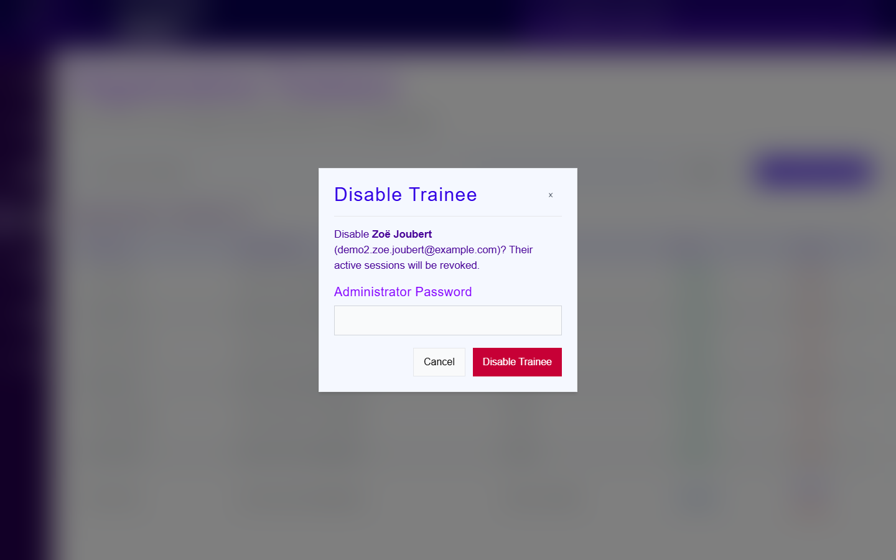

## Organisation Administrators

### View Administrator Permissions

1. Select **Administrators**.
2. Open an administrator entry.
3. Review role and permission information.

### Promote or Invite an Administrator

1. Choose the supported promote/invite action.
2. Select an eligible same-organisation user or enter invitation details.
3. Configure only permissions you are authorised to grant.
4. Review and submit.

### Edit Permissions or Remove Administrator Privileges

Use the administrator action menu and permission control. Protected-administrator, self-authority, and organisation-boundary rules remain enforced even when a control is visible.

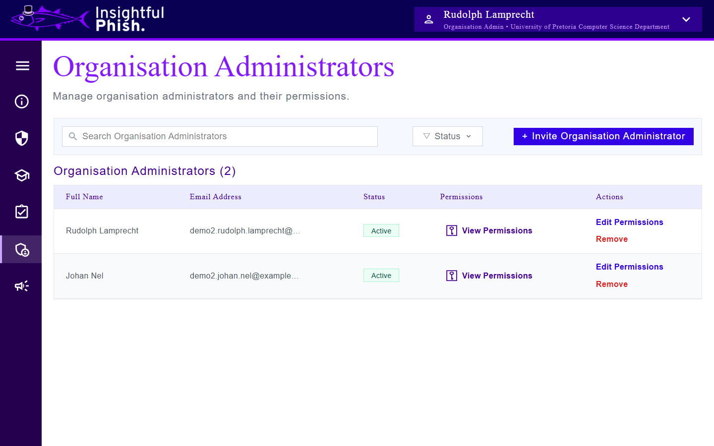

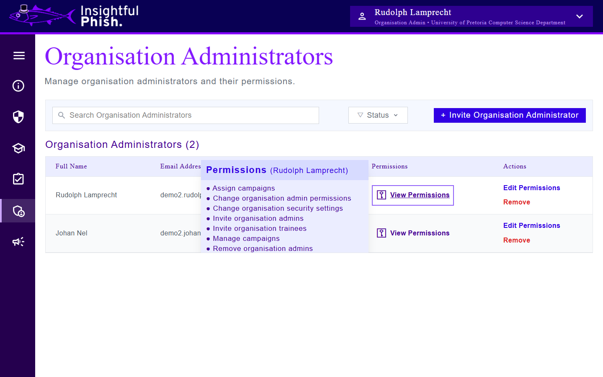

## Content Management

Select **Content Management** to access organisation reusable-content areas. The page provides entry points for Training Documents, Quizzes, the organisation Email library, and Simulated Inbox authoring where available.

Content becomes Campaign selectable only after its normal explicit lifecycle transition. Draft content is not eligible merely because it was generated, previewed, or saved.

Platform administrators use the corresponding platform-owned Training Document, Quiz, and Campaign pages. Organisation Email content remains organisation owned.

## Training Document Creator

### Create and Save a Draft

1. Open **Content Management** and choose Training Documents.
2. Select the create action.
3. Enter a title, summary, difficulty, categories, and Markdown content.
4. Use preview to inspect headings, paragraphs, lists, links, and emphasis.
5. Select **Save Draft**.

Saving creates editable reusable content. It does not activate the document or add it to a Campaign.

### Generate With AI

1. From the normal creator, choose **Generate with AI**.
2. Provide the supported objective, categories, difficulty, and guidance.
3. Submit once and wait for generation.
4. Review every generated field in the normal editor.
5. Edit as needed, then explicitly save.

Generated Markdown uses normal Markdown structure. Accidental HTML line-break tags are normalised at the backend generation boundary rather than changing the general renderer.

### Activate, Archive, Restore, or Copy

Activate only after review. `AVAILABLE` content becomes Campaign eligible. Use supported archive/restore actions for lifecycle management. Where active content is immutable, copy it to a fresh Draft before editing.

## Quiz Creator

### Create Quiz Metadata

1. Open Quizzes from **Content Management**.
2. Create a Draft.
3. Enter title, description, pass threshold, difficulty, and required metadata.

### Add and Edit Questions

1. Open the question editor.
2. Choose `SINGLE_CHOICE` or `MULTIPLE_CHOICE`.
3. Enter the complete question prompt.
4. Enter complete answer text for each option.
5. Review positional labels (`A`, `B`, `C`, and so on).
6. Configure correctness, feedback, categories, points, and supported selection bounds.

Single-choice correctness uses radio controls and retains exactly one correct option. Multiple-choice correctness uses checkboxes and can retain multiple correct options under its valid bounds. Switching back to single-choice clears incompatible stale correctness/bounds.

### Generate a Quiz With AI

Use **Generate with AI** from the normal Quiz Creator. Generated questions/options populate editable unsaved state. Option labels are normalised from position while `text` retains the complete human-readable answer. Review correctness and feedback before saving.

### Save and Publish

Select **Save Draft** while editing. Publish only after validation passes. Publishing makes the Quiz Campaign eligible; it does not assign the Quiz or a Campaign. Copy published content into a fresh Draft when changes are needed.

## Organisation Email Library

### Create an Organisation Email

1. Open **Content Management** and the Email library.
2. Begin creation.
3. Enter sender label/address, subject, preview, body, classification, categories, difficulty, and warning signs as supported.
4. Save explicitly.

Generated or manually authored HTML is validated against the supported parser-based allowlist. A system-controlled link marker cannot be replaced with a caller-controlled destination.

### Generate an Email With AI

Use the Email editor's AI action. Generation populates editable Organisation Email Draft fields and does not send a message. Review body HTML, classification, categories, warning signs, and any quality feedback before saving/activation.

### Activate or Copy

Activate a reviewed email for normal library use. Copy active content to obtain a new editable Draft. An Organisation Email is not itself a Campaign component and cannot be attached directly as a Simulated Inbox alternative.

## Simulated Inbox Creator

1. Open Simulated Inboxes from **Content Management**.
2. Create or edit the Draft metadata.
3. Select eligible organisation-library messages.
4. Order the messages and review their controlled content.
5. Save the Draft and complete supported approval/activation actions.

A Campaign can select the resulting Simulation only when the parent Simulation is approved and its Simulated Inbox is active. AI does not generate an entire eligible Simulation; Email AI generation remains only one input to the normal creator lifecycle.

## Campaign Management

### Browse and Open Campaigns

Select **Campaigns** from the organisation or platform navigation. Search/filter using controls actually present on the list, then create a Draft or open an existing Campaign.

**Screenshot:** 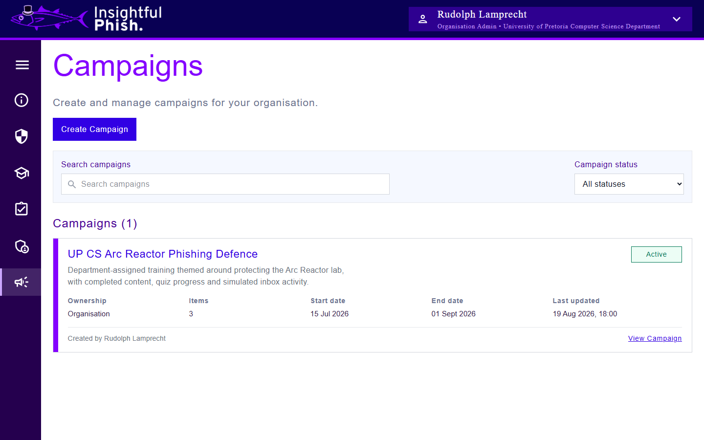

### Build or Edit a Campaign Draft

1. Open a Draft in the existing Campaign Builder.
2. Edit Campaign metadata.
3. Select eligible reusable content from the scoped catalogue.
4. Add content to the Campaign.
5. Set required/optional state.
6. Reorder items.
7. Review the ordered structure and save changes.

Organisation Campaigns can reference eligible platform or same-organisation content. Platform Campaigns use platform-owned content.

**Screenshot:** 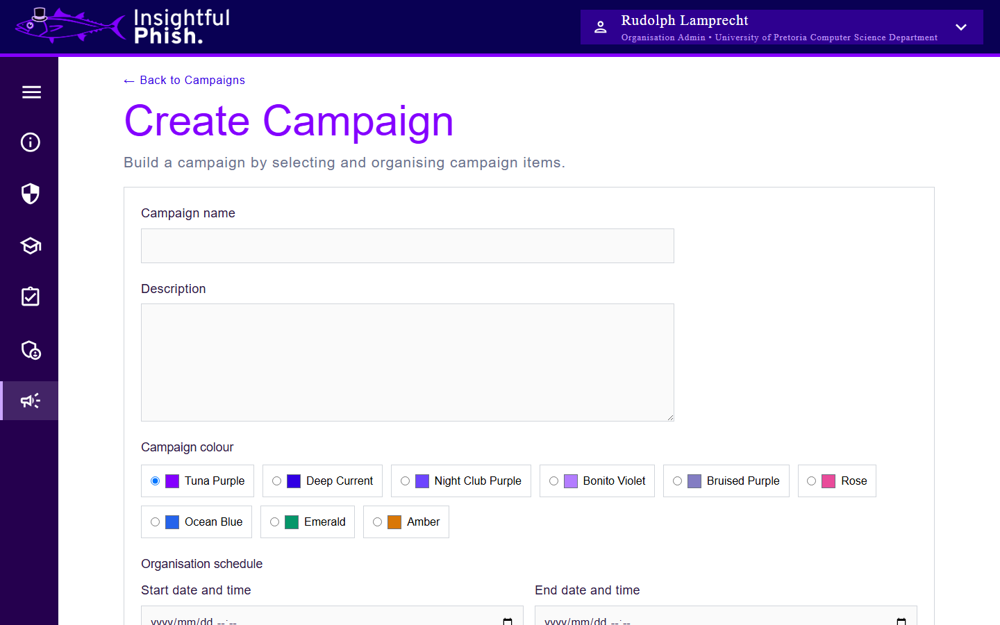

The retained screenshot shows the base builder; Demo 4 additionally includes groups, Quiz occurrence settings, adaptive items, and AI proposal controls described below.

### Create and Manage Groups

1. Choose eligible top-level items to start a group.
2. Enter group metadata and completion settings.
3. Move direct `COMPONENT` or `ADAPTIVE` items into or out of the group.
4. Reorder the group and its children.

Groups cannot contain another group. Moving or dissolving a group preserves supported child identity and configuration.

### Configure a Quiz Occurrence

For each normal or adaptive Quiz occurrence:

1. Set the attempt limit.
2. Choose `BEST`, `LATEST`, or `AVERAGE` score policy.
3. Set required state.

Quiz settings belong to the Campaign occurrence, not the reusable Quiz. Non-Quiz items do not carry these settings.

### Save and Manage Lifecycle

Saving updates the Draft through the canonical Campaign request. Activate only after eligible references and structure validate. Supported lifecycle controls allow archive and reactivation.

#### Activate a Campaign

Open the Campaign detail, choose activate, review validation, and confirm.

#### Archive or Reactivate a Campaign

Use the lifecycle action available for the current state. Existing history remains associated with the original Campaign.

**Screenshot:** 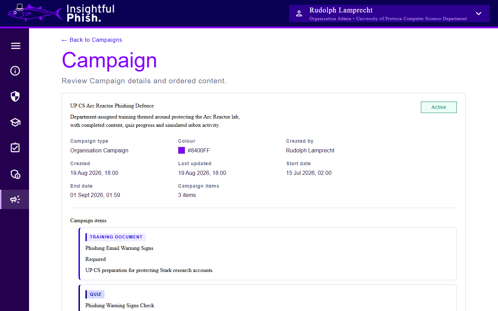

### Copy an Active Campaign to a Draft

Use the copy action on an Active Campaign. The new Draft receives a fresh Campaign ID and fresh item/group/adaptive-alternative identities while preserving eligible content references, order, grouping, required state, and Quiz settings. Assignments, attempts, evidence, progress, and adaptive resolutions are not copied.

## Adaptive Campaign Items

### Add an Adaptive Item

1. Select **Add adaptive item** in the Campaign Builder.
2. Choose one content type: Training Document, Quiz, or Simulated Inbox.
3. Select exactly one eligible `EASY`, `MEDIUM`, and `HARD` alternative.
4. Confirm that all alternatives share the same non-empty category set.
5. Configure required state and Quiz occurrence settings when applicable.
6. Add the occurrence, then place/reorder it top-level or as a direct group child.

Changing an alternative set replaces occurrence identity on save. Changing only non-identity settings such as required state or Quiz attempts/scoring preserves the existing Campaign Item identity where valid.

### Generate a Missing Variant

For a missing Training Document or Quiz difficulty, use the offered AI-help action. The system selects bounded title, summary, type, and category context from a compatible selected alternative and opens the normal builder.

Review quality findings and generated Draft content. Explicitly save and activate/publish it, return to the Campaign, and manually select it. Returning never silently attaches inactive content. Whole-Simulated-Inbox AI generation is not offered.

## AI Campaign Proposals

### Complete Proposal

1. Open the AI Campaign proposal panel in organisation Campaign management.
2. Select **Complete**.
3. Enter supported proposal intent and submit.
4. Wait while duplicate submission is disabled.
5. Review proposed Campaign name, description, rationale, findings, and items.
6. Edit proposal-level fields and remove unwanted items.
7. Open generated content in its normal builder where supported.

Proposal keys are transient and are not Campaign Item or reusable-content IDs.

### Follow-Up Proposal

1. Select **Follow-up**.
2. Choose an eligible active assignment-candidate trainee from the minimal selector.
3. Request the proposal.
4. Review/edit the transient suggestion.

The backend validates current trainee eligibility and computes category state. The browser does not send raw trainee history to AI.

### Materialisation and Lifecycle Safety

AI proposals do not create, save, activate, or assign Campaigns. Generated reusable content follows:

1. normal builder;
2. administrator review/edit;
3. explicit **Save Draft**;
4. explicit activate/publish/approve;
5. manual selection of a real eligible persisted ID;
6. ordinary Campaign save and activation.

An Organisation Email proposal must proceed through normal Simulated Inbox/Simulation authoring before a Campaign-eligible Simulation ID exists.

## Assignment and Insights

### Assign Campaigns to Organisation Trainees

1. Select **Assign Training Campaigns**.
2. Select eligible active organisation trainees.
3. Select eligible active organisation Campaigns.
4. Review the proposed assignments.
5. Confirm.

Invalid, duplicate, cross-organisation, disabled, or stale candidates are rejected safely.

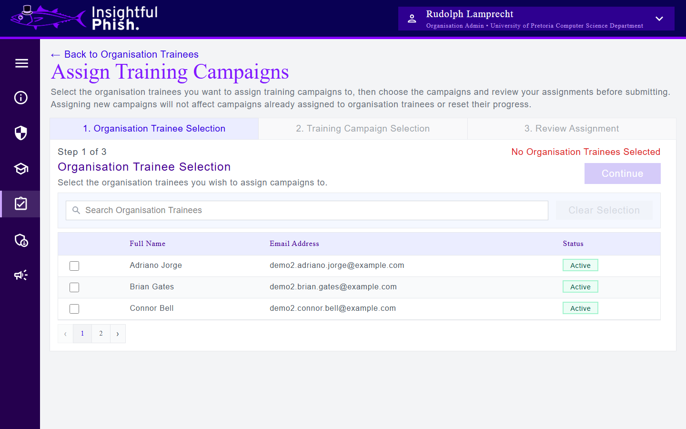

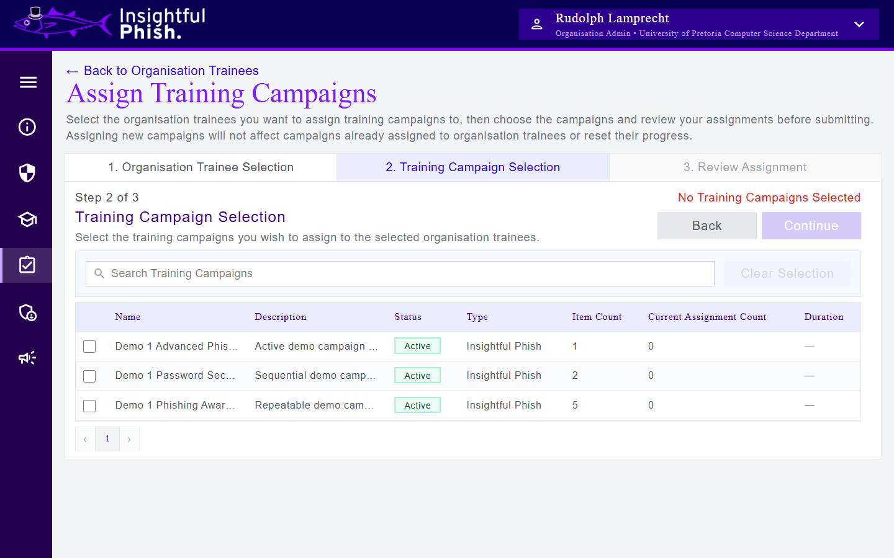

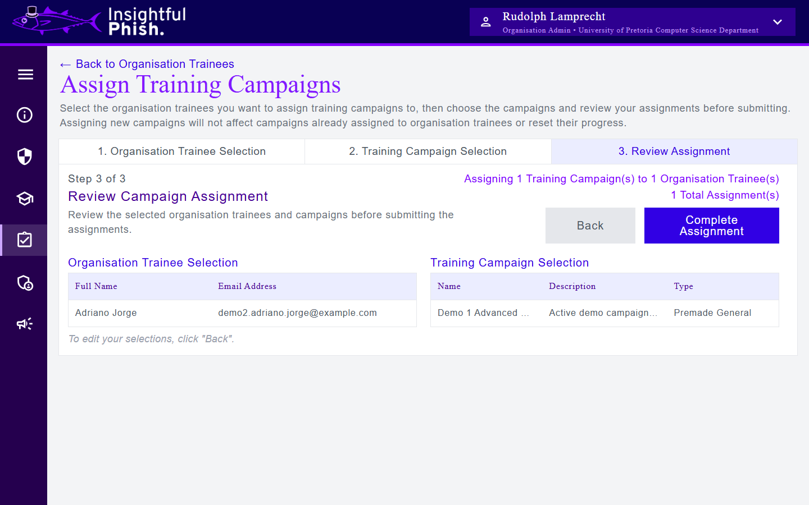

### Review Campaign Insights

Open a Campaign's statistics/insights page and review the implemented scoped participation and result measures. Empty data remains an empty state and is not fabricated.

**Screenshot:** 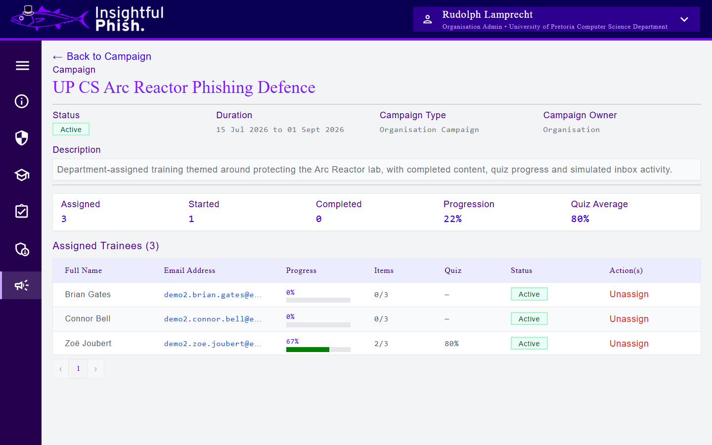

### Unassign a Trainee

1. Open the selected existing assignment.
2. Choose the destructive unassignment action.
3. Review the Campaign and trainee.
4. Confirm permanent removal.

Unassignment removes that assignment and dependent trainee progress transactionally. It is not a progress reset and has no undo/restore path. The bounded audit record does not retain deleted answers or interaction payloads.

## Platform Administration

### Review Organisation Registration Requests

Select **Organisation Management**, review the pending request list, and open a request for full details.

### Approve, Reject, Mark Contacted, or Delete an Eligible Request

Use only actions available for the request's current lifecycle. Approval creates supported organisation/setup state transactionally; rejection grants no access. Contact status supports onboarding work. Deletion is limited to eligible request state.

### Review Organisation Details and Onboarding

Open request/organisation detail to review lifecycle and current onboarding state. Resend initial setup only when state and cooldown permit it.

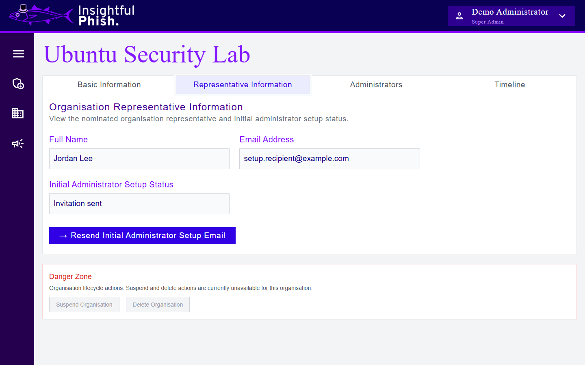

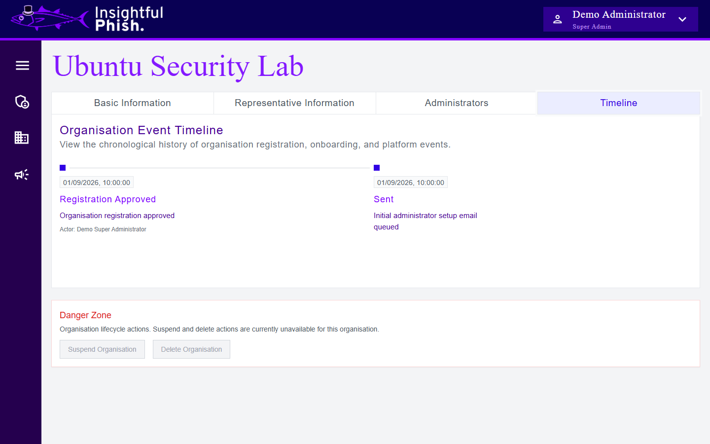

### Manage Organisation Lifecycle

Use supported suspend/reactivate actions from organisation detail. Reactivation does not silently restore individually disabled users or revoked invitations.

### Understand Platform Administrator Capabilities

Normal platform administrators and the protected super-administrator see different administrator-management actions.

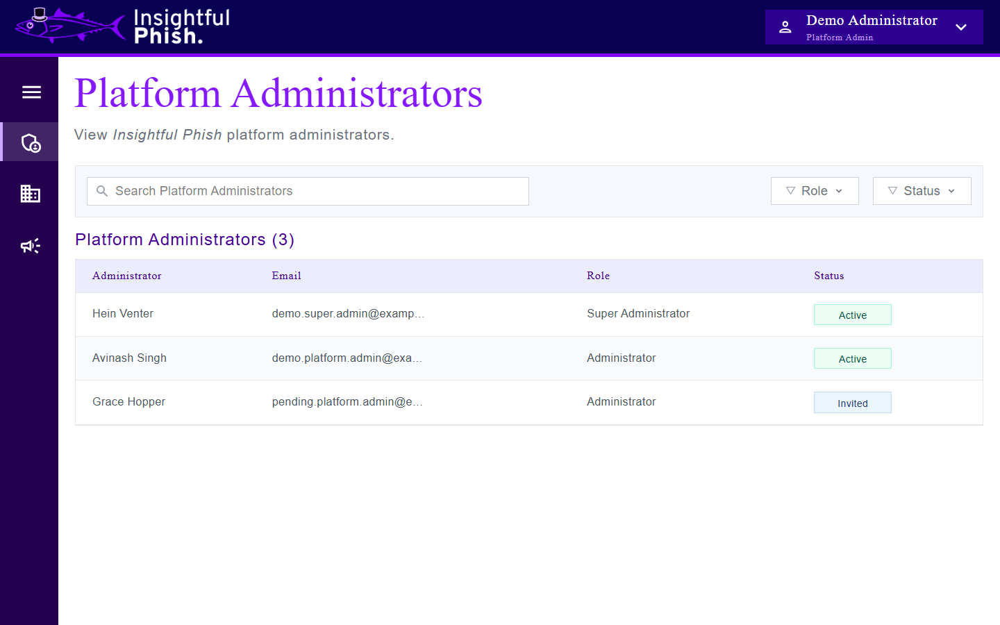

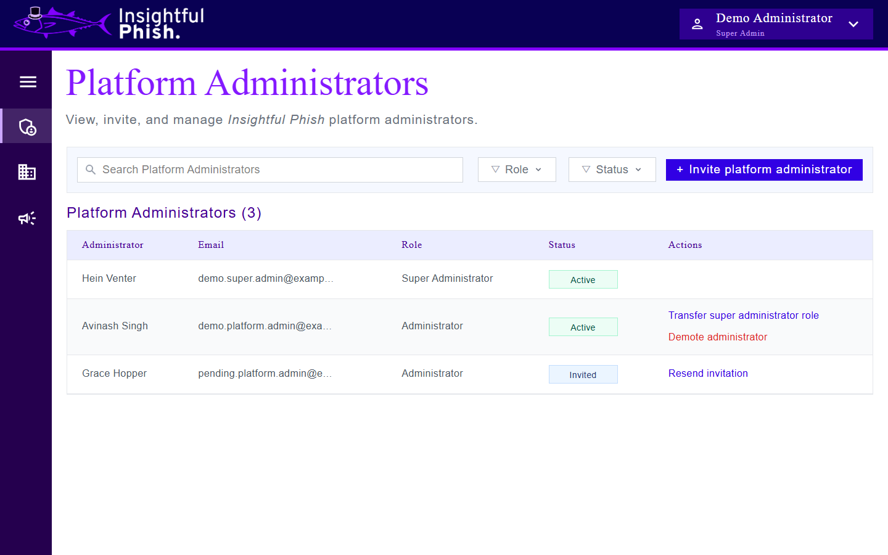

### Invite, Upgrade, Resend, Transfer, or Demote

Use **Platform Administrators** and the action available for the target's current state. Role transfer requires an eligible active target and preserves one accountable super-administrator. Invalid self/last-authority operations are rejected.

**Screenshot:** 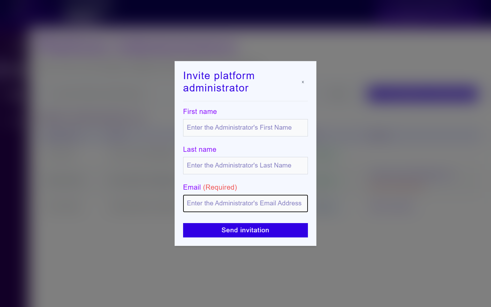

**Screenshot:** 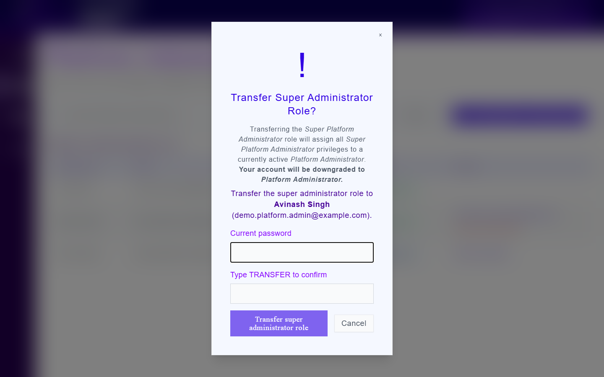

### Manage Platform Campaigns

Platform Campaign management uses the same canonical Campaign Builder and lifecycle concepts but only platform-owned eligible content. Active Campaigns can be copied to fresh Drafts for revision.

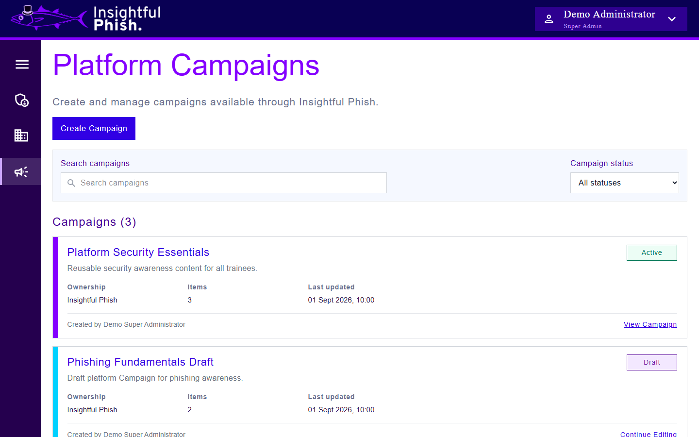

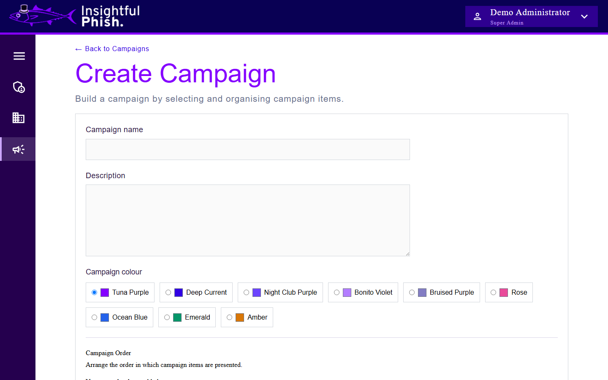

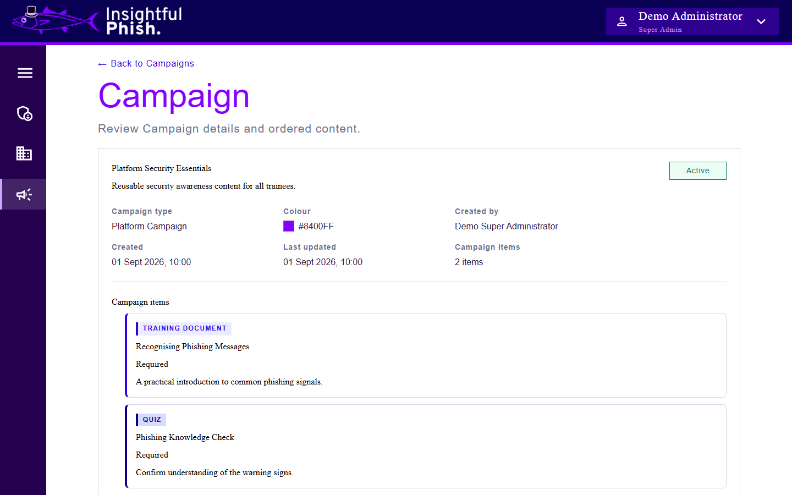

## Shared Account and Support Guidance

- Use account-management guidance in the [Trainee User Manual](user-manual.md) for profile, email, password, and session actions.
- Check role, permission, organisation, and lifecycle state when an action is absent or disabled.
- Do not retry lifecycle or invitation actions rapidly; observe cooldown and stale-state messages.
- When reporting a problem, provide the page, resource name, action, and displayed error, but never provide passwords, tokens, invitation/setup links, database URLs, provider keys, or raw trainee history.
- Review [Privacy and Data Boundaries](sas/privacy-and-data-boundaries.md) and [Known Limitations](sas/known-limitations.md) for current implementation boundaries.

Back to the [Demo 4 Documentation Home](README.md).
