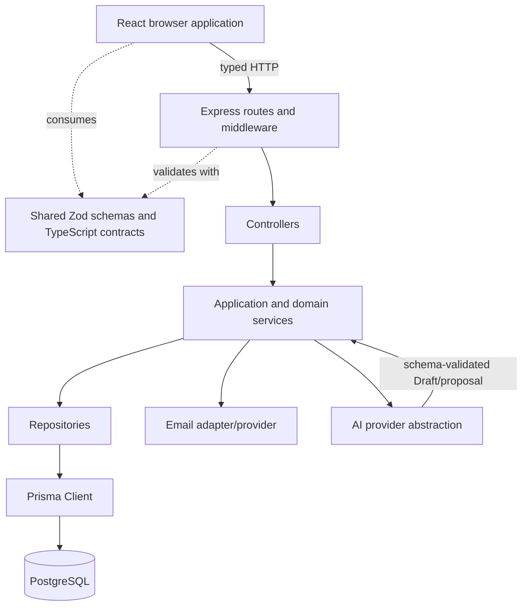
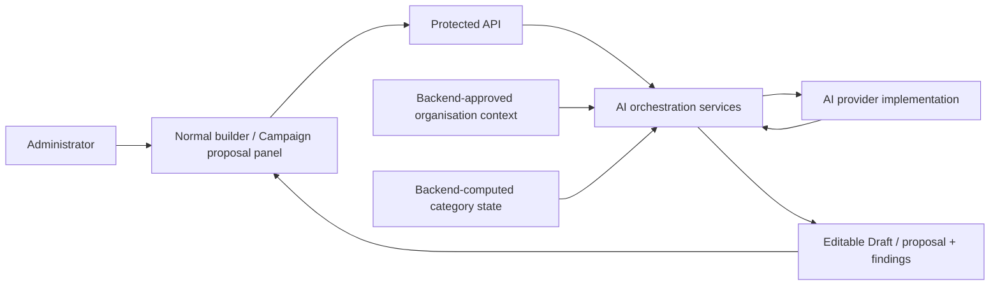
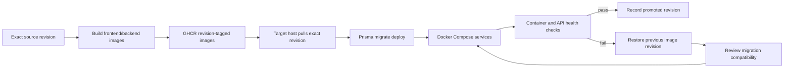

# Demo 4 Architecture and Deployment Diagrams

These Mermaid diagrams are the editable and repository-rendered source for the Demo 4 logical and deployment architecture.

## Logical Architecture

## Reusable Content, Campaign, and Adaptive Runtime

```mermaid
flowchart LR
  Builders[Normal reusable-content builders] --> ContentServices[Content lifecycle services]
  ContentServices --> ContentRepo[Content repositories]
  ContentRepo --> Eligible[(Eligible persisted content)]
  Eligible --> Builder[Existing Campaign Builder]
  Builder --> CampaignService[Campaign validation service]
  CampaignService --> CampaignRepo[Campaign repository]
  CampaignRepo --> Graph[(COMPONENT / ADAPTIVE / GROUP)]
  Graph --> Assignment[Campaign Assignment]
  Assignment --> Evidence[Category evidence services]
  Evidence --> State[Deterministic category state]
  State --> Resolution[Persisted adaptive resolution]
  Resolution --> Selected[Selected eligible content]
```

## AI Boundary

AI output has no automatic save, activation, publication, Campaign assignment, adaptive-difficulty, or email-send authority.

## Deployment and Promotion

Back to the [Architecture Overview](../../sas/architecture-overview.md) or [Deployment and Operations](../../sas/deployment.md).
