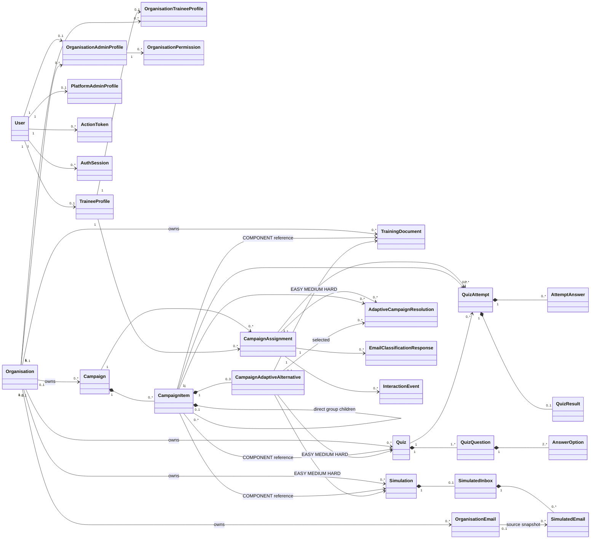

# Demo 4 Domain Model Diagram

This Mermaid diagram is the editable and repository-rendered source for the Demo 4 conceptual domain model. It intentionally shows requirement-level relationships rather than every Prisma field.

## Legend

- Filled composition relationships indicate lifecycle-owned children.
- Associations indicate scoped references or participation.
- `Organisation "0..1"` ownership distinguishes platform-owned from organisation-owned resources.
- `CampaignItem` represents exactly one canonical form: `COMPONENT`, `ADAPTIVE`, or `GROUP`.
- A `GROUP` has only direct `COMPONENT` or `ADAPTIVE` children.
- An adaptive item has exactly one `EASY`, `MEDIUM`, and `HARD` alternative.

Back to the [Demo 4 Domain Model](../../srs/domain-model.md).
