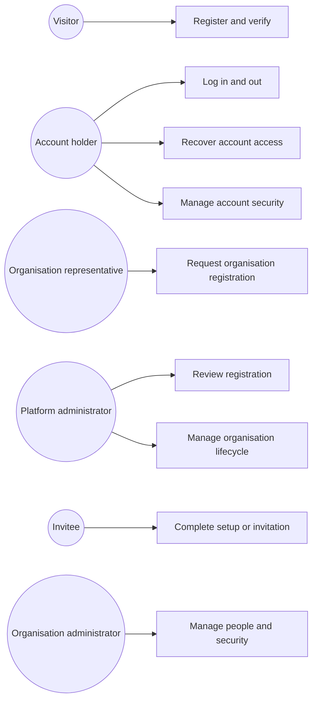
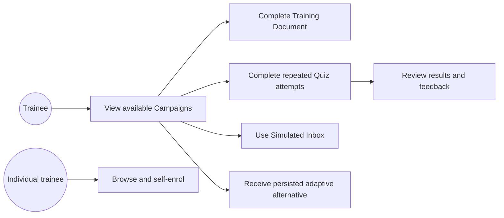
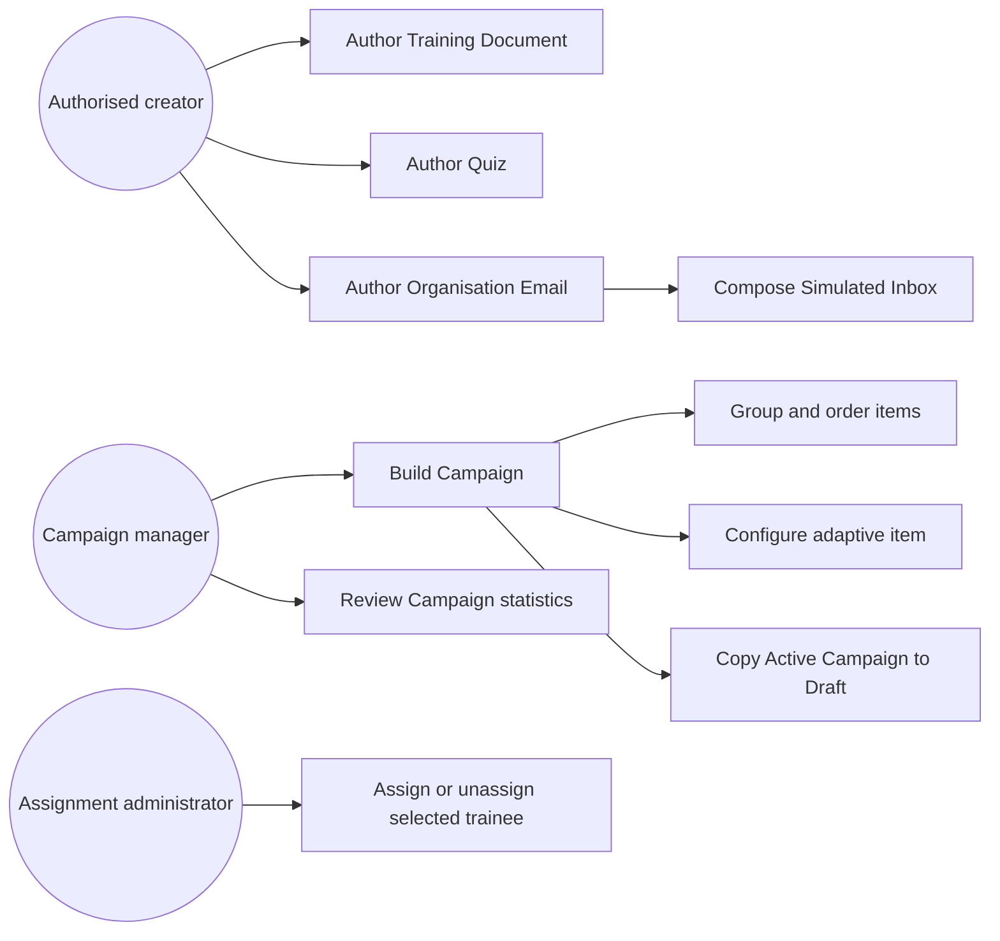
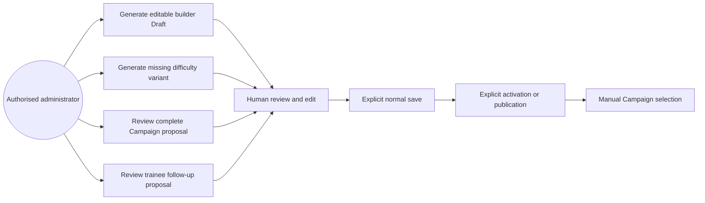

# Demo 4 Use-Case Diagrams

These Mermaid diagrams provide the editable and repository-rendered overview for implemented Demo 4 use cases. Detailed preconditions, flows, exceptions, postconditions, and requirement links remain in the [Use Cases](../../../srs/use-cases.md).

## Account and Organisation Access

## Trainee Campaign Participation

## Content and Campaign Administration

## AI-Assisted Administration

Back to the [Demo 4 Use Cases](../../../srs/use-cases.md).
