# Insightful Phish Demo 4 User Manual

## Introduction

This manual explains how trainees and account holders use Insightful Phish in Demo 4, including self-enrolment, repeated Quiz attempts, current result behaviour, and user-visible adaptive Campaign behaviour.

Available pages and actions depend on account type, organisation membership, Campaign assignment, lifecycle state, and security policy.

## Contents

1. [How to Read a Task](#how-to-read-a-task)
2. [Access and Account Basics](#access-and-account-basics)
3. [Account Management and Security](#account-management-and-security)
4. [Individual Trainee Tasks](#individual-trainee-tasks)
5. [Organisation Trainee Tasks](#organisation-trainee-tasks)
6. [Adaptive Campaign Items](#adaptive-campaign-items)
7. [Organisation Access](#organisation-access)
8. [Troubleshooting](#troubleshooting)
9. [Security and Privacy](#security-and-privacy)
10. [Glossary](#glossary)
11. [Support](#support)

## How to Read a Task

Each task explains:

- **Who can do it:** the applicable account context;
- **Before you start:** required account, Campaign, or invitation state;
- **Steps:** the normal user actions;
- **Result:** what successful completion changes;
- **If it fails:** common safe recovery actions.

Button names are shown in bold. Never share a password, setup token, verification link, invitation link, or reset link with another person.

### Current Navigation

The signed-in interface uses an icon sidebar and an account menu in the application header. Move the pointer over a sidebar icon, or focus it with the keyboard to identify its label.

Trainees receive these sidebar destinations:

- **Campaigns**
- **Help**

**Help** opens the currently configured user-manual link in a new browser tab.

## Access and Account Basics

### Sign In

**Who can do it:** A registered user with an eligible account.

**Before you start:** Your email address must be verified where verification is required. Organisation-linked access also depends on active organisation and membership state.

1. Open Insightful Phish.
2. Select **Log In** from the public navigation.
3. Enter your email address and password.
4. Select **Remember Me** only when offered and appropriate for the device.
5. Select **Log In**.

After successful sign-in, the application opens the area appropriate to your account context. Invalid credentials use a generic response and do not reveal whether a particular email address exists.

**Screenshot:** 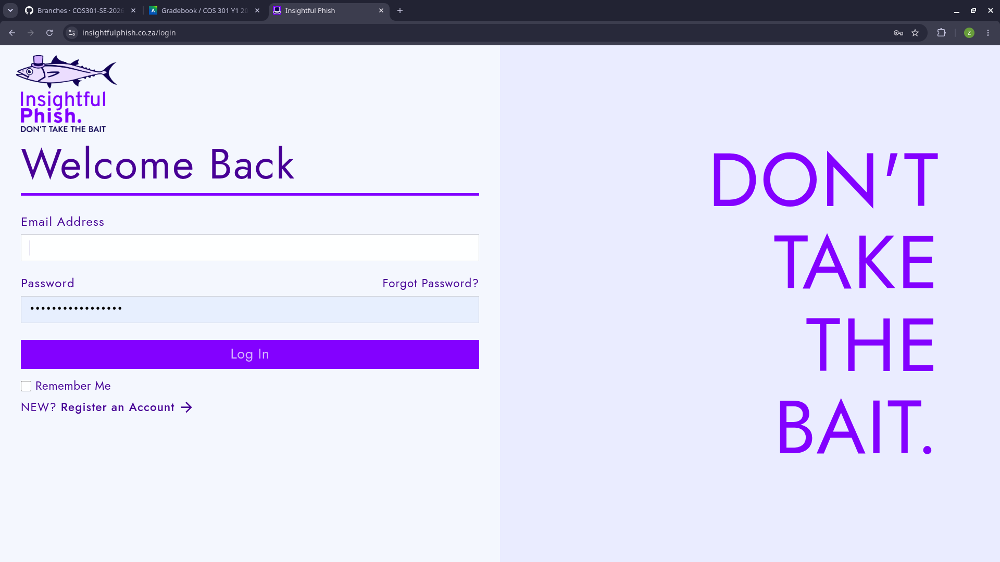

### Log Out

1. Open the account menu in the application header.
2. Select **Logout**.
3. Confirm that you return to a public page.

Logout revokes the current session. Other active sessions remain until they expire or are separately revoked.

### Create an Individual Trainee Account

1. Select **Register** from the public navigation or sign-in page.
2. Enter the required first name, last name, email address, password, and password confirmation.
3. Correct any field validation messages.
4. Submit registration.
5. Open the verification message sent to your email address.

Registration creates a pending account until email verification succeeds. A conflicting existing account, active invitation, or registration state can prevent registration.

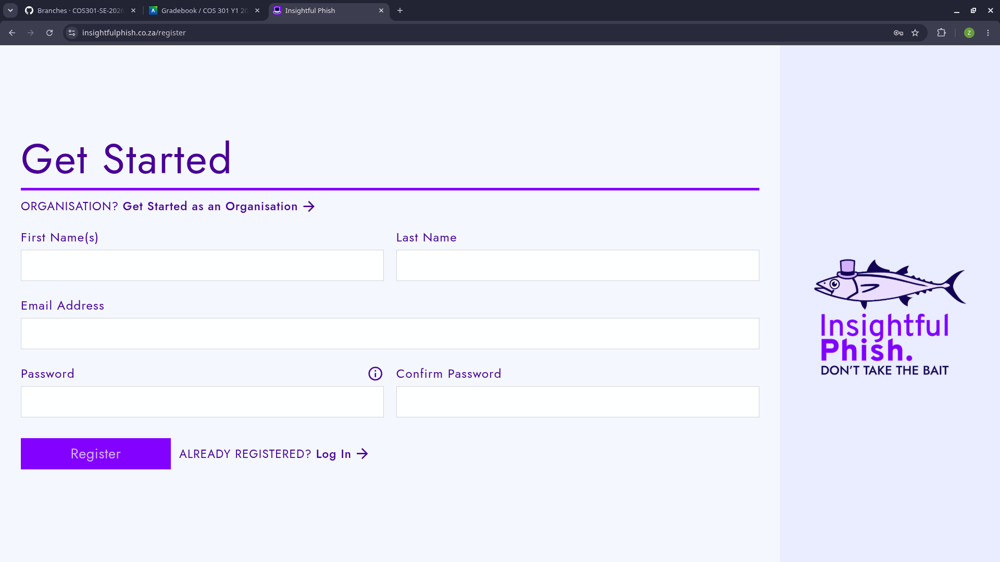

### Verify Your Email Address

1. Open the verification link sent after registration.
2. Wait while Insightful Phish validates the token.
3. Continue to sign-in after the confirmation appears.

Verification links are scoped, time-limited, and single-use. If a link is expired, revoked, superseded, or already used, use the offered resend/recovery action instead of repeatedly opening it.

### Reset a Forgotten Password

1. Select **Forgot Password** from sign-in.
2. Enter your email address.
3. Submit the request.
4. Open the reset link from your email if your account is eligible.
5. Enter and confirm a password satisfying the displayed policy.
6. Submit the reset and sign in again.

The request page returns the same safe acknowledgement whether or not the submitted address identifies an eligible account. A successful reset revokes existing sessions.

### Complete Account Setup From an Invitation

**Who can do it:** An invited initial administrator or another invitee whose flow requires account setup.

1. Open the setup link from the invitation email.
2. Review the organisation and account information shown.
3. Enter the required credentials and profile information.
4. Submit the setup form once.
5. Sign in after setup completes.

The setup link must match the intended recipient, organisation, purpose, and current invitation state.

### Accept an Organisation Invitation

1. Open the invitation link sent to your email address.
2. Review the organisation and offered membership or role change.
3. Complete any required account step.
4. Confirm acceptance.

An unavailable screen is shown when the invitation is invalid, expired, revoked, superseded, mismatched, or already used. Contact the organisation administrator if a replacement invitation is required.

## Account Management and Security

### Open Account Management

1. Sign in.
2. Open the user menu.
3. Select **Account Management**.
4. Choose **Personal Information**, **Account**, or **Sessions**.

Some settings can be managed by your organisation and appear read-only or unavailable.

**Screenshot:** 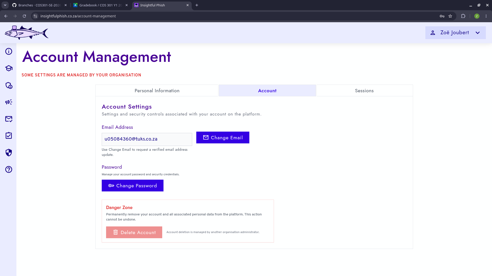

### Update Personal Information

1. Open **Personal Information**.
2. Edit fields available to your account.
3. Save the changes.
4. Check the success or validation message.

Failed validation leaves the existing profile unchanged.

### Request an Email Change

1. Open the **Account** tab.
2. Choose the email-change action if your account and organisation policy permit it.
3. Enter the new address and any required confirmation credential.
4. Submit the request.
5. Complete the confirmation link sent to the new address.

The account continues to use its existing confirmed address until the tokenised change succeeds.

### Change Your Password

1. Open **Account**.
2. Select the password-change action.
3. Enter the current password where required.
4. Enter and confirm the new password.
5. Submit the change.

The new password must satisfy platform and applicable organisation policy. Supported notifications are sent after a successful sensitive change.

### Review and Revoke Active Sessions

1. Open **Sessions**.
2. Review the displayed device, activity, and expiry information.
3. Select the revoke action for a session you no longer recognise or need.
4. Confirm the action where prompted.

Raw session credentials are never displayed. Revoking the current session can require signing in again.

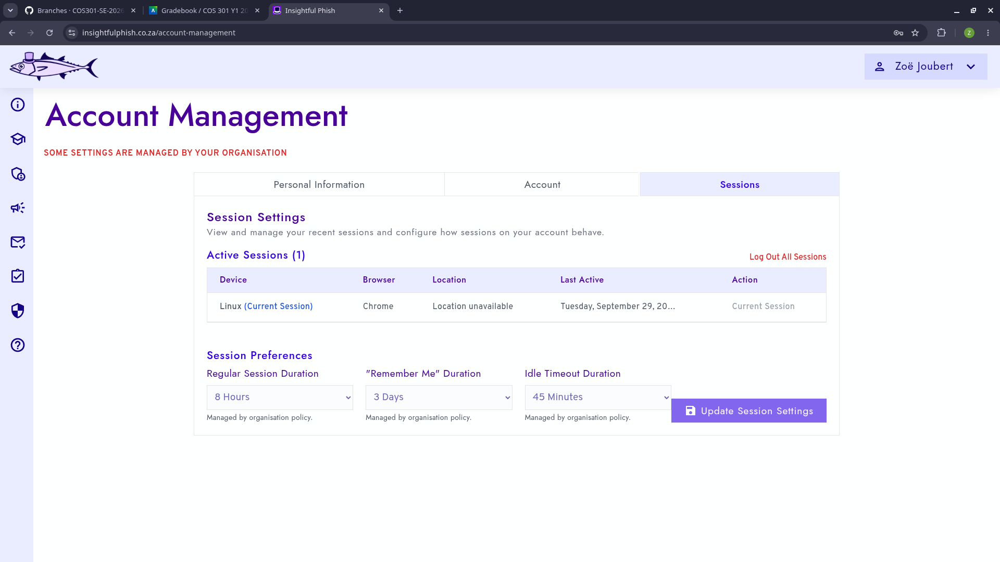

### Update Session Settings

Use **Sessions** to change personal session preferences where organisation policy permits. If the page says that settings are managed by your organisation, the organisation policy takes precedence.

Avoid remembered sessions on shared or public devices.

### Account Deletion Availability

The **Account** tab contains a **Danger Zone** with a **Delete Account** control. Self-service account deletion is currently unavailable, so the control is disabled.

The page explains the restriction for the current account:

- Platform Administrator accounts do not support self-deletion.
- Organisation Administrator account deletion is managed by another Organisation Administrator.
- Organisation Trainee account deletion is managed by the Organisation Administrator.
- Other accounts are told that account deletion is currently unavailable.

Because the control is disabled, there is currently no supported user workflow for confirming deletion or deleting an account from Account Management. Contact the responsible administrator or support if account removal is required.

## Individual Trainee Tasks

### Discover and Self-Enrol in a Platform Campaign

1. Select **Campaigns** in the navigation.
2. Open **Discover platform campaigns**.
3. Review the available Campaign title and summary information.
4. Select **Enrol in Campaign**.
5. Open or continue the Campaign from your Campaign list.

Enrolment is idempotent: submitting it again does not create another enrolment. Organisation-only or unavailable Campaigns cannot be self-enrolled.

**Screenshot:** 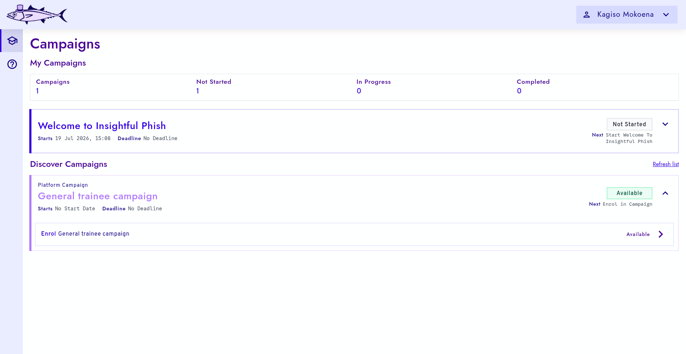

### Open Campaign Activities

1. Open **Campaigns**.
2. Expand an enrolled or assigned Campaign.
3. Review its ordered activities and groups.
4. Open an available activity.

The Campaign card shows its start date, deadline, status, and next action. An activity can be unavailable when the Campaign has not started, has expired, is inactive, or the content is otherwise unavailable. Completion belongs to that Campaign occurrence and does not automatically complete another occurrence using the same reusable content.

## Organisation Trainee Tasks

### View Assigned Organisation Campaigns

Organisation Campaigns appear on **Campaigns** after an authorised administrator assigns them to your active organisation trainee profile.

1. Open **Campaigns**.
2. Select an assigned Campaign.
3. Review the Campaign status, schedule, activity groups, and activity progress.
4. Continue with the next available item.

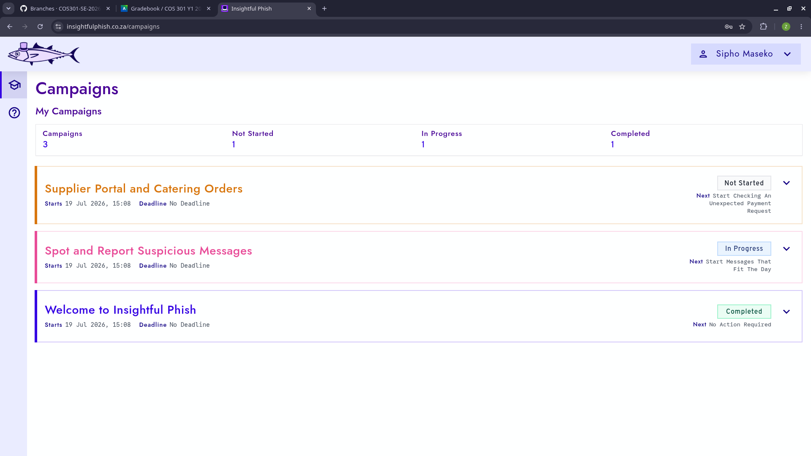

### Read a Training Document

1. Open an available Training Document from its Campaign.
2. Read the title, summary, headings, paragraphs, lists, and approved links.
3. Select the displayed completion action after finishing.
4. Return to the Campaign.

Repeated completion requests do not create duplicate completion records. Trainees cannot edit the reusable document.

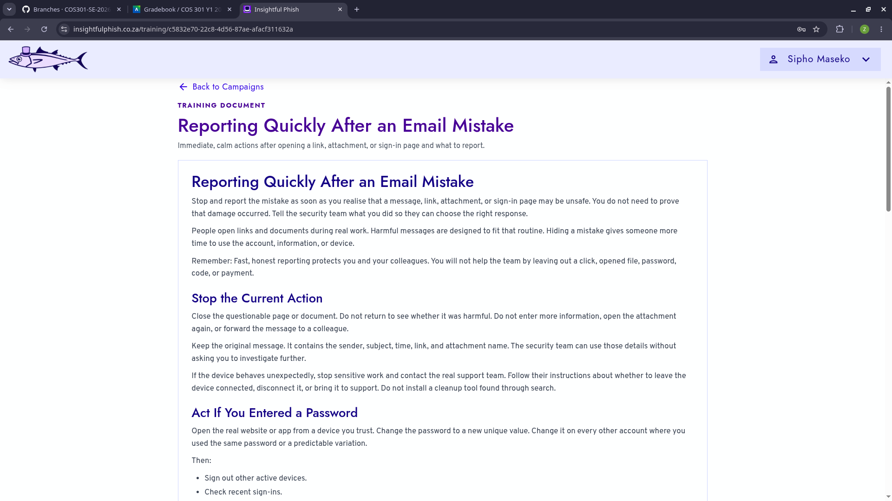

### Complete a Quiz

1. Open an available Quiz occurrence.
2. Review the attempts-remaining message.
3. Answer every required question.
4. Use radio buttons for single-choice questions.
5. Use checkboxes for multiple-choice questions.
6. Review selections and submit.

An existing `IN_PROGRESS` attempt resumes instead of creating a duplicate. Correct answers and protected feedback are not exposed before submission.

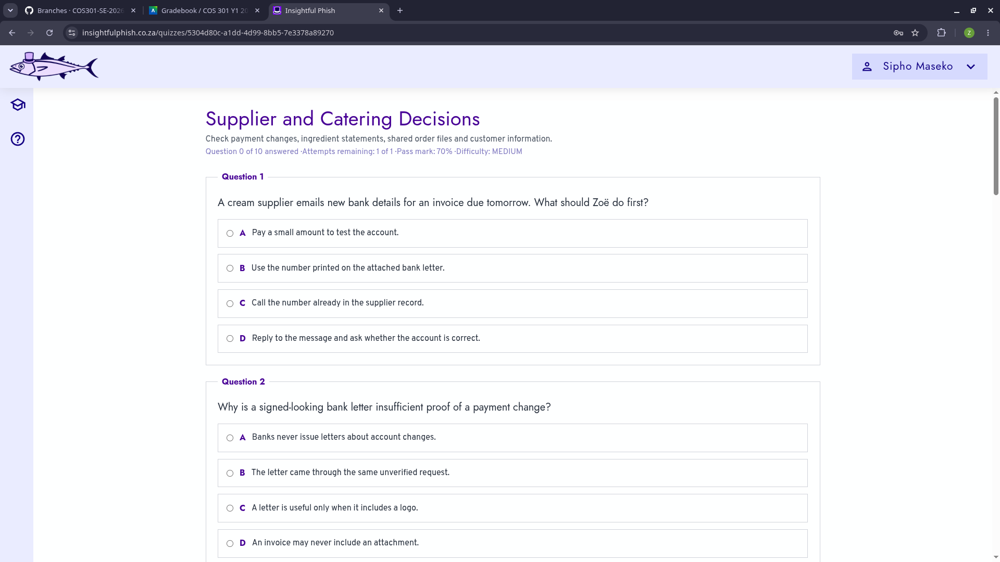

### Review Quiz Results and Repeat Attempts

After submission, the result shows:

- pass or not-passed state;
- the submitted attempt score;
- the attempt number and submission time;
- attempts remaining;
- previous submitted attempts where applicable.

Answer-level feedback is shown after you pass the Quiz or use all available attempts. When feedback is available, it includes your selected answers, correctness, other options, and configured option feedback.

Select **Retake Quiz** only when attempts remain. A new attempt is created while previous submitted results remain available in **Attempt History**.

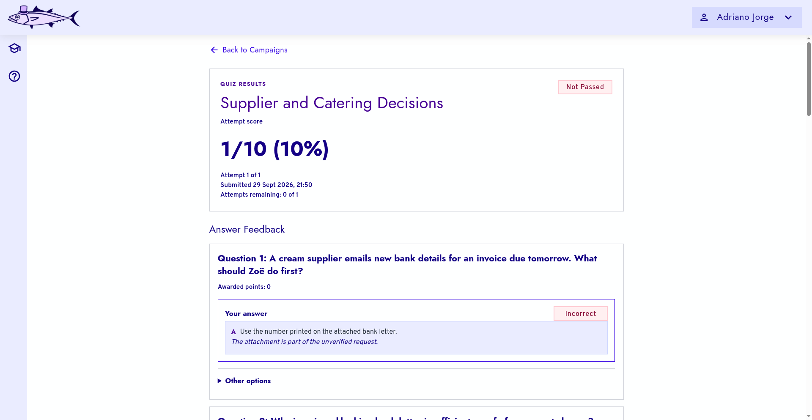

### Work Through a Simulated Inbox

1. Open an available Simulated Inbox from its Campaign.
2. Review message summaries such as sender, subject, preview, and simulated timing.
3. Select a message to inspect.
4. Return to the inbox to continue with other messages.

The inbox is controlled training content and is not connected to your real mailbox.

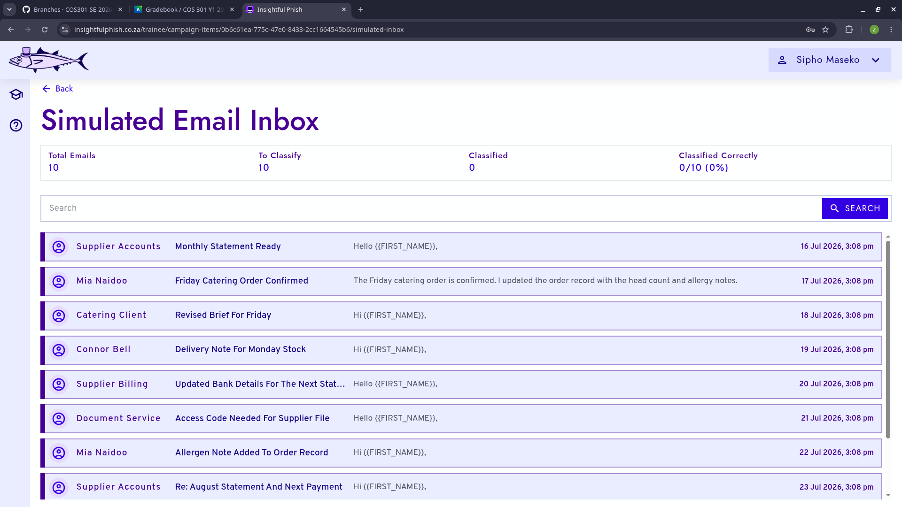

### Inspect and Classify a Simulated Email

1. Inspect the sender, subject, body, links, and visible warning signs.
2. Choose **Safe**, **Suspicious**, or **Phishing**.
3. Select the warning signs you identified.
4. Select **Submit Answer**.
5. Review the expected classification, explanation, correctly identified signs, missed signs, and incorrect selections.

Controlled links can record training interaction behaviour. Do not enter a real password, payment detail, or other secret into simulated content.

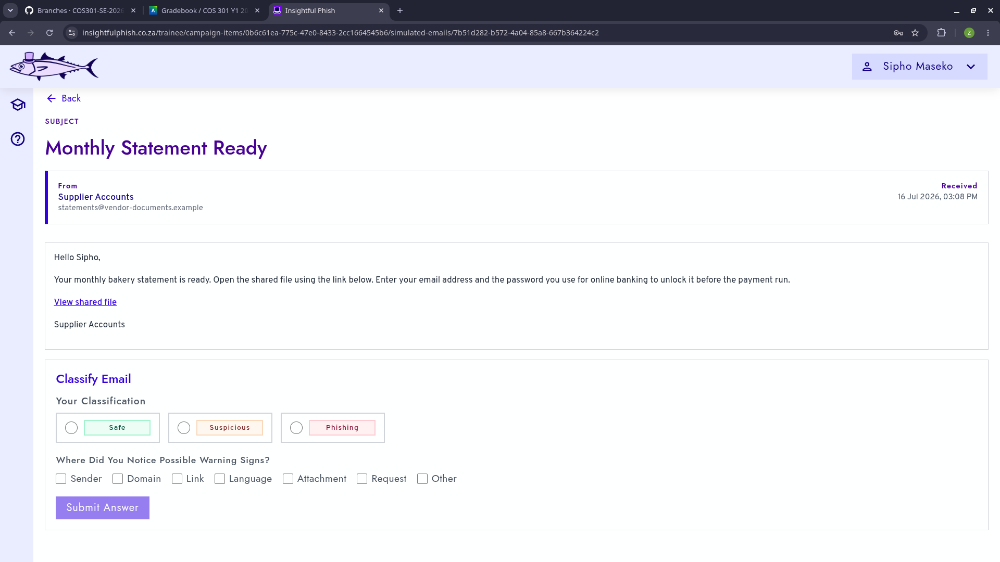

### Real-Email Simulation Training

Your organisation may send authorised simulation emails to your normal work or training mailbox. This workflow is separate from the Simulated Inbox inside Insightful Phish.

Treat the message as you would any unexpected email: inspect the sender, destination, wording, and request carefully. A simulation link can open a controlled training portal. If you interact with the portal, it can display an educational reveal explaining the warning signs in the email and page.

Never enter a real password, payment detail, or other secret into a suspicious page. Follow your organisation's normal reporting process for suspicious messages. Simulation and feedback links can become unavailable after their permitted lifetime.

## Adaptive Campaign Items

An adaptive occurrence has eligible `EASY`, `MEDIUM`, and `HARD` alternatives of one content type. Insightful Phish uses supported learning evidence to select one alternative for your Campaign assignment.

You complete the resolved Training Document, Quiz, or Simulated Inbox through the normal page described above. The selected alternative is persisted for that assignment and item, so refreshing does not choose a different item.

The trainee interface does not expose internal evidence weights, category-state calculations, or a global difficulty control. AI does not choose your adaptive difficulty.

## Organisation Access

### Request Organisation Registration

1. Open **Organisation Registration Request** from the public area.
2. Enter the required organisation and representative details.
3. Continue through the review step.
4. Submit the request.
5. Keep the displayed reference/status information.

A platform administrator reviews the request. Submission does not immediately grant organisation access.

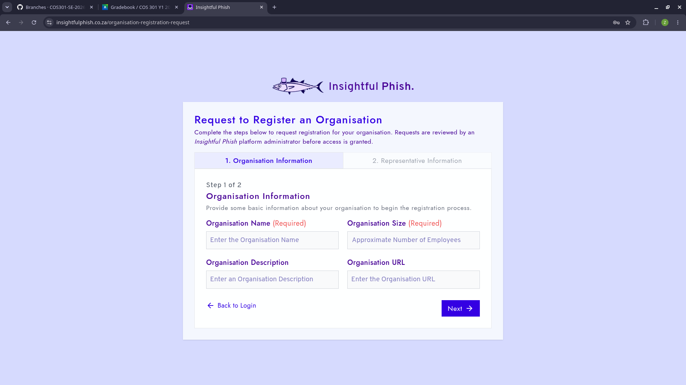

### Complete Initial Organisation Administrator Setup

1. Open the setup email issued after approval.
2. Complete the required profile and credential fields.
3. Submit once.
4. Sign in to the approved organisation context.

The token is consumed only after successful setup and cannot be reused.

## Troubleshooting

### Login Does Not Work

Check the email spelling, password, verification state, and whether your organisation access is active. Use password recovery rather than repeatedly guessing credentials.

### Verification, Setup, or Invitation Link Fails

The token may be expired, revoked, superseded, mismatched, or used. Use the available resend path or ask the issuing administrator for a replacement.

### A Setting Is Read-Only

Organisation policy can manage account/session settings. The page identifies managed settings; contact an organisation administrator if the policy appears incorrect.

### A Campaign Item Is Locked

Return to the Campaign and check its schedule and availability. An activity may be unavailable when the Campaign has not started, has expired, is inactive, or its content is unavailable.

### A Quiz Cannot Start

Check the attempts-remaining message and Campaign availability. A submitted Quiz can only be retaken when its occurrence permits another attempt.

### An Action Button Is Missing or Disabled

The action may be unavailable for your role, permission, resource state, or Campaign progress. Confirm you opened the correct account context and item.

### A Request Fails or Is Rate Limited

Read the displayed message, wait for any stated cooldown, and retry once. Repeated rapid requests can extend disruption and do not bypass token or permission checks.

### A Page Shows No Data

Confirm you are signed in, return to **Campaigns**, and reopen the page. A legitimate empty state can mean no Campaign is assigned or enrolled. Contact support with the Campaign/item name if expected data remains absent.

## Security and Privacy

- Use a unique password and keep verification, invitation, setup, and recovery links private.
- Sign out on shared devices and revoke unfamiliar sessions.
- Do not enter real credentials or sensitive information into simulated content.
- Report suspicious real messages through your organisation's approved channel; the Simulated Inbox is training content.
- Insightful Phish records learning progress, Quiz attempts, classifications, and controlled interaction events required for Campaign delivery and results.

## Glossary

| Term                       | Meaning                                                                                                |
| -------------------------- | ------------------------------------------------------------------------------------------------------ |
| Campaign                   | Ordered collection of training occurrences available through enrolment or assignment.                  |
| Campaign occurrence        | One configured Training Document, Quiz, Simulated Inbox, adaptive item, or group in a Campaign.        |
| Individual trainee         | Independently registered trainee who can self-enrol in available platform Campaigns.                   |
| Organisation trainee       | Trainee linked to an organisation and eligible for direct Campaign assignment.                         |
| Organisation Administrator | Organisation-linked administrator whose available management actions depend on explicit permissions.   |
| Platform Administrator     | Platform-level administrator who manages supported platform resources and Organisation onboarding.     |
| Super Administrator        | The single protected authority held by one Platform Administrator; it is not a separate ordinary role. |
| Adaptive item              | One occurrence resolved to an eligible `EASY`, `MEDIUM`, or `HARD` alternative.                        |
| Effective Quiz score       | Score selected or calculated across attempts using the occurrence's score policy.                      |
| Simulated Inbox            | Controlled training inbox that does not connect to a real mailbox.                                     |

## Support

When asking for help, provide:

- the page or Campaign/item name;
- the action attempted;
- the displayed error message;
- whether the issue continues after signing in again.

Do not send passwords, tokens, setup links, invitation links, provider credentials, or real sensitive information to support.

Back to the [Demo 4 Documentation Home](README.md).
